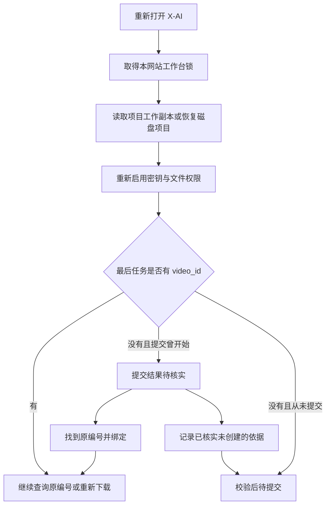
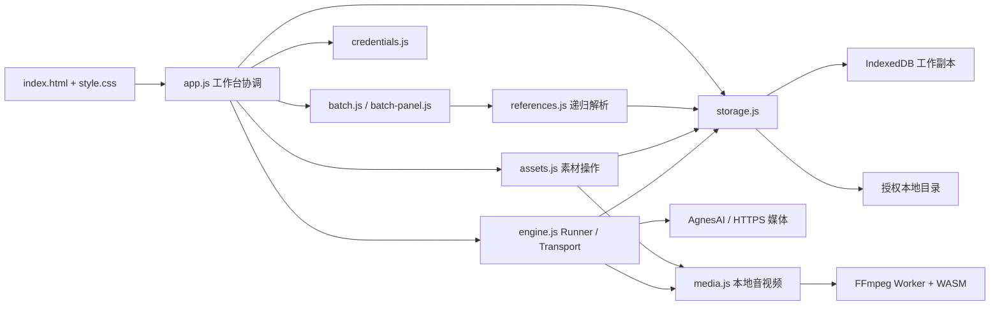
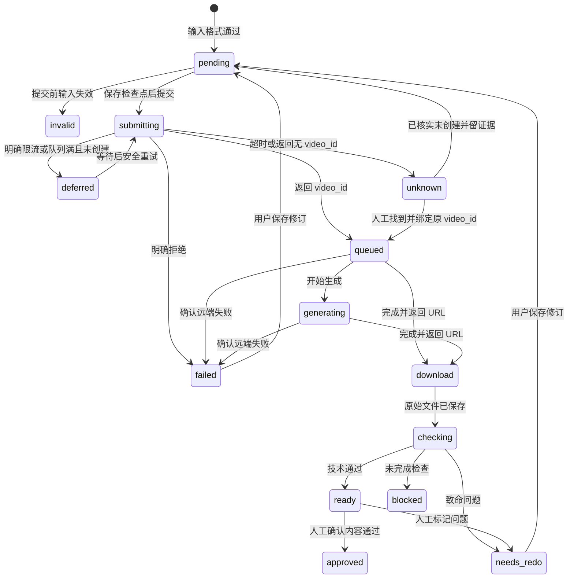

# X-AI 1.2.7 详细设计文档

> 产品：X-AI · 本地视频创作台<br>
> 版本沿革：1.0 原设计；1.1 同名素材、自动关联、筛选与创作项目；1.1.1 单段互斥试听 / 试看；1.1.2 本地启动与连接恢复；1.1.3 原素材只引用与文件状态恢复；1.1.4 目录写入重试与批量映射保存；1.1.5 任务刷新与动态进度；1.1.6 紧凑进度与媒体下载恢复；1.2.0 小白版 / 专家版、PavoAI与动态平台能力；1.2.1 极简默认入口与提交冷却；1.2.2 自动排队与下载恢复；1.2.3 队列自检、后台校验与输入清空；1.2.4 下载检查点与模块版本一致性；1.2.5 操作独立间隔与渐进限流；1.2.6 Pages自动媒体通道；1.2.7 本机服务保活与密钥操作。新增与变更详见第27—41章，完整需求追踪和故障复盘见第42章。<br>
> 文档基准日期：2026-10-03（北京时间）<br>
> 文档补充修订：**1.2.7-R1**，汇总上述各轮需求、故障定位、修复、验证及维护注意事项；代码版本仍为1.2.7，不表示新增代码发布。<br>
> 代码目录：`PRIVACY-REDACTED\REDACTED-DIR`<br>
> 面向读者：产品负责人、普通使用者、前端开发者、音视频开发者、测试人员及接手开发的 AI。<br>
> 文档性质：当前实现说明 + 设计约束 + 扩展方案。不是服务商永久规格承诺，也不是历史视频生产已全部完成的证明。

当前文档按版本分章维护，冲突时后续章节取代对应旧规则。第27—36章记录1.1至1.2.2，第37章记录 **1.2.3** 队列自检、后台校验与输入清空，第38章记录 **1.2.4** 下载检查点、模块版本一致性及S03现场修复。历史验证保留原日期和版本，不能当成新功能的验证结果。

**1.2.5最新规则见第39章**：只有生成提交遵守当前平台超过60秒的间隔，默认61秒；查询与下载采用独立短间隔，429等明确限流反馈才逐步加长，恢复后逐步缩短。此规则取代旧章节中所有“全部认证请求90秒”和“正常排队自动指数退避”的实现描述。

**1.2.6 新增规则见第40章**：针对实际 Pages 来源的 CDN 跨域失败，增加指定来源的本机媒体通道自动发现与短期凭证；本机通道不再局限于同源页面。前端与本机工具必须配套更新，浏览器本地网络权限仍由使用者决定。本章覆盖旧章节关于 Pages 只能手动配对下载的说明。

**1.2.7 新增规则见第41章**：Windows本机服务与守护由系统独立启动，守护每30秒检查原端口；密钥会话操作与编辑任务记录解耦，在途下载不阻止启用、更换或停用密钥。S06现场自动恢复有独立的真实文件、哈希及原任务编号证据。

**当前规则统一入口为第42章**：特别注意默认16:9 / 12s / 720p、冷却期接收入队、生成POST间隔61秒、服务查询10秒、队列自检30秒、较长有效返回视频直接采用，以及下载恢复无需用户逐项选方案。早期Auto / 4s、冷却拒收、全部认证请求90秒、已选素材数量星标、超12秒重做和手动切换下载通道等描述均保留为历史，不作为当前实现依据。

## 0. 阅读方式、状态标记与依据

### 0.1 阅读路径

|读者|建议先读|主要问题|
|---|---|---|
|普通使用者|第42章当前规则，再读第3、5、6、9、13、18章|怎样准备材料、入队、自动恢复、审核和保存文件|
|产品或设计人员|第42章需求追踪，再读第2—6、16、21、34—37章|功能边界、交互状态、错误恢复、可读性|
|接手开发者 / AI|第42章交接，再读第7、8、10—15、17、19—25、27—41章|源码、数据协议、状态机、不重复计费、测试和扩展|
|测试人员|第42章验收矩阵，再读第9、12—16、20、23、26—41章|限制、失败分类、版本恢复、验收场景|

本文件是可维护的主文档。旁边的 `X-AI详细设计文档.html` 是供浏览器阅读的派生版本；修改设计时先改 Markdown，再重建 HTML。阅读版不加载 API 密钥，不调用生成服务，也不操作用户项目。

### 0.2 文档用语

- **已实现**：当前源码中存在相应逻辑，不代表所有外部服务条件都已验证。
- **已验证**：有仓库验证记录支持；应区分模拟网络、真实本地媒体处理和历史真实认证。
- **设计约束**：开发时必须保持的行为，例如未知提交不能自动重发。
- **后续设计**：建议的扩展，不应向使用者宣称已提供。
- **技术通过**：文件、媒体及程序规则通过；不等于人物、剧情、动作、口型和声音正确。
- **人工内容通过**：使用者明确确认观看、听审后记录的结论。
- **原路径素材**：手动选择、拖入或清单定位的未修改文件；平台只引用，不把它复制到输出目录。
- **工作缓存**：用户选择 / 拖入原素材后，用于浏览器预览和校验的缓存；1.1.3不为未修改原件新增磁盘副本，旧版管理文件仅保留历史恢复。
- **当前版本**：`job.current` 所指的具体视频、哈希和检查记录；不是根据文件名推测的“最新文件”。

### 0.3 依据与冲突处理

设计依据为本轮用户要求、项目 `AGENTS.md`、当前 `index.html` / `src/` / `tools/`、README、专题使用说明和 `docs/验证记录.md`。正文按当前最终版组织；历史记录里仍可能有此前的复杂密钥入口、宣传页头、生成日期等描述，不应据此恢复已被用户否定的界面。

此次文档整理没有新建收费视频，没有重新声称完成 379 镜 / 40 集任务，没有重新验证服务商价格、余额、配额或所有下载域名。历史长任务提供流程经验；平台自身验证证据见第 20 章。

## 1. 产品目标与运行边界

### 1.1 产品定位

X-AI 是一套纯静态、可发布到 GitHub Pages 的网页视频操作平台。用户在自己的浏览器中编排分镜，选择本地图片和声音，调用 AgnesAI 生成视频，取回后在本地检查、审核和按集拼接。

平台不依赖对话 AI 在旁边逐步操作。用户完成一次清单、素材和参数准备后，可启动有状态、可恢复的串行队列。平台直接处理可确定的格式与文件问题；剧情拆解、角色一致性、音色身份等语义问题由使用者或外部工具判断。

### 1.2 本地、服务商和网站分别做什么

|位置|承担工作|保存 / 接触的数据|
|---|---|---|
|静态网站 / GitHub Pages|提供 HTML、CSS、JS、SVG、WASM、说明文档|公开代码和公开第三方资源；不应含私人密钥和素材|
|用户浏览器|表单、清单解析、文件读取、SHA-256、队列、预览、校验、WASM 拼接|项目工作副本、选中的素材、已下载媒体；密钥在会话内存|
|用户磁盘|项目记录、优化版、原始下载、单镜、核验材料、分集片；原素材原位引用|用户实际输出及可迁移备份|
|AgnesAI|认证、任务创建、排队、模型生成、状态查询|每次实际提交的提示词和选定参考素材|
|结果媒体服务 / CDN|返回已生成视频|视频文件；不应收到 AgnesAI Authorization|
|可选本机连接器|绕开浏览器跨域限制，转发受限路由|经过转发的请求；不保存明文密钥或请求内容|

“本地运行”指网页业务逻辑和文件处理在用户电脑；不表示在本地离线运行生成模型。提示词和参考素材在创建请求时会发送给服务商。访问 Pages 仍需要联网；已加载的部分本地操作可继续，但没有完整离线应用保证。

### 1.3 当前范围

已实现：单段编排；多段清单编排；文本引用递归展开；图片 / 声音素材库；批量图片优化；素材 ZIP；三种生成模式；串行限流；断点恢复；下载；本地媒体校验；人工审核；历史尝试；按集拼接；过程 MD；静态发布。

目前不提供：自动剧本创作、语义拆镜、图像生成、声音克隆、内置 Whisper、AI 视觉审片、视频作为参考输入、多模型实际调用、自动无限付费重做、服务端后台调度、关闭页面后的持续运行、多个设备之间的账户级统一锁。

## 2. 用户需求与落地规则

|需求|当前落地|开发不可破坏的规则|
|---|---|---|
|纯静态且脱离 AI 独立操作|原生 ES Modules + 浏览器文件 / 媒体能力|不得把关键业务移到必须依赖的云端后台|
|单段与批量界面有明显区别|独立 fieldset、独立参数、独立参考列表、不同底色 / 主按钮|批量页不展示单段提示词、单镜上传框和单镜参数|
|常用密钥简单|自动启用本机私有默认配置；可直接填写自己的 KEY|普通模式不展示口令 / 加解密复杂流程|
|保留高级密钥能力|默认收起的高级模式|导入候选未成功解锁前不覆盖已有加密副本|
|提醒本地目录|名称、状态、保存位置、备份结果可见|浏览器不给完整盘符时不能伪造完整路径|
|已有 references 保护|选择目录时递归备份并核对哈希；覆盖前再次备份|备份失败停止后续写入|
|清单已有路径就直接引用|原路径来源记录、句柄回读、哈希校验|不复制原素材，不改源清单字节|
|优化版仍好追踪|合法格式尽量同名写入 references，记录替代映射|扩展名必须对应真实编码；不同来源同名不得互相覆盖|
|大批素材有进度|预检说明、当前文件 / 阶段、进度、逐项结果|完成当前项后停止；已完成结果保留|
|长条图尽量全图显示|contain、宽卡片、全图放大预览|不得通过裁掉头脚填满卡片|
|CSV 支持明确分隔和文件引用|分隔符识别、中文表头、路径 / 编号、递归文本|不能把模糊引用猜成实际文件|
|限制与失败清晰|4—12 秒、90 秒认证间隔、一个远端任务、错误 + 操作按钮|未知 POST 不盲重发；查询超时沿原 video_id|
|生成结果须校验|元信息、抽帧、哈希、完整解码、人工复核|技术通过不能自动成为艺术通过|
|模型入口可扩展|真实原生下拉框，目前仅一个选项|添加名称前必须实现该模型完整调用和恢复|
|品牌署名|X-AI 1.2.1 与 ® YiQiXP 同一行，下一行统一字体标语|不恢复此前被否定的多行版权日期块|

## 3. 主要使用流程

### 3.1 单段流程

1. 打开 localhost 或 HTTPS 页面，等待初始化结束。
2. 选择输出目录；遇到已有项目先恢复并核对，已有 references 自动备份。
3. 确认密钥已启用；需要时检查连接。
4. 选择“单段生成”，填写镜号、分组、画面动作、时长、比例、生成模式。
5. 参考模式从本地素材库选择或直接添加文件；首尾帧模式明确选择帧；对白单独填写。
6. 点击“检查并加入队列”。程序列出错误和警告；有错误则不入队。
7. 在任务页点击“开始 / 继续队列”。提交前保存检查点，开始串行生产。
8. 生成完成后下载、检查、预览。使用者观看和听审，确认通过或标记具体原因。
9. 若为分组的一镜，其他镜完成后可按集拼接；整集仍需观看审核。

### 3.2 多段流程

1. 切换“多段一次生成”，单段操作区隐藏并禁用。
2. 粘贴清单或导入 CSV / TSV / JSON / TXT。
3. 清单有相对路径或引用其他文件时，选择清单与素材共同上级目录，在下拉中指定清单位置。
4. 点击“读取引用并展开”：先确定文本和素材路径，展示来源与替换；有歧义 / 缺失则整批停止。
5. 对定位到的实际素材显示预检清单，再由使用者开始导入，看到逐项进度。
6. 预览字段和素材映射；必要时打开“批量默认设置”，补齐清单缺省参数。
7. 点击“检查整批并加入队列”：重新核对文本来源哈希及每镜组合；任一镜错误都不部分入队。
8. 启动队列。批量是多镜一次准备、按序逐镜运行，不是多任务并发。
9. 每镜保留独立 video_id、下载和 QA；每组按实际当前版本拼接。

### 3.3 中断恢复流程



页面关闭 / 电脑休眠会暂停本地执行。已经提交的云端生成可能继续。恢复必须优先保留其编号和证据；不能为获得“干净状态”而删除最后一次尝试。

## 4. 页面结构与视觉规范

### 4.1 信息架构

固定侧栏提供四个入口：创作工作台、任务与成片、本地素材库、操作指南。底部是本地说明卡、连接与密钥、版本署名和标语。主区域顶栏提供当前位置、居中的“小白版 / 专家版”切换与解释、密钥载入状态和帮助。默认小白版直接显示PavoAI创作区，隐藏创作项目栏、文件夹 / 统计栏和保存位置详情。专家版显示这些管理信息。选择保存目录的权限仍在首次生成时申请，详见第35章。

工作台无大型装饰 Hero，内容宽度不再限制在旧的 1530px 上限，以保留有效操作面积。任务总数、已生成数、素材数均来自实际项目数据，不是示例数字。

### 4.2 品牌

- Logo：`assets/logo.svg`，64×64 viewBox；深色圆角底、两条交叉 X 形带、紫色渐变、中央播放三角的组合。
- 标准名称：X-AI；辅标 VIDEO STUDIO。
- 左下版本：`X-AI 1.2.1　® YiQiXP`，同一行。
- 最底标语：`让X-AI和你创造属于你的故事`；继承整体字体，14px、常规字形、两行完整短句“让X-AI和你创造”“属于你的故事”，不留单字孤行。
- 标语卡：明确两行“你的文件，” / “你的电脑”；两行同左边缘。
- 操作指南：描边书本 SVG；圆圈符号已替换，避免误认为单选选中状态。
- 不展示“最新生成日期”版权块；文档日期与产品底部布局是不同信息。

### 4.3 字号、颜色、间距

正文基准 15px / 约 1.65 行高；功能与辅助说明通常不低于 14px。背景为暖灰 `#f6f6f3`，正文 `#252633`，辅助文字主要 `#656270`。单段主按钮为蓝绿色 `#286575`，批量主按钮 `#6750cc`、表单底色 `#f5f1fd`。警告和错误使用文字、图标 / 状态及边框共同表达，不能只依赖颜色。

按钮至少有明确文字、合理点击面积、焦点样式；轻量动作使用带间隔的浅边框按钮。批量清单的“示例 / 导入 / 模板”等不能挤成一串文字链接。

### 4.4 响应式

|范围|侧栏|主要行为|
|---|---|---|
|宽桌面|220px|完整标志、导航文字、说明卡、署名和标语|
|≤1150px|185px|缩小侧栏宽度；正文仍保持可读；标语保持 14px|
|≤900px|76px 图标栏|隐藏品牌辅文、说明卡、版本和标语|
|≤600px|58px 图标栏|表单单列，轻量按钮换行，模型完整规格补充显示|

390px 页面已检查无横向溢出，但核心自动写目录仍以桌面 Chrome / Edge 为运行目标。响应式可见不代表所有移动浏览器文件能力相同。

### 4.5 弹窗与错误层级

采用原生 `<dialog>` / `showModal()`。弹窗在浏览器 top layer，普通页面 toast 即使提高 z-index 也可能被遮罩挡住。设置窗口的错误固定进入弹窗底部反馈区，相关字段可标红 / 聚焦；其他弹窗把通知插入自己内部。任意 modal 打开时隐藏背景 toast 容器。

## 5. 创作工作台详细交互

### 5.1 单段操作区

下表为专家版完整字段；默认小白版直接进入PavoAI并隐藏非必要管理区，自动完成处理。单段、批量和PavoAI保留独立操作区，详见第34—35章。

|字段|类型 / 默认|校验 / 行为|
|---|---|---|
|镜号|字符串，初始 S01|安全 ID；唯一；最长 64 位|
|分集 / 分组|字符串，初始 EP01|安全 ID；作为文件目录及拼接组|
|画面与动作描述【提示词Prompt】|多行文本|必填，最多 12000 UTF-16 长度计数；一镜一个主要动作由用户保证|
|生成方式|text / reference / keyframe，初始 reference|模式组合规则见第 9 章|
|片段请求时长|当前Agnes默认12；提示词明确时长优先|按所选平台 / 模型 / 模式profile范围校验；返回原片不受该范围限制|
|画面比例|枚举，默认 16:9|支持的六种比例|
|参考素材|图片 / 声音列表|图 ≤5，声 ≤3，总时长及实际字节检查|
|首帧 / 尾帧|图片 ID|仅 keyframe，至少一个，不能携带参考声音|
|指定对白|字符串，可空|独立于动作；空值生成无对白约束|
|随机种子|可空整数|0—2147483647|

“填入示例”只填示例文本，不创建任务。“补充画幅与对白约束”添加确定性的运行约束，不调用大模型重写剧情。单段成功入队后可生成下一个未使用的 Sxx 镜号；批量入队不改写单段镜号。

### 5.2 批量操作区

直接显示清单输入、导入按钮、源目录选择、读取引用、字段预览、共用素材库和可下载展开清单。默认参数折叠在“批量默认设置”，包含默认时长、比例、分组、镜号前缀、共用素材。

显示与禁用必须同步：`single-editor.hidden/disabled` 和 `batch-editor.hidden/disabled`。仅 CSS 隐藏必填字段仍可能被浏览器 required 校验阻止提交；disabled 的 fieldset 也可从键盘路径中移除非当前控件。

单段selected、批量batchSelected、PavoAI的pavoSelected分开，草稿字段在创作项目draft中保存。切换和刷新恢复当前模式及各自输入；批量目录授权需重新选择，不能假装保留文件权限。

### 5.3 模型下拉框

原生 `select#video-model`，标签“视频生成平台与模型”。当前唯一选项：

`AgnesAI · Agnes Video 2.5 Flash · 720P · 此模式请求最长 12 秒`

值为 `agnes-video-2.5-flash`。单段和批量共用此选择框。手机下方另显示完整模型名及 `720P · 此模式请求最长 12 秒`，避免原生长选项被截断后看不到限制。

当前显示、校验和请求读取src/models.js中的能力profile，新任务保存profileId。当前仅配置一个真实Agnes适配器；后续增加其它模型 / 平台需能力配置和真实适配器。模型 / 模式change会更新名称、请求范围和控件，详见第34.6节。

### 5.4 入队是一个整批检查点

专家版入队后手动开始；小白版和PavoAI在校验通过后直接运行本轮，自动下载、校验和保存。

点击提交后，解析每镜 spec → `newJob` → `validateJob`。校验时同时包含已有任务和本批任务，避免本批内部重复镜号。所有错误与警告显示出来；任一错误拒绝整批。全部格式通过则一次加入 `project.jobs`，记录 `input_approved` 事件，保存项目并进入任务页。

## 6. 本地目录、权限与文件保护

### 6.1 两种目录职责

**输出目录**通过 `showDirectoryPicker({id:'x-ai-output',mode:'readwrite'})` 选择，负责写入生成产物、项目记录和优化版，不新增未修改原件。**源目录**通过 `showDirectoryPicker({id:'x-ai-input',mode:'read'})` 选择，负责清单和外部素材只读定位。两者可以不同；推荐代码仓库、源素材、生产输出分开。

浏览器只暴露授权目录名和可遍历的相对路径，不保证提供 `D:\...` 完整绝对路径。界面显示目录名、授权状态和相对保存位置，并说明这一边界。不能凭用户选择的名称拼出未经验证的盘符。

### 6.2 选择输出目录的顺序

1. 确认没有生产、素材操作或目录操作正在占用。
2. 检查候选目录 `project.json`。
3. 有项目则询问恢复；取消不写入候选目录。恢复前按记录核对媒体。
4. 检查 `references` 下已有文件；递归备份到 `backups/references_时间_随机后缀/`。
5. 每文件计算 SHA-256，复制后回读备份文件计算同一哈希；写备份 manifest。
6. 备份成功后才把候选设为输出目录并保存句柄 / 项目。
7. 从浏览器工作副本镜像文件到新目录时，只写入派生素材和生成结果，跳过所有未修改原素材，包括旧版管理副本。

这是文件层面的保护顺序，不是跨 IndexedDB 与磁盘的事务。意外断电、磁盘失败或复杂恢复中断仍可能留下部分备份文件；不能宣称所有多文件写入具有数据库式原子回滚。

### 6.3 原素材直接引用

手动选择、拖放与清单路径导入统一保留 `sources`、`aliases`、原始文件名和哈希，`storage:'source'`；优先保存原文件的只读句柄。浏览器为预览可保留缓存；输出目录不再复制原件。提交时有有效源句柄则回读文件，验证 SHA-256；有句柄但权限 / 文件失效时明确阻断，不静默改用过期缓存。

没有源文件 / 目录句柄的 fallback 只能读取用户已选择的 File 缓存，不能继续任意读取未授权磁盘路径。其外部源变化检测能力相应减弱。

### 6.4 优化文件与路径映射

所有优化结果必须与对应原素材同名并保持真实编码。PNG/JPEG/WebP 图片与支持的声音裁切保留原扩展名；不支持保留同名合规格式时，停止该项并提示先用外部工具转换原素材、同步清单后缀后重新导入。

所有优化结果统一放到 `references/optimized/原素材ID/版本ID/原文件名`；不同来源及多次优化靠目录区分，文件名不加哈希或“_优化”，不覆盖原件。`derivedFrom` 指回原资产，原资产 `effectiveAssetId` 指向合规优化版；`reference-mapping.json` 记录原路径 / 哈希与有效路径 / 哈希。

新分镜解析及尚未提交的无尝试任务可切换有效素材；已提交、已生成任务的尝试快照不回写。源 CSV 不改字节；运行时采用映射。写入已有管理素材目标路径前再次备份旧字节，旧资产记录可更新为备份路径。

### 6.5 标准输出树

```text
输出目录/
  project.json
  reference-mapping.json
  X-AI_制作过程与结果.md
  references/
    受管理的手动导入副本
    optimized/原素材ID/版本ID/原文件名
  backups/
    references_时间_随机后缀/references/...
    references_时间_随机后缀/manifest.json
    replaced_时间_随机后缀/原相对路径
  raw/EP01/S01_v1.mp4
  clips/EP01/S01_v1.mp4
  checks/S01_v1/
    frame_1.jpg ... frame_5.jpg
    last.png
    report.json
  episodes/
    EP01_v1.mp4
    EP01_v1_inputs.json
```

同一尝试重新下载得到不同字节时使用 `_d2` 等下载序号，保留旧文件 / `downloadHistory`。raw 与 clips 当前保存相同视频字节：raw 是原始下载记录，clips 是经校验登记的剪辑入口，当前没有自动裁切或重新编码单镜。

## 7. 技术架构与源码职责



### 7.1 模块表

|文件|主要职责|关键入口|
|---|---|---|
|index.html|固定结构、表单、dialog、导航和模型入口|DOM ID 与 data-* 动作|
|src/style.css|密度、模式区分、预览、反馈及响应式|模式 / 状态类及断点覆盖|
|src/app.js|初始化、页面协调、按钮、入队、目录 / 恢复、人工审核|init、ensureIdle、defaults、render、openDetail|
|src/core.js|通用规则、状态标签、ID / 路径 / 项目检查、脱敏、密钥加密|validateJob、newJob、makeProject、validateProjectFile|
|src/batch.js|CSV / JSON / 文本解析、字段别名、素材查找、spec 生成|inspectBatch、parseCSV、parseBatch、findAsset|
|src/batch-panel.js|源目录索引、清单加载、预览、读取与入队前复核|choose、prepare、specsForQueue|
|src/references.js|文本 / 素材上下文递归、定位、去重、来源哈希|needsResolution、resolveReferences、verifyResolvedDocuments|
|src/assets.js|素材预检、进度、停止 / 继续、复用、批量优化、预览|planImport、planOptimize、execute、activateReplacement|
|src/archive.js|不重编码 ZIP，UTF-8 名称、CRC32、大小限制|createArchive、archiveNames|
|src/storage.js|IndexedDB、文件句柄、读写 / 备份、恢复、项目 / MD|saveProject、readAsset、backupReferences、restoreProjectFiles|
|src/local-write.js|1.1.4稳定字节、本地写入退避、重开句柄、提交回读核验|durableWrite、pathParts、WRITE_BACKOFF|
|src/credentials.js|普通密钥、默认配置、高级保险箱、固定反馈|initialize、loadDefault、unlock、useNew|
|src/local-default.js|本机免口令 AES-GCM 封装|sealLocalDefault、openLocalDefault|
|src/media.js|素材元信息、转换 / 裁切、Data URI、抽帧、解码、拼接|importAsset、inspectVideo、deepCheck、concatenate|
|src/engine.js|认证节流、请求 / 查询、尝试状态、结果接受、修订 / 拼接|Transport.api、Runner.start、step、payload、acceptFile|
|src/queue-progress.js、queue-panel.js|1.1.5真实阶段 / 完成数、活动计时、进度和局部UI更新|queueProgress、reportedProgress、QueuePanel.update|
|tools/serve.py|仅回环地址的开发静态服务|前台默认4173，支持健康检查与测试前缀|
|tools/launch.py、local_runtime.py|1.1.2本机启动与服务身份|后台首选4183，保存端口，复用本工程实例|
|tools/connector.py|可选 CORS 本机连接器|固定上游、来源 / 配对码、90 秒节流|

### 7.2 初始化顺序

安全上下文 / Web Locks / Web Crypto 能力检查 → 取得 `x-ai-studio-tab` 独占锁 → 读取并校验 IndexedDB 项目 → 读取输出句柄 → 创建 Runner / 素材库 / 批量面板 / 密钥面板 → 自动加载默认密钥 → 恢复中断状态 → 保存工作副本 → 渲染并绑定事件 → 设置 `document.documentElement.dataset.ready='true'`。

第二个同网站页面未取得锁时，只显示“另一个页面正在使用”和重新连接入口，不先载入 / 修改项目再阻止。浏览器自动化检查必须等 ready，再点击控件。

### 7.3 本地状态与并发

- `x-ai-studio-tab`：同源工作台实例锁，整个页面生命周期持有。
- `x-ai-production-runner`：队列运行锁。
- `x-ai-auth-http`：认证请求锁，等待节流并发出请求。
- `saveProject` 内部 Promise 链：串行写项目快照，避免保存相互覆盖。
- `writeFile` 内部 Promise 链：串行打开、写入、提交并回读验证本地文件。1.1.4最多5次有限重试，失败不会阻塞后续补保存。
- `saveProject(...,{deferMapping:true})`：只用于素材批处理的逐项检查点，映射在结束 / 停止时统一刷新；入队和收费请求前完整保存，不延后必要检查点。
- `serialFF`：串行使用单个 FFmpeg 引擎。
- `ensureIdle`：目录、素材、递归解析或队列运行时限制会改写记录的操作。
- 创作项目选择仅改草稿与成员，可在 Runner 运行期间进行；素材、目录处理期间禁止切换，实际资产变更仍受 ensureIdle 限制。
- `installPlaybackController`：1.1.1 新增，对页面内用户 audio/video 预览执行互斥播放；不控制脱离 DOM 的技术解码元素。

这些锁是同浏览器同源范围。不同端口 / 域名、其他浏览器、其他设备或外部生产脚本没有统一锁。

## 8. 数据模型与持久化协议

### 8.1 记录原则

项目 JSON 保存可解释、可迁移的状态和证据；媒体二进制放在 IndexedDB `blobs` 及本地文件。JSON 不包含明文 API KEY、解锁口令、连接器配对码或完整 Data URI。请求体保存脱敏摘要与完整请求哈希；哈希可供同一份输入复核，不可从哈希还原请求。

浏览器数据库名 `x-ai-studio`，当前版本 1；object stores 为 `state`、`blobs`、`handles`。`state/project` 是项目工作副本，`state/rate` 为认证请求时间槽，`state/vault` 是用户主动保存的加密副本。句柄不序列化到项目 JSON。

### 8.2 Project

|字段|类型|语义|
|---|---|---|
|schema|string|固定 `x-ai-project-v1`；恢复前校验|
|id|string UUID|项目身份；不能把另一个项目的记录覆盖在途任务|
|name|string|项目名；默认“我的视频项目”|
|createdAt / updatedAt|ISO 时间|UTC 序列化；界面可按用户时区显示|
|jobs|Job[]|执行顺序即数组顺序；当前最大支持 1000 镜的记录校验|
|assets|Asset[]|原始与派生资产记录|
|episodes|Episode[]|每集所有成片版本，不只留最后一个|
|events|Event[]|过程事件；当前是 JSON 内数组，不是独立 events.jsonl|
|settings|object|origin、connection、gap；不保存密钥|
|studios / activeStudioId|Studio[] / UUID|1.1 新增：独立创作草稿与素材成员；不替换 jobs 或 episodes|

`settings.origin` 只能来自固定 Agnes 域名列表；`connection` 为 direct / bridge；gap 在恢复及设置时限定 90—3600 秒。`updatedAt` 主要由事件记录更新，不能视为每个字节改动的严格事务时间戳。

### 8.3 Job

|字段|类型 / 常见值|用途|
|---|---|---|
|uid|string UUID|不随用户镜号变化的任务身份；Blob key 使用它|
|id|string|可读镜号，如 A01-01；同项目唯一|
|episode / episodeTitle|string|安全分组 ID；可保留中文原集名|
|prompt / dialogue|string|已确认入队的画面文本和对白快照|
|seconds|integer|4—12|
|aspect|string|比例枚举|
|mode|string|text / reference / keyframe|
|seed|integer / null|可选随机种子|
|assetIds|string[]|选用的有效参考 Asset ID，稳定顺序|
|firstFrame / lastFrame|string / null|首尾帧 Asset ID|
|continuityFrom|string / null|上一镜镜号，用于真实结束画面衔接|
|sourceReferences|string[]|源清单素材写法，用于追踪|
|textSources|TextSource[]|文本来源、定位、编码、链及哈希|
|referenceReplacements|Replacement[]|prompt / dialogue 替换前后|
|state|string|生成与处理状态，见第 12 章|
|review|string|pending / approved / rejected|
|attempts|Attempt[]|每次收费生成尝试及拒绝 / 不明记录|
|current|Attempt 副本 / null|当前剪辑版本的路径、哈希、QA|
|error|string / null|短原因；原接口细节在尝试记录|
|progress|number|服务商返回进度；不保证连续 / 准确 / ETA|
|progressKnown|boolean / 未设置|1.1.5该次服务端响应是否提供合法0—100百分比；缺省不能推测百分比|
|revisionReason|string|本次准备重做原因|
|createdAt / updatedAt / reviewedAt|ISO 时间|创建、可选更新、人工审核时间|

`current` 当前采用 JSON 深拷贝尝试对象；开发时要同步关注尝试与当前副本，不能只修改其一。UI 的 V 编号当前使用尝试数，含尚无视频的拒绝记录，不等价于“已有 V 份成片”。

### 8.4 Asset

|字段|类型|用途|
|---|---|---|
|id|string UUID|资产精确身份|
|kind|string|image / audio|
|name / type|string|文件名、浏览器 MIME；格式仍需真实解码 / 编码核对|
|bytes|number|文件大小|
|sha256|string 64 位十六进制|内容指纹 / 完整性|
|errors|string[]|尺寸、格式或大小问题；可存入库，但不可直接提交|
|width / height|number|图片实际解码尺寸|
|duration|number|声音真实媒体时长|
|blobKey|string|IndexedDB 二进制位置|
|path|string|输出相对路径或源目录相对路径|
|storage|`source` 或未设置|source 为原文件只引用；未设置为派生输出，旧管理副本恢复时迁移|
|legacyPaths|string[]|1.1.3旧前缀路径，只用于兼容匹配与哈希恢复|
|diskPending / recordPending|boolean / 未设置|1.1.3本地文件或记录待补保存；不是付费任务状态|
|sources|Source[]|源目录 root UUID、rootName、相对 path|
|aliases|string[]|清单编号等别名|
|derivedFrom|string|指向原资产 ID|
|transform|string|尺寸 / 格式 / 裁切说明|
|effectiveAssetId|string|原资产当前合规派生版 ID|

同字节文件按哈希复用，同时合并本次路径和编号。哈希不用于人物身份识别；两张不同图即使同名也不能当相同资产。当前 `validateProjectFile` 对元数据有基本结构校验，不是完整 JSON Schema 安全证明，后续扩展须继续收紧未覆盖字段。

### 8.5 Attempt

|字段组|主要字段|说明|
|---|---|---|
|尝试身份|number、createdAt、submittedAt、reason|number 从 1 增长；先记录后 POST|
|输入快照|snapshot、inputHashes、request、requestHash|snapshot 含文本 / 参数 / IDs；request 为脱敏请求|
|远端身份|videoId、taskId|videoId 单独取，taskId 仅补充，不得替代|
|远端结果|response、submitError、pollResponse、polledAt、url|脱敏；最终 HTTPS 媒体 URL|
|重试控制|deferrals、queuePolls、pollErrors|限流 / 排队 / 查询失败计数|
|终止证据|resolved、terminalConfirmed、rejectedBeforeCreation、uncreatedEvidence|是否已确认结束 / 未创建；不能从一次超时推断|
|原始下载|rawBlobKey、rawPath、rawSha256|最早保存的原始文件|
|校验文件|blobKey、path、sha256、bytes、downloadedAt、qa|经检查登记的视频与结果|
|抽帧|frameDirectory、frameKeys、lastFrameKey / Path / Sha256|五点抽帧及结束附近画面|
|衔接输入|continuityInput|前镜镜号、末帧路径 / 哈希、前镜视频哈希|
|下载换版|downloadSequence、downloadHistory、forceDownload|同一 video_id 不同下载字节保留历史|

### 8.6 QA / Episode / Event / TextSource

**QA**：duration、width、height、fps、hasAudio、fullDecode、technical、fatal[]、warnings[]、darkRatios[]、error。`fullDecode` 是 passed / failed / not_run，`technical` 是 passed / failed / partial；元信息或抽帧异常可能中断检查进入 blocked，应保留原始下载。

**Episode**：id、version、path、sha256、blobKey、seconds、inputs[]、createdAt、fullDecode、review。inputs 每项包含 id、path、sha256，表示这次实际剪辑输入。review 当前为说明性字符串；没有独立完整的整集批准工作流。

**Event**：at、kind、message、jobId。message 经过密钥模式脱敏。当前事件保存在 project.events，随项目与过程 MD 输出；没有独立数据库日志轮转或全量 HTTP 时序遥测。

**TextSource**：root、path、sha256、encoding、field、selection、chain。入队保存所用文本及来源，而不是持续引用一个可能变动的文件。Replacement 含 field、before、after；通常每镜最多 prompt / dialogue 两项。

### 8.7 最小项目示例

下面是结构说明；UUID 和哈希均为示例，不可当作真实恢复记录直接投入生产。

```json
{
  "schema": "x-ai-project-v1",
  "id": "11111111-1111-4111-8111-111111111111",
  "name": "森林短片",
  "createdAt": "2026-10-01T00:00:00.000Z",
  "updatedAt": "2026-10-01T00:00:00.000Z",
  "settings": {"origin": "https://api.agnes-ai.cn", "connection": "direct", "gap": 90},
  "assets": [],
  "episodes": [],
  "events": [],
  "jobs": [{
    "uid": "22222222-2222-4222-8222-222222222222",
    "id": "S01", "episode": "EP01", "prompt": "小熊走向森林中的灯光。",
    "dialogue": "", "mode": "text", "seconds": 8, "aspect": "9:16", "seed": null,
    "assetIds": [], "firstFrame": null, "lastFrame": null, "continuityFrom": null,
    "state": "pending", "review": "pending", "attempts": [], "current": null
  }]
}
```

## 9. 校验规则、自动修正与处理边界

### 9.1 三层检查

1. **单文件检查**：读取、哈希、解码、格式、尺寸 / 比例、声音元信息。
2. **分镜组合检查**：参数、模式、数量、声音总长、占位编号、连续引用、请求体大小。
3. **输出媒体检查**：容器、时长、分辨率、画幅、抽帧、完整解码；另加人工内容审核。

添加素材前先展示本次检查范围和待处理文件，不让使用者误以为“上传”已经发生。素材错误保存在库中便于修正；缺失 / 坏文件无法导入时列逐项失败。

### 9.2 参数规则

|项目|程序规则|不能自动处理时的建议|
|---|---|---|
|镜号 / 分组|字母数字起始，后续字母数字下划线短横线，≤64；禁系统保留名|改用 A01-01 / EP01 等安全编号|
|提示词|非空，≤12000 字符计数|精简到本镜内容，用标题 / JSON 字段定位|
|时长|4—12 秒整数|用户或 AI 拆分动作；不硬截长剧情|
|种子|可空或 0—2147483647 安全整数|清空或填写合法值|
|图片单文件|<15,000,000 字节；可导入≤150,000,000，但超请求限制标问题|等比优化或外部图像工具|
|图像格式|PNG / JPEG / WebP|本地转格式；原件保留|
|图像尺寸|宽、高均 256—5760px|等比缩放及必要补边|
|图像宽高比|0.4—2.5|补边，不能拉伸主体|
|参考数量|图≤5、声≤3；连续前镜画面占一张图|减少引用、明确每张用途|
|声音总时长|2—12.001 秒容差|用户给裁切范围；不自动猜对白边界|
|请求体|组合估算≤约48MB；编码后严格<50,000,000 字节|减少素材或缩小文件|
|图片 / 声音占位|编号从 1，须存在对应类型和顺序|调整引用或占位|

MB 在代码中使用十进制字节限制。文本“字”当前按 JS 字符串长度近似计数，不是 Unicode grapheme 数；emoji 等可能占两个 UTF-16 单位。不要在文档或 UI 把这类限制伪装成语言模型 token 限制。

### 9.3 生成模式组合

|模式|允许|禁止 / 必须满足|
|---|---|---|
|text|prompt、对白约束、seconds、aspect、seed|不得带参考素材、首尾帧、连续前镜|
|reference|images / audios / 前镜画面|至少一个参考或有效前镜；不得带 first_frame / last_frame|
|keyframe|first_frame / last_frame 图片|至少一帧；禁止声音与 continuityFrom|

字幕 / 水印 / 白底拼贴、试音误用等通过提示词约束降低概率，程序不能保证模型遵守。对白密度约每秒超过 5 个汉字时给警告；不自动删台词。

### 9.4 图片优化

常规：长边最多 2048；宽高至少 256；根据 0.4—2.5 比例补最少画布；等比 fit 绘制，背景 `#ece9e3`。不裁切主体、不非等比拉伸。极窄图先按长边限制缩放，再补短边，避免生成数万像素画布。

所有 PNG / WebP 保留其格式，JPEG 使用质量参数 0.92；普通导入与路径引用都必须保留原文件名。底层还支持竖屏参考 720×1280 画布，但不是独立批量艺术重构。优化后重新 `importAsset` 校验，保留 transform。合规派生版本可跳过，已有同一派生版复用。

### 9.5 声音裁切

用户输入开始 / 结束秒数，满足 start≥0、end>start、end≤原时长容差、区间≤12。Web Audio 以 48kHz 解码，合成单声道 16 位 PCM；源路径 WAV 可直接保留 WAV，MP3/M4A/AAC/OGG/FLAC 再经 FFmpeg 转回真实对应编码。同名不等于原音质 / 声道完全不变，应听审。

普通管理声音同样保持原文件名和真实编码，另存独立版本目录。批量图片优化不自动裁切声音，列为 skipped；没有声音边界语义识别，也没有批量音色修复。

## 10. 清单解析、字段优先级与素材匹配

### 10.1 格式识别

先 trim / Unicode NFC / BOM 处理。以 `[` / `{` 起始按 JSON 解析：数组或 `{shots:[...]}`。否则在表头检测六种分隔符：逗号、tab、分号、竖线、中文逗号、中文分号；需要至少两个可识别列，最高分并列时报分隔符歧义。其余按纯文本独立分隔行拆段。

纯文本支持独立一行的两个及以上短横线、三个及以上等号 / 星号 / 下划线。CSV 每行一镜，不需要 `---`。不允许按 CSV 内普通标点随意拆剧情。

CSV parser 保留引号内换行和分隔符，`""` 表示字段内双引号；非空表头且规范名不得重复；每行列数必须与表头一致，错误包含源行号。未知列只作说明，在预览中列出，不把审核备注 / 历史试音当实际素材。

### 10.2 字段映射

|规范字段|主要中文 / 英文别名|说明|
|---|---|---|
|id|镜号、镜头编号、id|没有则默认前缀-01 等|
|episode|分集、分组、集名、episode|中文原集名可按本批出现顺序映射 EP01…|
|prompt|AgnesAI实际提示词、prompt、提示词、画面动作、画面与动作、画面描述|按列别名优先顺序选非空值|
|promptFile|prompt_file / path / ref、提示词文件 / 路径 / 引用、画面引用|非空文件列优先替换整个 prompt|
|dialogueFile|dialogue_file / ref、对白文件、台词文件、对白引用|替换对白字段|
|seconds|seconds、秒数、时长秒、时长|空则批量默认|
|aspect|aspect_ratio、aspect、画面比例、比例|空则批量默认|
|mode|mode、生成模式、生成方式|文字 / 参考 / 首尾帧映射为规范值|
|dialogue|dialogue、对白、指定对白、台词|明确空值保留为空|
|seed|seed、随机种子|转换数字后校验|
|files|assetIds、files、素材、参考素材、参考文件、素材编号、素材路径|主素材列，优先于图 / 声分列|
|images|images、image_paths、参考图、图片路径、图像路径、当前图像引用、当前图像候选引用|无 files 列时使用|
|audio|audio、audio_paths、参考声音、声音路径、音频路径、声音参考|同上|
|first / last|first_frame / 首帧、last_frame / 尾帧|精确图片引用|
|continuity|continuity_from、衔接镜号|必须引用此前任务|

字段规范化忽略大小写、空白、下划线和部分括号。历史五视图 / 审核说明等未识别列不会自动进入请求，即使里面存在可访问路径。

### 10.3 空值与默认参数

清单显式参数优先于本批默认，批量默认独立于单段。files 列存在时优先，空值 / `无` / `none` / `null` 表示明确无参考，选择 text 而不是拿共用素材填回。完全没有素材列才使用批量共用选择。首尾帧可决定缺省 keyframe；显式 mode 最终仍须通过组合校验。

中文分组自动 EP 映射仅在本批有效。跨批需要统一分组时应明确 EP ID，避免两份清单各自映射 EP01 后不小心混组。

### 10.4 素材引用

支持 `C01=../图片/角色.png`，后镜可复用 C01；多项用 `|`、分号、中文分号、换行或字符串数组。匹配优先精确 UUID，再当前源目录相对路径，再文件名 / alias / 唯一编号前缀。多个候选时报错，不能自动拿第一张。

反斜线规范化为 `/`；每个 `..` 必须留在已授权根目录。拒绝绝对盘符、URL、根路径、非法字符、过长路径。主目录索引最多 64 层、20000 文件，跳过 `.git`；索引只定位，不先读取全部媒体。

导出展开后的 JSON 中的媒体路径仍相对原 CSV 目录；使用者重新导入时应放在相同相对位置或调整路径。平台没有自动改写源文件的功能。

## 11. 递归文件读取与按类型替换

### 11.1 支持语法

|写法|效果|
|---|---|
|prompt_file=`../提示词/动作.md#开场`|用所选正文替换 prompt|
|prompt=`../提示词/动作.md#开场`|整个字段是明确文件路径时展开|
|`{{file:../风格.txt}}` / `{{引用:...}}`|正文内插入所选文件内容|
|`@file(../风格.txt)`|同上|
|`[风格](../提示词.md#标题)`|Markdown 文件链接展开|
|``|图片加入参考列表，文本写入对应 Picture 占位|
|`[声音](../声音/对白.wav)`|声音加入参考，写入 Audio 占位|
|`{"$ref":"其他.json#/shots/0/prompt"}`|JSON 引用与字段定位|
|files=`../素材目录.json`|按素材清单上下文读取，不把路径表原文塞入 prompt|

正文内普通自然语言保持文本。只有明确语法和有限“引用 / 见文件”形式解析；不对一句“风格像上次那个版本”猜文件。不执行文档内代码、shell、JS、HTML或任何所谓系统指令。

### 11.2 类型与定位

- TXT：全文，可继续含引用；不支持标题片段。
- Markdown：按唯一标题或当前镜号标题，取标题后的同级 / 更高级标题之间内容；代码 fence 内标题不用于章节定位。
- JSON：`#/字段/子字段` 指针、顶层字段或当前镜号；支持 `shots` / 数组按镜号；对象需明确 prompt / dialogue 字段或精确 pointer。
- CSV / TSV 文本：按当前镜号取对应行；重复 / 缺镜号报错。
- 素材 JSON：files / assets 数组、编号→路径对象、`{id,path}` 数组、`$ref`。
- 素材 CSV：编号 / 路径表，按素材表头检测分隔符；`#C01` 可只选一项。
- 图片 / 声音：读取定位，不当文字；首尾帧的嵌套目录须最终只得一张图。
- PDF / DOCX / XLSX / HTML / YAML 等：不进行内容展开，建议先转 TXT / MD / JSON / CSV。

每层相对路径的基准是**该层文件所在目录**，不是始终以源 CSV 为基准。最终媒体重新表达为相对原 CSV 的路径，规范路径去重；Picture 和 Audio 分别从 1 编号，引用发现顺序稳定。

### 11.3 递归执行算法

```text
解析主清单，并预收集编号定义
对每镜：
  建立媒体引用列表、占位标记、来源记录和替换记录
  先展开明确素材清单，再处理 prompt / dialogue
  对每个引用：
    基于当前文件归一化路径，在授权索引中唯一定位
    若是媒体，登记 / 去重并返回类型占位标记
    若是文本，检查路径+片段是否在当前调用链
    检查深度、数量、字节和操作预算
    从本轮缓存读取或实际读字节并计算哈希、解码
    按文件类型及上下文选择正文 / 行 / 字段
    将所选内容继续递归展开
  最后把暂存标记换为 <Picture n> / <Audio n>
  保存本镜已展开文本、素材路径、来源链和哈希
任一镜失败：保留错误供预览，但整批禁止入队
```

缓存和调用链必须分离：同一个文件在不同镜头正常复用，不是循环。循环身份为规范路径 + 片段，另有深度限制阻止变化片段绕过无限递归。

### 11.4 实际预算

|预算|当前值|
|---|---:|
|递归层数|12|
|不同文本文件数|500|
|单文本文件字节|2,000,000|
|已读取文本字节总计|10,000,000|
|每个展开文本字段长度|12000 JS 字符计数|
|解析操作计数|20000|
|展开行累计大小|10,000,000 JSON 字符长度近似|

最后一项当前用 `JSON.stringify(row).length` 计数，严格来说不等于 UTF-8 字节；后续可统一为字节计数。超过预算提示拆批 / 选片段，不悄悄截断。

引用文本支持 UTF-8、带 BOM 的 UTF-16LE / BE；UTF-8 解码失败尝试 GB18030 并提示核对。主清单直接导入当前使用 `File.text()`，建议统一 UTF-8，不能把嵌套引用的编码回退能力自动当主清单编码保证。

### 11.5 预览与输入快照

页面展示读取文件数、替换数、before / after、来源链、编码、哈希。展开完成后才允许下载展开 JSON。入队前重新读取文本并比对哈希；清单编辑使缓存失效；变化则要求重新展开。入队后 prompt / dialogue 固定为确认的文本快照，不再根据磁盘变化重写。

图片 / 声音在实际创建请求时再读源文件并核对哈希。文本来源记录写入 job、attempt.snapshot 和过程 MD；旧版本的输入证据不因当前文件优化而回写。

### 11.6 可复用的递归示例

```text
项目/
  分镜/第一集.csv
  提示词/动作.md
  提示词/风格.txt
  图片/小熊.png
  声音/环境.wav
```

```csv
镜号,分组,时长秒,提示词文件,对白
A01-01,EP01,8,../提示词/动作.md#开场,
```

`提示词/动作.md`：

```markdown
# 开场
{{file:风格.txt}}
小熊抬头看向远处的灯火。

[环境](../声音/环境.wav)

# 下一镜
这里不进入开场。
```

风格.txt 可以继续含本地引用。只有上述图片、声音被定位导入；源目录中没有被引用的媒体不会全部上传。

## 12. 生成队列、状态机与不重复计费

### 12.1 Job 状态定义

|状态|界面含义|后续方向 / 操作|
|---|---|---|
|draft|素材待检查|预留标签；当前表单通常校验后直接入 pending|
|invalid|素材需处理|修正参数 / 素材，不发 POST|
|pending|审核通过 · 待提交|仅表示格式检查通过，等待用户启动队列|
|submitting|正在提交|检查点已保存，禁止另一收费提交|
|unknown|提交结果待核实|人工绑定原 video_id 或提供未创建依据|
|queued|服务端排队|沿原 video_id 查询，递增等待|
|generating|生成中|沿原 ID 查询|
|deferred|退避等待|仅明确未创建的限流 / 队列满允许重新提交|
|download|待下载|使用同一次尝试 URL 下载|
|checking|本地校验中|原始下载已保存，进行真实媒体检查|
|ready|已生成 · 待内容审核|技术通过，可预览 / 人工审 / 按组合成|
|approved|内容审核通过|使用者明确确认；整集仍待审|
|needs_redo|不合格待处理|技术致命问题或人工否定；先判断是否需重下载|
|failed|生成失败|服务商已确认失败，或明确创建拒绝|
|blocked|需处理后继续|权限 / 认证 / 缺链接 / 下载 / 本地检查等阻碍|

素材操作另有 success / warning / duplicate / skipped / error，不能与 Job 状态混用。



图表示主要路径；查询 / 下载 / 权限失败还可进入 blocked，并由“继续原任务”“重新下载”“重新校验”等操作恢复。

### 12.2 调度原则

Runner 优先找 queued / generating / download / checking / blocked / deferred 现有任务，再找 pending 新任务。存在 submitting / unknown 时暂停整队核实；blocked 暂停并显示原因。一个任务生成、下载、检查处理完成后才继续下一镜。

“暂停新提交”允许当前已接受任务继续查询 / 下载 / 检查；到新任务边界停止。它不是云端取消按钮；当前没有实现取消收费任务的 API。

### 12.3 每次认证请求 ≥90 秒

Transport.api 在 `x-ai-auth-http` 锁内读取 `state/rate`：

```text
gapMs = max(90, settings.gap) × 1000
nextAt = max(last + gapMs, notBefore)
等到 nextAt
先保存 last = 当前时间
再发 POST 或 GET
```

连接测试 GET /v1/models、创建 POST、查询 GET 都计入。失败也占一个时间槽。刷新后读取上次时间，不能把新页面当成重新计时。媒体 CDN 下载不带认证，也不按认证 RPM 创建新槽。

退避 `min(3600,90×2^min(level,6))` 秒，notBefore 取已有值与新值较大者。第一次明确限流 level=1 通常 180 秒；长期排队在轮询次数达到阈值后递增；等待显示下次最早请求倒计时，不显示未经计算的完成 ETA。

### 12.4 创建前记录

请求实际构造及素材回读 / 哈希验证通过后，建立 Attempt：输入快照、原素材指纹、脱敏请求摘要、requestHash、衔接来源。然后 state=submitting、submittedAt 写入，`persist(true)` 确保磁盘 checkpoint 可写，才发 POST。

如果磁盘权限失败，应在 HTTP 之前中止。项目保存和媒体写入仍非跨存储事务；进程中断后要依据已有尝试保守恢复。

### 12.5 创建响应分类

|结果|处理|为何|
|---|---|---|
|JSON 中找到字符串 video_id|queued，立即持久化|已接受任务，有精确查询身份|
|只返回 task_id / id，无 video_id|unknown|task_id 不一定是视频查询 ID|
|429 + `rate_limit_exceeded`|deferred，延长等待|明确本次创建被拒绝|
|503 + `video_queue_full`|deferred|同上|
|400 / 401 / 403 / 422 明确拒绝|failed / resolved；401 / 403 暂停新提交|输入 / 权限问题，不把其余队列逐个收费尝试|
|其他 HTTP 错误 / 5xx / 非 JSON / 网络超时|unknown|可能已创建收费任务|

仅 HTTP 429 本身不够；要配合已识别代码。当前没有服务商幂等键协议支持，不能依靠“相同 prompt”认为重发免费或不重复。

### 12.6 查询与下载恢复

GET 失败保留 video_id。400 / 401 / 403 / 404 等需要处理时 blocked；普通网络错误退避继续查询。服务商 completed / success / succeeded 且有 URL 进入 download；完成但无 URL blocked。未知非终止状态保守显示 generating，不猜测已失败。

重新下载和手动导入不创建新视频。原始下载存在可复用 Blob 时 checking 恢复优先用它。需要重新拉取时 forceDownload。已知 ID 即使 UI 被误设 pending，也优先恢复 queued；未知未解决的 submittedAt 不能直接重做。

## 13. 输出校验、人工审核与交付含义

### 13.1 本地校验顺序

1. HTTPS 下载，累计大小限制 512,000,000 字节。
2. SHA-256 并保存 raw 文件和浏览器副本。
3. MP4 前 64 字节含 ftyp 的基础签名，大小≥1024；这只是第一层检查，不是容器形式证明。
4. 浏览器 video 元信息：实际 width、height、duration。
5. 请求时长 / 画幅 / 最低分辨率检查。
6. 五点 seek 抽帧并检查暗像素比例，保存 JPEG；另取结束附近的 PNG。
7. FFmpeg WASM 完整解码视频和可选音轨，获得 fullDecode、音轨、fps。
8. 保存 checks/report.json、clips 当前文件及 Attempt QA。
9. 技术通过后 ready，等待内容审核；失败 / 未完成保留原始文件与原因。

### 13.2 精确容差

|项目|当前判定|
|---|---|
|时长|必须可读取且为正数；较长返回原片直接采用，不因超过请求上限或偏差判失败；明显短于请求仅提醒试看完整性|
|比例|与该模型目标实际尺寸比例差>0.045 为致命问题|
|清晰度下限|宽高中较小者<680px 为明显低于720P的致命问题|
|暗画面|任一采样暗像素>90%只给警告|
|帧率|与24fps差>0.1fps给统一拼接警告|
|无音轨|单镜警告；当前按集拼接入口要求补音轨|
|完整解码|失败为致命；无法执行为 partial，不算通过|

这并不检查输出必须与每一个目标尺寸像素完全相等；当前是最低边长 + 比例容差。将来对不同模型应制定独立实际输出规格。

### 13.3 抽帧与“末帧”准确含义

五点比例为 6%、27%、50%、73%、97%，预览缩略图宽 240px。结束参考取浏览器视频 `duration−0.08` 附近，原视频尺寸 PNG。它来自实际当前视频，但 seek 不保证是编码序列的最后一帧；当前文案“真实末帧”应理解为真实视频结束附近画面。需要严格逐帧一致时后续可改用 FFmpeg 精确提取并保存帧时间。

暗画面可能是合理夜景，不能自动当坏片；五点抽帧也不能发现所有短暂闪帧、黑边、字幕或脸型漂移。没有内置语音识别、声音身份识别或黑边语义模型，不应写出“Whisper 已通过”等虚假记录。

### 13.4 人工审核项

|维度|使用者应检查|
|---|---|
|身份|人物脸型、服装、配色、怪物 / 道具正确|
|画面|比例填充、主体完整，无不期望字幕 / 水印 / 参考板标签|
|动作|本镜动作成立、没有重复前段、没有不合理突然切镜|
|对白|指定台词、发音、说话人、口型、无朗读动作说明|
|声音|环境声正确、试音未误作台词、音色一致、无意外人声|
|连续性|前镜结束状态、视线 / 方向 / 道具与本镜衔接|
|整集|节奏、剧情完整、镜间声音和转场，无不期望空隙|

只有使用者点击“确认内容审核通过”并确认完整观看 / 听审后，review=approved、state=approved。标记不合格需记录原因，review=rejected、needs_redo；不会立即自动发收费 POST。

### 13.5 成果与完成

一个 job 文件存在只是“有下载”；QA passed 表示“技术通过”；review approved 表示“单镜人工通过”。整集 MP4 和输入清单存在、解码和总时长通过后才是“有技术成片”；当前整集仍待人工审核。后台启动、队列入队或更新 MD 都不能当交付完成。

## 14. 版本、衔接与按集拼接

### 14.1 修订规则

用户在详情修订 prompt、dialogue、seconds、aspect、mode、参考和首尾帧，保存新版本为 pending。保留旧 Attempt、video_id、QA、文件和原因；`current=null`，队列由用户启动才创建新尝试。

原远端任务 unresolved / 未确认结束时禁止修订收费重做。unknown、submitting、queued、generating、deferred、download、checking 均不允许建立新的收费尝试。blocked 且没有 current 时需先恢复 / 核实，不能当成干净失败。

### 14.2 历史选择

已有历史视频可预览 / 设为当前。当前参数与历史 snapshot 时长 / 比例不一致时阻止直接选用。切历史后 review 重新 pending，后续镜头和成片不自动回滚；使用者须复核连续性。

当前 job.prompt 等字段不自动全面回滚为历史输入；历史 Attempt.snapshot 是该版本真实输入证据。未来改进历史 UI 应优先展示当前版本的 snapshot，避免用户误把当前待修文本当历史视频实际请求。

### 14.3 连续镜头

仅参考模式：给下一镜 images 最后一张追加前镜 `current.lastFrameKey` 对应的实际 PNG，写入运行约束；最多5张图仍适用。前镜必须 ready / approved 且有结束画面。Attempt.continuityInput 登记前镜视频 SHA、画面 SHA 和路径。

前镜换版不会自动免费修复后镜，也不会强制删除已有后镜；目前需使用者根据来源复核。后续可增加“依赖已失效”标记，见第 21 章。

### 14.4 拼接门槛与算法

同组所有镜 state 为 ready / approved，QA.technical=passed；同画幅；每镜音轨存在；输入总大小≤450,000,000 字节；按 jobs 顺序取 `current.blobKey`，核对哈希。

FFmpeg 为每个视频统一目标尺寸、等比 scale+pad、fps=24、SAR=1、时间戳从0；音频重采样48kHz、立体声、时间戳从0。concat 合并，H.264 libx264 / ultrafast / CRF20，AAC160k，MP4 faststart。当前没有可编辑转场、字幕、背景乐混音或时间线。

产物 duration 与输入原片实测 duration 总和差≤0.5 秒；再次完整解码 passed 后保存 `episodes/EPxx_vN.mp4` 和 `_inputs.json`，登记版本、哈希、实际时长、输入指纹、review 说明。

### 14.5 旧成片失效检测

当前 UI 比较已有输入镜头哈希和 current 哈希，变化时显示“镜头已更新，需重拼”。它不是完整依赖审计：新增镜头、变更顺序 / 分组、删除或其他条件可能需要更完整比较。交付前应核对镜数、顺序、路径和输入清单，不能只凭未出现提示就断言成片为最新。

## 15. 密钥、安全与信任边界

### 15.1 普通模式

启动读取本机 `private/default-access.json`，成功自动启用，无需口令。用户可输入新的 sk- KEY，点“使用新密钥”；KEY 前后空格清理，格式按 `^sk-[A-Za-z0-9_-]{12,}$` 检查，成功后清空输入框。新 KEY 仅会话内存，刷新后回到本机默认或重新输入。

“密钥已启用”不是“接口认证通过 / 有余额 / 生成可用”。连接测试只请求模型列表，计入90秒间隔，不创建视频。

### 15.2 本机免口令封装

格式 `x-ai-local-default-v1`，openingKey 为32随机字节，iv为12字节，cipher为AES-GCM密文，均Base64。由于开启材料也在本机配置中，完整文件持有者可以恢复 KEY。它避免明文落盘，但不是公开网页隐藏共享密钥的方案。

整个 private 目录由 Git 忽略并留在本机；Pages 发布版不带私人默认 KEY，访客填自己的 KEY。不能把密文加开启材料同时公开后声称密钥安全。

### 15.3 高级保险箱

用户主动保存：`x-ai-vault-v1`，PBKDF2-SHA256 / 310000 次，16字节 salt，AES-256-GCM / 12字节 iv，口令至少12位；口令不保存也不发给 AgnesAI。解锁接受 iterations 100000—1000000 的受支持记录。

旧本机保险箱 `private/default-vault.json`；其口令由 Windows DPAPI 放在 `%LOCALAPPDATA%\X-AI\default-vault-password.dpapi`。取口令脚本只供同一 Windows 用户高级操作，不是正常使用步骤。忘记自行设定口令时应重新输入 KEY，不能凭空恢复。

导入为候选来源，解密成功才覆盖浏览器加密副本；输错口令保持之前活动密钥。高级模式每次打开设置默认收起；停止当前 KEY、备份 / 导入 / 删除和高级连接参数都在里面。

### 15.4 请求与内容安全

- 认证请求固定上游 ORIGINS；拒绝认证重定向，credentials=omit。
- CDN 下载只允许无内嵌凭据 HTTPS，不带 API Authorization。
- 本机连接器配对码在会话内存，重启更换；固定页面 Origin。
- UI 文本经 escapeHTML / textContent；文档、CSV、引用文件是数据，不执行代码。
- 项目恢复校验 path 不含绝对盘符、`..` 等；控制媒体 / task 字段及单在途任务。
- redact 去掉敏感命名字段、sk-字符串和完整 Data URI；这是程序规则，不是对所有任意格式机密的通用 DLP。
- CSP 限定脚本 self、WASM、媒体 blob / data / HTTPS、连接 self / HTTPS / 本机4174；没有第三方分析脚本。

用户提示词、路径、来源和服务商 URL 可以包含私人信息，项目 JSON / MD 也是私有制作文件。当前输出文件没有应用层加密，不应把“KEY 已保护”理解为所有素材 / 日志也已加密。

## 16. 错误反馈与二次操作

### 16.1 显示结构

先显示一句短原因，紧邻相关位置；详情保留原接口响应或逐项结果。能修复的问题提供明确动作，不只给“未知错误”。普通 toast 最长约7秒；设置弹窗固定反馈；状态阻碍保存在 job.error，不依赖短 toast 长期可见。

|情况|短说明方向|动作|
|---|---|---|
|无 KEY|请启用默认或填写自己的密钥|连接与密钥|
|目录权限失效|请重新授权本地文件夹|重新授权 / 选择原目录|
|已有 references|检测到已有文件，正在备份 / 已备份数量|查看备份位置|
|路径缺失 / 多候选|列镜号、路径 / 编号和原因|修正清单、选共同上级目录、重新读取|
|文本源已变化|预览已失效，需要重新展开|读取引用并展开|
|单图不合规|尺寸 / 格式 / 比例具体问题|优化、全图查看、下载|
|声音过长|实际总秒数超限|手工指定裁切 / 减少参考|
|批量部分坏文件|逐项失败，其他已保存|停止、继续剩余、重试失败、导出记录|
|429 / 队列满明确拒绝|退避等待，下一请求最早时间|暂停新提交、继续|
|POST 不明|可能已创建，必须核实|绑定 video_id、已核实未创建并填依据|
|GET 网络错误|原编号保留|继续查询原任务|
|认证失败|当前请求失败，已暂停新提交|更换 KEY、连接测试、恢复原任务|
|下载失败|可重试下载，无需新生成|重新下载、源视频、手动导入|
|解码失败 / partial|检查未通过，原文件已保留|重新下载、重新深度校验|
|艺术问题|显示用户记录的原因|标记不合格、修订、导出 AI 复核提示词|
|拼接超量 / 无音轨|不能按当前输入合成|分组、补音轨、外部FFmpeg|

### 16.2 批量素材控制

素材窗口先显示计划，随后当前文件、处理阶段、计数、progress、结果分类。停止在当前项保存后生效；继续剩余和重试失败是本页面的一轮恢复，关闭页面后没有持久化的素材批量任务恢复承诺。已保存 Asset 可以从项目 / 浏览器恢复。

素材库全选 / 选待优化 / 取消选择为批量勾选；“清空素材库”将当前项目成员移到可恢复记录，保留资产和任务；“用于当前分镜”或“批量共用素材”决定参考选择，二者不能混淆。导入全库不意味着全部加入某镜。

### 16.3 ZIP 与下载措辞

ZIP 使用 store、不重编码媒体、UTF-8、CRC32，文件名原样保留，以 `assets/素材ID/原文件名` 子目录区分同名；最多500MB / 65535条目，加素材清单和哈希。打包内有进度，取消在安全点结束；原文件字节不改。

浏览器 a.download 只发起下载请求，不能证明用户系统已保存。文案应为“ZIP 已准备 / 已请求下载”，不能在没有 File System write 证据时宣称磁盘保存成功。视频当前提供单镜和逐集下载；没有统一“批量所有视频 ZIP”入口，后续可扩展但不冒充现有功能。

## 17. AgnesAI 接口协议与可选连接器

### 17.1 当前接入基准

以下是项目当前已采用的接口规则，来源为既有实操和源码；不是此次重新从服务商核实的最新版规格。上线 / 新模型接入前应再核对服务商文档、账户权限和余额。

|项目|当前值|
|---|---|
|主要 Origin|https://api.agnes-ai.cn|
|备用已知 Origin|https://apihub.agnes-ai.com|
|模型 ID|agnes-video-2.5-flash|
|创建|POST /v1/videos|
|查询|GET /agnesapi?video_id=…&model_name=agnes-video-2.5-flash|
|连接检查|GET /v1/models|
|Authorization|Bearer + 会话 KEY|
|请求内容|JSON，size=720P，n=1，seconds 为字符串|
|认证超时|浏览器180秒；连接器上游120秒|
|媒体下载|HTTPS，浏览器180秒；连接器上游150秒|

默认不因一个 Origin 失败自动切换另一个并重新 POST。用户改连接设置须等当前任务处理结束，保持原 video_id 和调用记录。

### 17.2 创建请求示例

```json
{
  "model": "agnes-video-2.5-flash",
  "seconds": "8",
  "mode": "reference",
  "size": "720P",
  "aspect_ratio": "9:16",
  "n": 1,
  "seed": 42,
  "images": ["data:image/png;base64,<此处为真实图片编码，不是字面占位>"],
  "audios": ["data:audio/wav;base64,<此处为真实声音编码，不是字面占位>"],
  "prompt": "以<Picture 1>作为角色参考，小熊抬头。\n\n【X-AI运行约束】\n……"
}
```

未设置 seed 时不发送。reference 使用 images / audios；keyframe 用 first_frame / last_frame；text 不带素材字段。dialogue 不作为独立 API JSON 参数发送，而是在 requestPrompt 中变成明确对白约束。记录脱敏请求时 Data URI 替换为“本地二进制素材，未导出”，实际 HTTP 使用完整编码。

### 17.3 本地素材为什么不需要图床

平台从 File / Blob 真实读取图片和声音，校验后用 FileReader.readAsDataURL 编码到请求体。这个接入路径已由此前实操采用，解决本地文件不能直接当公网 HTTPS 路径的限制。不是所有未来模型都支持同样输入方式，接入时必须确认。

当前不实现通用文件上传到公共图床，不需要在 GitHub Pages 放私人素材。媒体内容在创建时仍随请求发送给 AgnesAI，Data URI 并不意味着服务商没有收到文件。

### 17.4 画幅规格映射

|比例|当前 DIMENSIONS，用于比例 / 拼接基准|
|---|---|
|9:16|720×1280|
|16:9|1280×704|
|1:1|720×720|
|4:3|960×720|
|3:4|720×960|
|21:9|1680×720|

16:9 实操常见实际高度704，不写成严格1280×720。其他维度是当前程序基准，不应直接推断服务商每次必定输出完全同像素。

### 17.5 可选本机连接器

`tools/connector.py` 使用 Python 标准库，只监听127.0.0.1:4174。默认允许 localhost / 127.0.0.1:4173，并读取本工程 .local/startup.json 中的实际端口；手动前台服务可用 --local-port 4183 指定准确端口；Pages 用户增加 `--origin https://用户名.github.io`，不含仓库路径。随机配对 token 在控制台显示，用户填高级连接设置；重启更新。

允许路由仅：POST /api/v1/videos，GET /api/agnesapi，GET /api/v1/models，POST /media。Origin 精确允许、配对码恒定时间比较、固定上游、请求体≤50MB、API 响应≤4MB；认证请求拒绝重定向。媒体 URL 要公网 HTTPS / 默认443，并检查 DNS 结果不能为内网，重定向逐次复核。

连接器不记录请求头 / 体，不保存 KEY。认证节流文件 `%LOCALAPPDATA%\X-AI\connector-rate.json` 只存 Authorization 哈希和上次时间，在单进程锁内至少90秒。哈希仍属于本机运行数据，不放进公开仓库。多个独立连接器进程并非统一跨进程事务，应只运行一个实例。

连接器失败不会重发 POST，只返回保守502提示。浏览器是否允许 HTTPS 页面访问回环地址还受其本地网络策略影响；连接器不是对所有浏览器 CORS 问题的无条件保证。

## 18. 运行、发布、迁移与准备信息

### 18.1 本机运行

开发目标：Windows、Python3.10+、桌面 Chrome / Edge。双击 `启动X-AI.cmd` 自动检查并打开页面，或运行：

```powershell
cd PRIVACY-REDACTED\REDACTED-DIR
python tools/launch.py
```

首选 `http://127.0.0.1:4183/`，实际地址以启动输出和 `.local/startup.json` 为准。启动命令结束后后台服务继续，电脑重启后需再次启动。再次点击优先复用已有X-AI，不停止占用端口的其他服务。服务只提供静态文件，不处理生成。不能直接用 file:// 打开 index.html；模块、WebCrypto、Web Locks 和文件权限需安全上下文。

可选连接器：

```powershell
python tools/connector.py
# GitHub Pages 用户替换为自己的实际源：
python tools/connector.py --origin https://YOUR_NAME.github.io
```

### 18.2 发布者需要准备

GitHub账号、仓库名、本人Git提交姓名 / 邮箱、登录方式；可用Pages仓库；可选域名和DNS；用户自己的Agnes账户 / 配额。没有须写入GitHub Actions / Pages的API Secret，本平台无构建部署后端。

本地仓库位于 main，当前已存在本地提交 `a0d7499 Add X-AI local video creation studio`。此前使用说明中的“尚无首次提交”属于旧状态。本文未检查远端或Pages部署结果，发布由用户自己完成。

```powershell
cd PRIVACY-REDACTED\REDACTED-DIR
git status
git ls-files private .local
# 上一条应无私人文件输出
git config user.name "YOUR_NAME"
git config user.email "YOUR_GITHUB_EMAIL"
git add docs README.md tools/build-design-doc.mjs
git commit -m "Document X-AI detailed design"
git remote add origin https://github.com/YOUR_NAME/x-ai.git
git push -u origin main
```

在仓库 Settings → Pages 选择 Deploy from a branch、main、/(root)。部署后 `https://YOUR_NAME.github.io/x-ai/`。有 `.nojekyll`，模块 / WASM 使用相对路径。源码、licenses、vendor/source应保留；不要用浏览器拖拽上传整个私人工作目录。约32MB WASM 超过GitHub网页单文件上传限制，推荐Git push，不改成Git LFS指针文件。

上述是已有项目说明的发布流程，此文档整理未代为登录、提交、push或公开发布。若 GitHub 后续界面或规则变化，按其实际设置核对。

### 18.3 使用者需要准备

支持文件目录API的浏览器、足够磁盘 / 内存、能调用Flash的KEY和配额、镜号 / 分组、4—12秒分镜、明确提示词 / 对白、合规图片 / 声音。最初先验证一个4秒文字任务，再图 / 声参考，再较小批次；不要和外部生产脚本同时消耗同一账户的RPM。

### 18.4 换电脑 / 换域名

浏览器本地数据按 Origin 分开：端口、域名、浏览器变化不自动迁移。复制完整输出目录，打开新页面，选择旧目录，恢复项目并核对所有视频 / 原始下载 / 历史 / 抽帧 / 末帧 / 成片，重新启用密钥。

原路径素材未复制到输出目录，因此还需复制源素材目录并重新授权。只复制project.json、只复制输出目录却漏源素材都不能保证恢复。当前恢复对原素材可能需先从批量源目录授权并补入缓存，再恢复项目；不能绕过哈希匹配。

### 18.5 第三方组件

应用原创源码为MIT，`@ffmpeg/ffmpeg`0.12.15为MIT，单线程`@ffmpeg/core`0.12.10按随仓库的GPL许可说明分发，含libx264等组件。`THIRD_PARTY.md`、license、vendor/source源码与构建来源应随再分发保留。此文档说明仓库材料，不提供法律意见或改写第三方授权。

## 19. 性能、资源与可靠性设计

### 19.1 资源预算汇总

|环节|预算 / 做法|
|---|---|
|单批 / 恢复项目镜数|≤1000|
|主清单|≤10MB|
|手动导入项目JSON|≤20MB|
|目录索引|≤20000文件、≤64层|
|嵌套文本|12层、500文件、2MB每个、合计10MB|
|单素材导入|≤150MB；API要求<15MB|
|认证请求体|<50MB，Base64增加约1/3|
|媒体下载|≤512MB|
|素材ZIP|≤500MB|
|单次拼接输入|≤450MB|
|FFmpeg|单Worker、串行；约32MB WASM首次加载|
|队列渲染|默认前60条，“显示更多”每次增加60|
|批量预览|前20镜|
|图片库|lazy decoding，全图默认contain|

这些是应用防护预算，不保证接近上限时每台设备仍流畅。Base64、Blob、IndexedDB、FFmpeg虚拟文件和raw / clips物理副本可同时占用内存 / 磁盘。超大项目按集处理，必要时导出清单交桌面工具。

### 19.2 释放与排队

Object URL由页面缓存并在项目切换时撤销；下载链接延迟释放。FFmpeg任务finally删除虚拟文件并移除日志 / 进度监听；引擎保留复用。素材批量逐项执行并yield，避免持续阻塞；ZIP CRC读取过程中让出主线程。

### 19.3 可靠性的实际边界

网络POST超时不能证明未创建；local write和IndexedDB没有跨介质事务；浏览器存储配额可能不足；外部文件变化会令File句柄失效；浏览器自动睡眠 / 冻结不能保证后台调度。项目当前没有Service Worker生产执行、后台桌面守护进程或服务器持续队列。

恢复优先证据，不盲目“清空缓存再试”。保存磁盘和浏览器副本能提高可恢复性，不是所有断电情况的绝对保证。需要工程级长期无人值守时，可另设计本机常驻执行器，但应明确脱离纯静态页面能力范围。

## 20. 实际验证记录与可复现方法

### 20.1 已有证据

|检查|记录结果|证据类别|
|---|---|---|
|core / batch / references规则|最近联合41项通过|自动规则测试|
|batch-browser|最近10组通过|隔离浏览器、合成素材 / 目录、无收费API|
|references-browser|6组通过|真实OPFS / IndexedDB，递归来源与变化检查|
|asset-library-browser|8组通过|导入 / 进度 / 全图 / 派生 / ZIP|
|browser生产流程|17组通过|模拟生成接口、真实WASM解码 / 拼接 / 恢复|
|credentials-browser|已记录10组普通密钥 / 布局检查|合成KEY与模拟模型列表|
|连接器单元|已记录4项通过|来源 / token / 路由 / 内网URL|
|媒体合成测试|两镜合计计划8秒，容器8.021秒，完整解码passed|本地真实引擎和合成MP4|
|历史真实认证|2026-09-30 02:37北京时间，GET /v1/models HTTP200，含Flash|当时真实网络 / CORS / KEY；不代表收费创建|
|最近侧栏 / 模型界面|1500、1000、390px，单段 / 批量，无溢出 / 重叠|一次性视觉 / 几何检查，已留截图|

上述表格保留 1.0 的历史验证。1.1 / 1.1.1 的业务复测见第 27、28 章，1.1.2启动复测见第29章及验证记录，不以旧结果冒充新结果。平台开发阶段没有额外实际收费生成；长任务经验来自此前工程，不把合成样片当模型成片。完整测试背景见 `docs/验证记录.md`。

### 20.2 核心复现命令

```powershell
cd PRIVACY-REDACTED\REDACTED-DIR
node --test tests/core.test.mjs tests/batch.test.mjs tests/references.test.mjs
python -m unittest discover -s tests -p "test_*.py"

# 已启动4173本地服务，且安装Playwright / Edge后：
node tests/batch-browser.mjs
node tests/references-browser.mjs
node tests/asset-library-browser.mjs
node tests/credentials-browser.mjs
```

生产浏览器回归还需要测试仓库子路径服务：

```powershell
# 在单独终端保持运行：
python tools/serve.py --port 4175 --prefix /x-ai/
# 再在测试终端运行：
node tests/browser.mjs
```

Playwright无法从项目常规模块解析时，按测试脚本支持的PLAYWRIGHT_PATH指向已安装包；不把某台电脑的私有运行库绝对路径写成访客必需条件。测试输出test-results被Git忽略。

### 20.3 关键回归场景

未知POST再次点击继续只提交一次；缺video_id不采用task_id；GET失败保留原ID；90秒槽在请求前保存；401暂停后续；源图优化保留原哈希和真实PNG/M4A编码；既有references备份失败不覆盖；递归循环 / 缺失整批拒绝；预览后文本变化阻止旧内容入队；单段空required不阻止批量；当前版本路径拼接；换目录 / 完整历史恢复；手机无横向溢出。

### 20.4 何时重跑什么

- 仅颜色 / 文案 /可逆排版：实际浏览器查看相关宽度、可读性和操作；不用新增镜像实现的永久测试。
- 清单 /引用 /素材映射：规则测试 + batch / references浏览器。
- 密钥 /网络 /队列：credentials + core + browser + connector，并模拟未知提交。
- 媒体 /拼接 /恢复：真实WASM、完整解码、文件哈希和输入清单。
- 新模型 /真实API变化：先服务商规格与小额可控冒烟，再逐路径回归；不能用模拟通过代替真实兼容。

## 21. 现有限制、已识别欠缺与改进次序

本章是交接时需要知道的事实，不表示文档整理已修复这些问题。

|事项|当前状态|建议|
|---|---|---|
|多模型路由|select只有一个，Runner用常量|实施provider / model能力配置与任务快照后再加选项|
|前镜换版依赖|记录continuityInput，但不自动严格标后镜失效|建立依赖图和明确待复核状态|
|旧整集判定|主要比较原inputs中的SHA|完整比较顺序、数量、分组、路径、参数和SHA|
|严格末帧|浏览器seek结束前0.08秒附近|必要时FFmpeg逐帧提取并登记PTS|
|恢复协议|基本校验，无完整schema迁移框架|增加版本迁移、未知字段和深层值检查|
|跨磁盘事务|IndexedDB + 多文件写，非原子|事务journal / prepare-commit标记、可恢复写入计划|
|原路径跨电脑恢复|必须重新源目录授权 / 缓存|独立“定位原素材”向导，逐源根映射和哈希核对|
|素材处理轮次|页面内可继续，轮次未完整持久化|可选Operation记录，不覆盖已完成Asset|
|草稿|单段 / 批量切换保留本页，刷新不保证|独立Draft存储，明确恢复提示|
|自动语义审核|未内置视觉 / ASR|可选插件式审片，证据与人工结论独立|
|大项目下载|素材ZIP有批量，视频逐镜 / 集|可选按组视频ZIP / 目录导出并核对|
|日志膨胀|events /attempts在project内|分片事件和归档，保持恢复可读|
|主要CSS|历史覆盖累积、部分压缩长行|按组件 /断点重整，先保持截图回归|
|主清单旧编码|File.text默认为UTF-8|复用严格编码识别，并明示回退|
|展开总限量|JSON字符串计数近似MB|统一UTF-8字节预算|
|历史文本展示|详情读job.prompt，不全面同步选中历史snapshot|历史 /当前输入对照，防误读|
|配对与多设备|同源锁和单连接器进程|需要跨设备时另建明确账户级调度，不隐式并发|

建议先处理会影响计费、恢复或当前文件真实性的事项，再做长项目操作、性能及语义辅助。视觉优化不得以降低可读性或掩盖状态换取密度。

## 22. 后续多平台 / 多模型扩展设计

### 22.1 能力配置（未实现）

为每个模型增加ModelSpec，避免Flash常量散落：providerId、modelId、displayName、version、size选项、seconds最小 /最大 /步长、aspect实际尺寸、输入模式、图片 /声音数量、字节 /时长限制、DataURI /URL输入能力、authGap、poll策略、创建 /查询适配器、输出QA策略。

示意配置：

```json
{
  "providerId": "agnesai",
  "modelId": "agnes-video-2.5-flash",
  "displayName": "Agnes Video 2.5 Flash",
  "version": "2.5",
  "resolutions": ["720P"],
  "duration": {"min": 4, "max": 12, "step": 1},
  "inputModes": ["text", "reference", "keyframe"],
  "reference": {"imagesMax": 5, "audiosMax": 3, "fileBytesMaxExclusive": 15000000},
  "minAuthenticatedGapSeconds": 90,
  "adapterId": "agnes-flash-v1"
}
```

这不是当前可直接导入的运行配置。新增字段要迁移现行Project/Job/Attempt，不应直接混入当前schema而不验证。

### 22.2 逐任务冻结

用户选模型后，UI更新限制；入队时冻结 provider / model / size /能力版本；提交Attempt保存该快照；恢复 /轮询使用Attempt原模型，不用页面当前选择。已有Flash任务不能因用户选择另一项而改model_name查询或重新创建。

能力与验证联动：时长下拉、素材预检、请求体、提示词约束、结果尺寸、拼接组兼容均按所选模型更新。明确费用和不兼容输入，转换需要新派生素材，不改原件。

### 22.3 适配接口

建议职责：validateInput(job,assets)、buildPayload(job,assets)、create(payload)、extractSubmission(response)、poll(attempt)、normalizeStatus(response)、extractMedia(response)、validateOutput(file,expectation)。Transport保留统一认证节流、超时、脱敏和下载凭据隔离。

模型特有错误不能套用Flash的“429代表未创建”等猜测。只有适配器明确证实拒绝创建的代码才重试；未提供幂等保证就继续保守unknown。

### 22.4 新接入验收

先核对官方参数 /真实账户；小规模真实文字、图声、首尾帧、查询、下载；模拟未知提交、认证、限流；跨域 /连接器；输出时长 /像素 /音轨 /解码；恢复原任务；模型切换不影响历史。完成以后才在下拉启用该选项。

## 23. 非功能与验收标准

### 23.1 可用性

普通KEY替换一输入一按钮；高级默认折叠；说明≥14px；状态不只靠颜色；目录与实际数可见；所有耗时操作有阶段或数量；危险重做和历史选择表达后果。弹窗错误不能被遮罩挡住。

### 23.2 数据完整性

原路径文件哈希不变，源CSV不改；既有references备份回读；优化版真实编码及映射一致；请求输入与记录一致；当前视频路径 /SHA与拼接输入对应；所有换版保留历史；恢复缺失或哈希错误必须停止。

### 23.3 计费与队列

任意认证请求间隔≥90秒；最多一个在途生成；unknown不重发；查询错误保留ID；用户未启动队列不创建；修订只准备pending；401不把整批全部提交；暂停新提交不宣称云端已取消。

### 23.4 交付核对表

|级别|必须核对|
|---|---|
|单镜技术|实际MP4、哈希、时长、比例、解码、current路径|
|单镜内容|完整观看 /听审、具体问题记录、review|
|整集技术|镜数 /顺序 /分组、当前输入路径 /哈希、成片总时长、解码|
|整集内容|节奏、连续性、声音 /对白、整片观看|
|可迁移|project、raw、clips、checks、episodes和原路径素材均可读 /再授权|
|公开发布|无KEY /private /生产素材 /测试私密记录、资源相对路径、licenses|

当前应用可以自动完成部分核对，但没有统一最终全项目audit按钮。开发 /交付仍应据实际证据核对，不能用文件数量或MD更新替代审计。

## 24. 实操经验转化为设计决策

|经验 /坑|成因|设计决定|
|---|---|---|
|查询超时后重新POST重复消费|误把查询网络错误当生成不存在|video_id优先、unknown核实、查询原编号|
|RPM只限制创建仍触发限流|GET /测试也占认证请求|共用时间槽，所有认证≥90秒|
|单镜太长 /动作拥挤|生成接口最长12秒且动作表达受限|校验拒绝，用户 /AI拆镜，不自动硬截|
|本地图片不能直接当URL|服务商读不到用户盘符|真实文件DataURI路径，不额外图床|
|复制references破坏清单路径|原引用变文件名 /目录|原件不拷贝，优化才另存，运行映射|
|扩展名保留但编码变了|只改文件名没有实际转码|PNG /M4A等真实编码核对|
|旧五视图 /试音误入生成|把所有备注列当素材|字段白名单，历史备注只显示不提交|
|长横 /竖图卡片裁头脚|CSS容器最小内容尺寸与cover|明确容器+contain+宽卡+全图|
|输入几十文件无反馈|把异步多步骤叫一次上传|预检计划、阶段 /数量、停止继续|
|错误toast被modal遮罩挡住|top layer高于普通z-index|弹窗内固定反馈|
|单段必填字段阻止批量|只隐藏没disabled|独立fieldset，同步hidden+disabled|
|参考板白底 /标签进视频|模型复制版式|运行约束+真实看图，不能技术检查冒充视觉审|
|动作说明被念对白|提示词混合叙事 /台词|dialogue独立、只说指定对白约束|
|ASR近音字 /幻觉|识别不是最终艺术证据|当前不伪造ASR，将来保留识别置信与人工结论|
|前镜换版后后镜引用旧末帧|按文件名猜版本|current哈希与continuityInput来源|
|整集把历史版本拼回去|未使用当前登记路径|只从current输入，保存实际inputs|
|只复制JSON无法恢复|媒体与原路径来源未迁移|全文件恢复校验，源根重新授权|
|默认KEY加密却公开开启材料|纯前端免口令与秘密共享矛盾|private仅本机，发布使用者填KEY|

## 25. 给接手开发者 / AI 的执行说明

### 25.1 接手顺序

先读AGENTS、本文、README、验证记录，再读待改模块。确认工作目录为D盘X-AI，不改此前Z盘视频生产、人物、分镜或工作进程。先检查Git状态和服务进程，保存现有变化，不清空仓库或用户目录。

### 25.2 不可省略的决策

1. 用户最新界面优先：普通密钥简单、模式操作区分开、目录可知、字号可读、书本图标、两行标语、同行署名+下一行统一字体标语。
2. 任何计费生成须是用户已授权操作。开发验证默认合成KEY /素材 /模拟接口，不为了演示悄悄发真实POST。
3. 不把KEY、口令、配对码写日志 /Git /文档；无需读取private文件来做无关UI修改。
4. preserve last Attempt / video_id；不要clear manifest /尝试列表去“解决”unknown。
5. 先改源数据 /真实接口行为，再更新派生记录和说明；历史版本不回写冒充当前。
6. 明确实现 /验证 /后续设计，不能只做选项或说明就称已完成后端功能。
7. 常规小改只验证实际风险；涉及状态 /输入 /恢复须跑相应回归；通过记录必须真实。
8. 模型能力、运行限制和输出校验必须同步；不要改UI最长秒数却仍发不兼容请求。
9. 原素材直接引用，优化映射按哈希 /ID；不能仅因为同名就替换所有文件。
10. 用户负责Git身份 /推送 /Pages发布；未授权不代为公开或更改身份。

### 25.3 交接工作输出

每次说明具体问题、修改结果、实际验证及剩余边界；同步README /专题docs /验证记录。文档以2026-10-01当前基线为准，后续修改日期和版本写文档，不恢复产品已否定的生成日期块。

若扩展schema，准备旧样本迁移、输入证据保留和恢复测试；若变更请求，准备unknown /原ID恢复；若改文件命名，准备旧current /历史 /sources迁移，不能让原清单失效。

## 26. 附录：用例、术语与文件索引

### 26.1 验收用例模板

|编号|输入 /操作|预期结果|
|---|---|---|
|A01|新4秒text、无素材|合法入pending，未启动无POST|
|A02|13秒 /小数秒|明确拒绝，不截为12秒|
|A03|带6张参考图|素材可在库中，但分镜组合拒绝|
|A04|CSV千行、引号内换行 /分隔符|逐行镜头，剧情字段不误拆；列数错误报行号|
|A05|source.csv→JSON→MD→TXT并带图声|每层目录基准正确，图声去重、占位匹配、源哈希登记|
|A06|同文件正常复用 vs真正循环|复用缓存，循环整批拒绝并给引用链|
|A07|预览后外部文本改变|旧展开结果不能入队|
|A08|源图不合比例，优化|原哈希不变，派生同名格式真实、映射指向新图|
|A09|已有references，备份写失败|不覆盖原文件，不继续目录写入|
|A10|提交超时 /无video_id|unknown，重复开始不重复POST|
|A11|GET暂时失败|保留ID，退避查询，无新收费任务|
|A12|同task重新下载字节变化|另存下载序号，旧字节和QA保留|
|A13|视频时长 /分辨率 /解码不符|技术致命问题，保留原始文件，提示先重下载|
|A14|合法夜景大面积黑|仅暗画面警告，用户判断|
|A15|历史版设当前再拼接|当前路径 /哈希写inputs，审核重置|
|A16|第二同源工作台|不加载并改写项目，显示锁提示|
|A17|390px / modal错误|无横向溢出，错误在可见弹窗，完整规格可读|
|A18|新模型接入|真实能力、快照、原模型查询、输出QA全部联动|

以上是可复用验收用例，不全部表示此次文档制作又执行了一次；已有执行记录以第20章及验证记录为准。

### 26.2 术语

|术语|含义|
|---|---|
|Origin|协议+域名+端口，不含仓库路径；决定权限 /存储隔离|
|Data URI|把本地字节编码为data: MIME;base64字符串随JSON发送|
|SHA-256|内容指纹；验证相同字节，不是质量评分或加密存储|
|video_id|查询视频的服务商身份；与task_id不能猜着互换|
|Attempt|一次创建尝试及其输入 /输出 /错误证据|
|current|当前剪辑采用的明确视频记录|
|derivedFrom|派生资产指向原件|
|effectiveAssetId|原素材当前可用优化版|
|unknown|提交可能接受但缺确切结果，必须核实|
|partial|深度校验未确认通过，不是failed也不是passed|
|OPFS|浏览器私有文件系统，测试用于隔离素材；不等于用户输出目录|
|IndexedDB|本网站浏览器数据库，保存工作副本 /二进制 /句柄|
|WASM|本地运行的WebAssembly媒体引擎|

### 26.3 阅读与源码索引

|文件|内容|
|---|---|
|README.md|运行、使用边界、发布方法|
|AGENTS.md|当前项目协作 /用户最终界面约定|
|docs/密钥使用说明.md|普通KEY、高级保险箱、私有配置|
|docs/素材操作说明.md|预检、进度、全图、批量优化 /ZIP|
|docs/批量清单与路径引用.md|语法、路径、递归示例|
|docs/实现与实操经验.md|实现决策和历史纠错|
|docs/验证记录.md|过去实际执行的证据、模拟与真实区分|
|docs/部署与准备清单.md|用户应准备什么 /发布检查|
|THIRD_PARTY.md / LICENSE|原创与第三方许可 /来源|
|src/|实际业务源代码，协议与字段最终需对照实现|
|tests/|规则、浏览器、连接器与合成媒体验证|
|vendor/|随站点分发的媒体引擎和许可 /源码材料|

### 26.4 本文维护约定

本文为总体设计基线，专题说明为操作细节，验证记录为执行证据。三者发生冲突时先核对用户最新要求和当前源码，再修正文档。保留历史验证日期，不把以前通过改成新版本已通过。HTML阅读版从本文件生成，不单独修改正文；文档不记录真实KEY、配对码或用户私人生成素材。

HTML阅读版的生成工具为 `tools/build-design-doc.mjs`。只在维护文档时需要 Node 与 marked 开发工具；应用运行和已经生成的HTML不需要它们。

```powershell
cd PRIVACY-REDACTED\REDACTED-DIR
# 本机已有marked包时，可直接指定其模块路径：
$env:MARKED_PATH = 'C:\你的开发工具路径\node_modules\marked\lib\marked.esm.js'
node tools/build-design-doc.mjs
```

也可以在独立开发工具目录安装marked，并让MARKED_PATH指向该包，避免把文档构建依赖混入生产静态文件。生成器用解析器输出表格和带锚点目录，将三张Mermaid图转为无脚本的流程概览，并保留可展开的完整Mermaid源码。文档其他代码块只显示，不执行。


## 27. 版本 1.1 素材与创作项目升级

### 27.1 本轮范围与版本区别

版本 1.1 延续 1.0 的静态网页、浏览器本地处理、串行生成、提交检查点、历史保留和内容人工审核规则。以下是本轮新增或修改，不能与 1.0 的历史界面混同。

|项目|1.0 原行为|1.1 现行行为|
|---|---|---|
|普通导入图片优化|可能加“_优化.jpg”，路径带哈希前缀|与对应原文件同名，保持 PNG/JPEG/WebP 实际编码，目录区分来源和版本|
|声音裁切|普通管理素材另存带时间范围 WAV|支持格式保留原文件名与真实编码，裁切区间写入 transform|
|同内容去重|不同文件名也可复用一个 Asset|只有同名且 SHA-256 相同才复用，保留每个不同文件名的引用身份|
|提示词标签|画面与动作描述|画面与动作描述【提示词Prompt】|
|素材关联|手动从素材库勾选|保留手动选择，新增按完整文件名的自动关联|
|素材库显示|原始与派生混排|默认当前有效、优化优先，另有原始 / 派生 / 全部版本筛选|
|素材库清空|只有取消勾选|增加当前项目素材成员清空与恢复，保留媒体记录和历史|
|创作项目|一份全局制作记录及当前表单|一份全局制作记录下有多个独立 Studio 草稿与素材范围|
|默认生成参数|text、8秒、9:16|单段 reference、12秒、16:9；批量缺省12秒、16:9，参考模式按素材决定|
|标语|楷体斜体艺术字|“让X-AI和你创造属于你的故事”，整体统一字体，两行完整短句|
|批量下载同名项|加序号后缀|包内 `assets/素材ID/原文件名`，文件名不改|

### 27.2 文件名与目录不变量

优化是派生操作，必须满足 `derived.name === original.name`。不允许添加 `_优化`、裁切时间、哈希前缀，也不允许将 JPEG 字节命名为 PNG。所有成功输出使用：

```text
references/optimized/<原素材ID>/<派生版本ID>/<原文件名>
```

例如原素材 `图片/C02_齐天大圣.png` 的优化文件仍名为 `C02_齐天大圣.png`，只改变它所在的目录。两个原目录里的同名文件各有不同 Asset ID；同一原图多次优化也各有版本 ID，互不覆盖。原源文件与原有派生历史保持原路径或已登记的备份路径。

`optimizeImage` 对 PNG、JPEG、WebP 选择相应 Canvas 编码，核对返回 Blob MIME 后重新导入、计算 SHA-256、检查尺寸和比例。GIF/BMP/AVIF 等不能在保持原后缀的同时变成接口支持的格式，故停止该项，建议用户使用图像工具转换原文件并同步清单引用后重试，不私自改名。个别错误不阻断其余素材。

声音裁切保留支持的 WAV/MP3/M4A/AAC/OGG/FLAC 后缀和编码。部分格式需 FFmpeg WASM 重新编码，原音质、声道不保证不变，结果仍需听审；编码不可用时停止该项并给出外部处理建议。平台不识别台词语义，不自行选择裁切边界。

文件名必须可安全保存且长度不超过240字符。不能安全保存的名称明确报错，要求在原目录修正并同步引用；不悄悄替换字符或截断原名。手动下载保留安全文件名。批量 ZIP 在素材ID子目录中保存原名，校验重复路径、路径越界、CRC和源哈希。

不同文件名但字节相同的素材仍是两个索引身份，各自优化后保留各自名字。同名、同SHA文件才复用。其浏览器字节缓存可有所重复，这是保证引用关系清楚所接受的空间取舍。

### 27.3 有效版本与历史边界

原 Asset 的 `effectiveAssetId` 指向通过格式检查的派生版本；`effectiveAsset` 可顺着多层关系读取，设置循环保护。普通手动导入和路径引用均使用同一映射机制。

`activateReplacement` 登记替代、更新相关 Studio 成员，并将无历史尝试的未提交 Job 里的原ID或此前有效ID替换为新ID，包含首尾帧。已经提交或有尝试的任务输入快照保持不变。`reference-mapping.json` 输出原路径、原哈希、实际有效ID、路径和哈希；源CSV字节不改，执行时使用映射后的素材。

默认素材视图把原图映射到当前有效版本并去重，隐藏已替代原图和过期派生版。未优化成功的原图保留显示，错误也保留。用户可以筛选“原始素材”“优化 / 派生版本”“全部版本”查看历史。历史图片只是可见记录，不等于重新成为当前有效参考。

1.0 已生成的错误命名派生版不会自动重命名或改写历史。用户选中它再次优化时，若名字与原Asset不符，改以原Asset为本次输入，生成符合1.1规则的同名新版本。旧文件保留。无法读取原素材时如实报错。

### 27.4 提示词自动关联素材

单段提示词标签增加【提示词Prompt】，在“从素材库选择 X 项”旁提供“自动关联素材库”。用户输入例如“以 C02_齐天大圣.png 为人物参考，在 月夜荒漠.jpg 中走动”，点击按钮后关联当前创作项目中匹配的文件。

规则如下：

1. 仅匹配当前Studio已登记的素材；按Unicode NFC规范化、大小写不敏感的完整文件名（含扩展名）识别。不会凭剧情、角色中文名或一个编号猜素材。
2. 有有效优化版时选择当前版；同一原件及其同名派生链视作一条关系。
3. 不同来源的同名文件有多个候选时，尝试用提示词中的完整已登记路径唯一定位；仍不唯一就报出文件名，要求写准确路径或手动选择。存在歧义时不先加入其他“猜对的”部分。
4. 未匹配时在表单说明写入完整文件名或先导入素材；不读取未授权磁盘，不自动新增外部文件。
5. 与当前已选素材合并、按有效ID去重，检查最多5张图、3段声音、声音合计≤12秒。超限整体不应用，交由用户删减。最终入队仍执行全部组合验证。
6. 成功切到图像 / 声音参考模式，在下方显示实际关联素材，用户可移除。首尾帧控制用户应手动指定，不将文件名自动猜成首帧或尾帧。

这是一套可解释的名称匹配规则，不是AI语义理解。批量模式继续使用CSV明确素材列、路径定位及递归文本引用机制，单段新增按钮不替代批量解析。

### 27.5 素材筛选与清空

|维度|选项|行为|
|---|---|---|
|版本|当前有效（默认）、原始、优化 / 派生、全部|当前有效隐藏已替代原图；其他选项用于复核历史|
|类型|图片与声音、图片、声音|可与版本和状态组合|
|校验|全部、格式检查通过、待处理|只按Asset.errors区分，不冒充艺术审核|
|查找|文件名、编号、路径关键词|本地搜索，不联网|

多个维度取交集。全选只选择当前可见结果；切换筛选后移除不可见勾选，避免批量处理隐藏素材。用于分镜的参考选择与批量勾选仍相互独立。

“取消选择”只清除批量勾选。“清空素材库”经过一次说明确认，把当前Studio的 `assetIds` 移入 `archivedAssetIds`，不删除磁盘文件、浏览器Blob、全局Asset、Job、Attempt或Episode，不改变已经选入草稿的参考。“恢复已清空素材”把这些成员恢复。其他Studio的成员不受影响。页面注明当前素材库所属创作项目。

### 27.6 导入结果窗口的按钮区别

导入完成时，文件已经存入浏览器；若已连接且授权目录，管理素材和派生结果已写入该目录。两个原先不清楚的按钮改为：

|按钮|做什么|不做什么|
|---|---|---|
|选中结果并打开素材库|关闭结果窗口，打开素材库，勾选本轮结果以便批量操作|不直接把所有结果加入分镜、不重新导入|
|关闭结果|只关闭结果窗口|不撤销导入、不改变既有批量选择、不自动加入分镜|

窗口底部同时说明这一区别。导入前取消仍叫“取消”；处理中可以在完成当前项后停止，随后继续剩余或重试失败。来源为单段上传框时，原有“导入后尝试用于当前参考”行为保留并明确显示超限提示。

### 27.7 独立创作项目与全局任务

创作工作台顶部新增“全新项目”“项目选择”，同时展示当前项目名称。这里操作的是 `Studio`，不是替换整份生产制作记录。核心边界是：

- `Project.jobs`、`Project.episodes`、`Project.assets`、Runner、认证节流、输出目录仍是全局制作记录。
- `Project.studios` 保存多个创作草稿；`activeStudioId` 只决定当前表单及素材成员。
- “任务与成片”始终展示整份制作记录的全部任务，不根据当前Studio过滤；Job记录 `studioId / studioName` 供识别来源。
- 新Studio为空草稿与空素材库，单段初始reference、12秒、16:9；镜号和分集建议使用未占用值，最终仍按全局唯一约束检查。
- 多个Studio共用当前输出目录。只切Studio不会重新授权目录、清空旧视频、重启Runner或创建付费任务。
- 原任务页的“新建项目”明确改名为“新建制作记录”，保留原有整份记录切换及在途任务阻止逻辑，避免与新Studio混同。

Studio结构如下。schema仍为 `x-ai-project-v1`，这些字段是向后兼容的新增；新版本可以恢复旧记录，旧版本不保证理解新成员范围。

```json
{
  "studios": [{
    "id": "studio-uuid",
    "name": "我的西游短片",
    "createdAt": "2026-10-01T00:00:00.000Z",
    "assetIds": ["original-uuid", "optimized-uuid"],
    "archivedAssetIds": [],
    "draft": {
      "batchMode": false,
      "fields": {"prompt": "人物走进森林", "seconds": "12", "aspect": "16:9", "generation-mode": "reference"},
      "selected": ["optimized-uuid"],
      "batchSelected": [],
      "continuity": false
    }
  }],
  "activeStudioId": "studio-uuid"
}
```

`ensureStudios` 为没有studios的旧记录创建一个初始成员，把现有Assets纳入，不丢失原Job和视频。导入记录时检查Studio ID唯一、成员存在、活动ID有效、草稿字段类型和长度；未知DOM字段不写入，应用只使用白名单字段。

草稿保留单段/批量输入、参数、参考选择与连续镜复选框。输入在500ms防抖后保存，切换前立即捕获旧草稿；刷新恢复当前草稿。媒体与目录操作期间禁止切Studio，单纯切草稿可在Runner运行期间进行。

批量源目录的内存索引、递归展开缓存不跨Studio复用；切换后需要重新选择源目录并重新展开引用，避免另一个项目的路径上下文被套用。此前已入队Job里的展开文本、来源链和哈希不变。

分集拼接仍按全局 `episode` 组合，因此不同Studio应使用不同分组；若用户特意用同一分组，就是同一个拼接集合。不能只改变UI项目名而悄悄改变原拼接算法。

### 27.8 默认参数和界面密度

单段生成方式默认“图像 / 声音参考”，默认12秒、16:9横屏；没有参考时仍会阻止入队，可主动改为文字生成。批量缺省时长和画幅也为12秒、16:9；有共用参考且清单未写素材列时取reference，无参考则text，显式清单参数始终优先。连续镜复选框初始不勾选，不为了默认reference而自动引用前镜。

宽屏三个参数选择框约为210、135、185px，靠左排列；窄屏生成方式独占一行，时长/比例在下一行，不横向撑宽。自动关联按钮靠近素材库选择按钮。

版本署名保持同行，当前版本随更新显示；标语分两行“让X-AI和你创造”“属于你的故事”，继承整体无衬线字体和14px正文风格，去除斜体、楷体和渐变。

### 27.9 本轮验证与复现

本轮使用Windows、Microsoft Edge、合成素材、模拟API，不发送真实收费生成。测试端口4183，与当时占用4173的其他本地服务隔离；4185/x-ai/用于仓库子路径检查。

- 核心、CSV、递归引用及Studio测试45项已通过。
- 新增1.1浏览器验证7组已通过：默认参数、同名真实编码、筛选、自动关联、独立草稿、清空恢复、响应式布局。
- 原批量导入与路径流程10组、递归引用6组、队列/解码/拼接/恢复17组已复测通过。
- 素材批量操作8组已复测通过；批量ZIP9个媒体文件原SHA及CRC通过。

详细结果以 `docs/验证记录.md` 的版本化条目及本地test-results证据为准。新增改动后的最终补充结果继续追加，不以启动服务代替测试通过。

## 28. 版本 1.1.1 单段互斥试听与试看

### 28.1 用户行为和适用范围

1.1.1新增统一媒体播放控制。素材库声音、任务卡片视频、详情中的当前 / 历史视频和分集成片预览均属于同一页面播放范围。用户开始任意新的一段时，其他正在播放的音频或视频自动暂停，只播放新段。

暂停保留原段的播放位置，不自动回到开头，不自动重新播放上一段。用户再次选择旧段可以从暂停处继续。没有新播放时不干预当前正常播放；结束、手动暂停仍由原生媒体控件处理。

切换页面、切换Studio或关闭预览窗口时暂停当前播放，防止隐藏页面继续出声。过滤或重新渲染移除正在播放的元素时，也暂停被移除的元素。

此规则只覆盖同一X-AI页面中的用户预览。另一个软件、浏览器标签页的播放器及系统音频不在本网页可控范围。平台用于技术抽帧/读取metadata的脱离DOM媒体元素不参与预览控制，也不会被当作新用户试看打断正在试听的声音。

### 28.2 实现与事件顺序

新增 `src/playback.js`，初始化一次 `installPlaybackController(document)`。通过捕获阶段监听 `play`，因为audio/video的play事件不依靠普通冒泡委托；动态加入的卡片无需逐一绑定。

事件发生后：

1. 识别目标为AUDIO或VIDEO。
2. 暂停此前记录的活动元素。
3. 遍历页面的其他audio/video，暂停任何仍在播放的元素，防止先前状态丢失或多个调用同时启动。
4. 将新目标设为活动元素。

只调用 `pause()`，不写 `currentTime=0`，也不调用旧播放器的play。`pauseAll()`供页面导航与Studio切换使用。

关闭dialog同时使用关闭事件及open属性变更监听，避免原生关闭事件时机或事件传播差异导致隐藏预览继续播放。MutationObserver也检测活动元素从DOM移除；`dispose()`可解除监听并暂停现有播放。

### 28.3 验证与验收

新增 `tests/playback-browser.mjs` 使用可解码的合成MP4，实际调用原生audio/video播放。以下6组已通过：声音→声音暂停且保留位置；声音→任务视频；任务视频→dialog试看；关闭dialog暂停；页面导航暂停；后续动态新增播放器加入互斥规则。最终同时播放元素数量为1，未发现页面异常。

本轮没有修改AgnesAI生成请求、审核状态、队列顺序或付费重做逻辑。测试是本地实际媒体播放，不能代替用户对真实成片内容和声音的审核。

## 29. 版本 1.1.2 本地启动与连接恢复

### 29.1 问题与用户操作

2026-10-02打开原本地地址出现ERR_CONNECTION_REFUSED。检查确认4183未监听，之前依托开发工具临时命令运行的静态服务已退出；4173由另一程序占用。此前启动入口固定4173且需保持终端，不能直接恢复原4183页面。

日常入口统一为双击根目录 `启动X-AI.cmd`：调用Python启动器，检查已有实例，启动服务，等待健康检查通过，再打开浏览器。首选4183，记录后优先复用该端口。启动命令和窗口结束不停止后台静态服务，电脑重启后需再点击入口。端口不可用时选择候选空闲端口，显示实际网址；不会关闭其他程序。

浏览器业务队列仍在网页内执行。后台静态服务器持续运行，不意味着关闭网页后仍能自动提交、下载或拼接。重新打开应恢复制作记录和目录授权，保留既有video_id继续；本轮不自动启动收费任务。

### 29.2 启动器、身份与并发

`tools/local_runtime.py`定义应用身份和工程路径哈希；哈希由规范化绝对工程路径生成，不返回目录原文或私有配置。`GET /__xai_health`返回app、workspace、当前package版本和实际服务PID，不读取API KEY、素材或任务。测试前缀模式对应前缀下的健康检查，日常启动器不使用测试前缀。

`tools/launch.py`按以下顺序工作：

1. 创建Git忽略的 `.local/`，取得操作系统文件锁。重复点击串行处理，进程退出自动释放锁；等待超过15秒提示稍后重试。
2. 读取startup.json中的端口。内容损坏或无效端口忽略；PID只供诊断，不能单凭PID认定服务存在。
3. 候选顺序为显式--port、已存端口、4183、4173、4184—4193，去重。先检查全部已知候选中的健康接口，应用和workspace都相符才复用。
4. 无现有实例时检查可绑定端口，使用当前Python解释器启动serve.py，仅监听127.0.0.1。Windows使用DETACHED_PROCESS、CREATE_NEW_PROCESS_GROUP及隐藏窗口参数，与启动终端脱离；日志重定向本机文件。
5. 最多等待10秒健康检查。启动失败只结束本启动器刚创建且未就绪的进程，保留错误日志；不依据端口去终止其他程序。
6. 原子替换startup.json，保存实际网址、端口、服务PID、版本、workspace和UTC核验时间。正常模式最后打开系统浏览器；--no-browser用于只启动 / 检查。

本机检查使用禁用系统代理的回环HTTP客户端，避免代理配置阻挡127.0.0.1。健康检查不是业务审核或生成验收。

### 29.3 本机文件与故障处理

|文件 / 命令|作用|边界|
|---|---|---|
|.local/startup.json|实际地址与服务身份检查点|不保存密钥、素材或队列|
|.local/startup.lock|重复启动文件锁|文件留存不代表锁仍占用|
|.local/static-server.log|本机服务启动、访问及错误日志|Git忽略，不发布；标准访问日志可能含访问文件路径|
|python tools/launch.py --no-browser|恢复 / 检查服务|输出当前实际网址|
|python tools/launch.py --port 4183|指定首选端口|先复用已有同工程实例，端口占用可回退|
|python tools/serve.py --port 4183|开发者前台模式|需保持终端，Ctrl+C结束|

收藏网址连接被拒绝时先运行启动入口，再以实际地址打开。如果所有候选端口均忙，提示指定一个其他空闲端口；如果Python缺失，CMD保留错误窗口并说明需要Python3.10+。浏览器自动打开失败会保留可手动输入的网址。文件或目录权限错误直接显示启动失败与原因。

更换端口会改变网页origin，IndexedDB和目录授权不能自动跨端口共享。启动器保存并复用原地址，减少变化；真正换端口时由用户从本地制作记录恢复，不清空旧浏览器数据。当前恢复沿用4183。

### 29.4 可选连接器同步

`tools/connector.py`默认4173来源继续保留，并读取同一工程startup.json中经过应用身份、workspace及端口范围检查的实际端口。只增加localhost / 127.0.0.1的准确端口来源，不放宽为通配来源。手动前台服务可用--local-port指定额外本机端口；Pages继续显式--origin指定HTTPS来源。

先启动网页，再启动连接器。如果网页后来换端口，应重新启动连接器并重新填写配对码。连接器仍前台运行，不随本轮启动器自动运行；既有配对、上游限定、密钥不落盘、90秒节流和不重发POST行为保留。

### 29.5 实际验证与版本区分

1.1.2启动回归9项通过，包含身份匹配、其他工程 / 应用拒绝、端口占用、地址优先、旧实例复用、损坏检查点及两个并发启动器。隔离真实进程验证：两个父启动器结束后，唯一静态服务仍可访问；修改检查点PID不会误用；.local、.git和test-results访问为404。测试只清理自己的隔离实例，等待进程退出后释放Windows日志句柄。

连接器7项本地测试通过，包含既有4项来源 / 上游 / 媒体限制和新增3项实际端口、异常检查点及端口范围。当前工程首页和Studio模块HTTP200，连续启动返回相同PID，原4173程序保留。

隔离Edge的页面就绪、版本与默认操作区检查通过，1440px和390px无横向溢出、页面异常或外部请求；默认密钥配置替换为合成数据。离线HTML30章、120节、目录缺失0、脚本0、外部请求0，桌面 / 手机阅读无横向溢出。证据详见验证记录，不把服务启动当成全部业务通过。

## 30. 版本 1.1.3 原素材只引用与文件状态恢复

### 30.1 问题证据与原因边界

用户在102项素材处理到37项时看到“素材已保存在浏览器，但写入目录失败”，底层英文为状态依赖操作执行时，文件状态与读取时已经不同。截图不能确定是哪一个底层文件、输出盘或进程发生改变，也不能证明账号或API异常。实际代码核对发现普通添加素材仍将原件保存为references/12位哈希_原文件名；仅CSV路径导入设置storage=source并跳过复制。前面“所有素材同名且原件不复制”的修复没有覆盖普通原始素材的落盘分支，属于遗漏。

文件状态问题有两个可处理路径：等候批量队列的File可能不再可读；目标createWritable / 写入 / close可能因状态改变或占用失败。旧代码没有在最初固定稳定字节，writeFile也没有跨调用串行协调，而commit统一包装为目录失败，用户看不到准确阶段。1.1.3同时修正保存规则、稳定读取、写入串行和错误分层。没有复现用户那台磁盘上的具体占用者，因此不宣称已定位外部占用程序。

### 30.2 原始素材导入统一规则

所有未修改图片和声音，无论从普通添加、单段表单、拖放、CSV相对路径进入，都登记为storage=source。原文件名、源路径、只读文件 / 目录句柄、别名和SHA-256保持对应；原件不写、不改名、不额外复制到输出references。浏览器保留工作缓存用于预览、技术校验与恢复，缓存不是输出目录原件副本。

点击按钮使用showOpenFilePicker取得只读FileSystemFileHandle并保存在handles的source:root键；原件本来处于任何目录都可引用。拖放尝试getAsFileSystemHandle，CSV继续保存共同上级目录句柄及规范相对路径。File输入兼容分支保留现有功能，不能凭File虚构原文件绝对路径，也不能任意读旁边文件；没有可复用句柄时使用已选择的缓存，重开或迁移可能需重新选择源文件。

`src/asset-source.js`集中定义sourceMetadata、旧记录升级与源路径合并。importAsset先从句柄取得当前File，再检查大小和文件类型；逐项执行时将arrayBuffer读取成稳定的内存File，此后指纹、解码、metadata及storeBlob使用同一次字节。已有同名同哈希原素材复用ID并合并源路径，缓存缺失时用这次已核验数据补齐，不制造第二份记录。

### 30.3 优化文件、映射与旧记录

只有具有derivedFrom的优化 / 裁切资产可以通过writeAssetFile写入输出目录；即使漏设storage，未修改原素材也会被跳过。目标为references/optimized/原素材ID/版本ID/原文件名。名称与原件完全一致、实际格式保持一致，目录ID只区分来源和版本。写入后回读SHA核验，成功才激活有效替代；源CSV不改字节。

原资产effectiveAssetId、project.json、reference-mapping.json、新任务及没有任何尝试的待提交任务使用有效优化版。已有Attempt、video_id、输入快照、已生成文件和剪辑选择不回写。原始素材的哈希和字节不改变；测试比较实际生成payload的Base64解码哈希与优化文件哈希。

旧版12位前缀是内容哈希摘要，不是随机乱码。恢复旧记录时，未修改管理素材变为源引用元数据，保留同一ID、blobKey、sha256和旧路径aliases / legacyPaths。无法得知旧版File的真实绝对源路径时标明“旧版原素材（待关联源文件）”；不会把推测地址当作已授权源目录。

已有浏览器缓存仍可预览；新选择同名且同SHA的原件会复用旧ID并补入真实源句柄。恢复旧输出目录时，在缺少源句柄 / 缓存的情况下，可从legacyPaths读取原有历史副本并核对哈希。旧文件保留，升级不重命名、不删除，也不产生新的原件副本。旧路径检索别名作为兼容入口；外部工具若绕过映射、只拼接旧文件名仍可能找不到，不保证外部脚本自动适配。

### 30.4 写入顺序与错误恢复

writeFile内部串行队列覆盖同页目录写入，失败不会阻塞后续恢复。输入若为磁盘File，在打开目标writable之前先读成稳定Blob，避免读写同一文件导致快照失效。写入失败abort临时流并保留原错误，给错误附上source-read或output-write及目标相对路径。不能对create / 付费POST等任务做不明重复提交，本次恢复只针对本地文件。

AssetLibrary先保存可恢复浏览器项目，再写已优化文件、核验、更新映射和保存目录记录。保存失败标记diskPending；最终onChange保存失败标记recordPending并保留浏览器记录，用户结果窗口不再被未捕获异常遮断。初始化目录暂不可写也先展示已恢复浏览器记录和处理提示。

|用户看到的问题|操作按钮|实际范围|
|---|---|---|
|原文件当前不可读，可能移动、替换或占用|重新选择原文件、重试失败项|重新定位并校验所选原件；同SHA才复用，不改其他镜头|
|输出记录状态变化、占用或未授权|重试目录保存|重新授权后只补待落盘派生文件和project / 映射，不重新导入|
|格式 / 尺寸不合规|单项 / 批量优化、裁切|产出同名新版本，原件保留|
|用户主动停止或保存失败暂停|继续剩余项|只执行尚未处理部分，不重复已成功项|
|需要带出本轮文件 / 原因|下载结果ZIP、下载处理记录|用户明确请求的下载，不是自动复制原件|

短中文提示区分源文件与目标保存，详细结果记录阶段、路径及建议；不显示长英文系统状态占满列表。diskPending和recordPending字段仅允许boolean，恢复前校验。正常素材库 / 项目 / 队列权限约束保留，处理中不切项目。

### 30.5 实际验证与升级操作

2026-10-02，49项核心 / CSV / 递归 / Studio / 新源规则测试通过。新增6组浏览器验证使用102个真实OPFS文件句柄：整批完成，输出目录只有元数据、原素材102个SHA不变；优化后仅一个同名PNG写入references，未尝试任务和映射使用优化字节、历史编号不变；失效File经有效源句柄重新取得，不读旧失效对象；模拟project.json的InvalidStateError后按钮补保存，不重复导入；所有本地写入串行，File输入先读后写。

第6组确认无源句柄 / 缓存的旧前缀记录能从现有历史文件回读并验证SHA，保留原ID和原文件名，不批量重命名。成功补保存后清除逐项待保存提示。ZIP独立9项CRC与SHA检查通过。HTML31章125节、页内目标缺失0、脚本 / 外部请求0，桌面和390px阅读无横向溢出。

原素材库8组、CSV目录与备份10组、递归引用6组、Studio / 版式7组复测通过。损坏文件仍逐项报告，停止 / 继续、ZIP、声音M4A同名编码、源文件变化阻止提交继续正常。没有真实付费API调用，没有修改用户生产素材；证据在Git忽略的test-results目录和验证记录中。

升级本机页面后重新加载1.1.3；若旧轮次暂停且文件来自旧输入，可重新选择原件，系统按同名和SHA复用已有成功素材，再处理剩余项。浏览器缓存和历史输出保留；不会借升级自动重发任何云端任务。文档第27—29章保留此前版本设计和测试，第30章明确本轮新增与修复。

## 31. 版本 1.1.4 目录写入反复失败修复

### 31.1 新证据、已定位缺陷与诊断边界

用户新截图明确显示无法保存reference-mapping.json，素材和浏览器记录已经保存。这属于输出目录元数据写入，不是声音格式、不符合尺寸或AgnesAI拒绝。1.1.3只解决稳定读取、同页串行和中文错误分层；createWritable、write、close失败后仍直接停止，并要求人手重试，没有处理短暂目录文件状态失效，因此前一版修复不完整。

同时，saveProject在每项素材保存和页面onChange时无条件重写project.json和reference-mapping.json，即使映射没有变化也更新时间并重写。102项导入产生大量相同目标写入，增加遇到文件替换、同步盘、扫描程序、浏览器底层状态变化的机会。此项是源码可确认的放大因素，不把它当成已证实的外部占用程序。新版诊断记录准确阶段，持续外部阻碍仍需用户更换输出目录或处理其权限 / 占用，不宣称只凭截图已找出具体Windows进程。

### 31.2 稳定本地写入协议

`src/local-write.js`实现durableWrite；storage.writeFile保留Promise串行，进入队列后调用此协议。目录权限先检查，相对路径禁止越界，文件名不加哈希或临时前缀。输入Blob / File在打开目标前读取完整稳定字节，计算预期SHA-256；源素材File不会在重试过程中重新读取成另一份内容。

每次尝试都从目录句柄重新查找各级目录和文件，不复用失败的FileSystemFileHandle或流。createWritable使用mode=exclusive，write写入稳定Blob，close提交后再getFile并立即读成稳定字节，比较SHA。只有实际目标内容等于预期才成功返回；优化文件、视频、检查点使用相同的基本写入核验。

只对InvalidStateError、NotReadableError、NoModificationAllowedError、AbortError有限重试：首次失败后等待150、450、1000、2000毫秒，最多5次尝试。失败流尝试abort，下一次重开。NotAllowedError和QuotaExceededError立即反馈权限 / 空间问题，不反复弹授权或无限等候。WriteVerificationError说明实际内容与预期不一致，不自动宣称通过。

close或回读阶段抛短暂错误时，可能已经提交成功。先重新获取文件并比对目标SHA，若内容完全一致，记录verified-after-error并结束，不重复重写。若不一致或当前仍不可读，再按有限退避恢复。失败不会阻塞后续点击“重试目录保存”；不采用删除目标文件、换名逃过错误或丢失既有路径的办法。

### 31.3 检查点与批量映射刷新

每个成功导入 / 优化仍先写浏览器记录，再保存派生媒体及逐项project.json。AssetLibrary.persistAsset向saveProject传deferMapping=true，本轮结束、主动停止或失败暂停时通过onChange完整刷新reference-mapping.json。即使用户暂停，已完成素材的映射也尝试保存；未完成项不伪装完成。

saveProject保存前读取现有JSON内容：project.json快照相同则跳过；reference-mapping.json比较mappings数组，不因仅at时间变化而重写。读取或JSON解析短暂失效会走实际重写；磁盘映射损坏或被修改会重建，不能仅依靠内存“上次已保存”缓存跳过。映射无变化时保留上次at，表示上次实际刷新时间。

批处理最终保存期间，busy和aria-busy仍为true，不能提前点完成或切项目。保存成功才显示处理结束；最终映射持续失败则显示“素材已处理 · 目录保存待重试”，标记recordPending并保留浏览器记录。已有优化文件不重新产生版本。点击“重试目录保存”补待保存媒体和完整映射，不重新导入、复制原件或构造新收费任务。

project.json与reference-mapping.json是两个独立文件，浏览器API不提供跨两文件事务；项目先保存、映射失败时会明确留下待保存状态。恢复后project.json仍是源记录，映射可以重建。队列入队 / 提交前的requireDisk完整保存沿用原行为，禁止通过deferMapping跳过付费任务检查点；已知video_id、旧Attempt、实际输入哈希不改变。

### 31.4 诊断和用户操作

state/write-diagnostics最多保存50条本地异常或恢复记录，每条含at、目标相对路径、stage、code、attempts、outcome。outcome为retry、failed、recovered或verified-after-error。记录不含媒体字节、授权头、密钥、提示词或绝对磁盘地址；诊断保存失败不能反过来让已成功写入失败。

最终中文提示说明目标文件、打开 / 写入 / 提交 / 核验阶段及已尝试次数，不笼统把所有错误认定为“原素材坏了”或确定“被其它程序占用”。“下载处理记录”附本轮相关诊断，便于后续确定失败发生在哪个API调用。打开阶段恢复后成功显示正常完成，短暂重试不必要求用户逐项操作。

|实际状态|用户动作|结果|
|---|---|---|
|短暂目录状态失败后成功|等待自动重试|核对字节后继续，不重复导入|
|持续目录文件不可写|重试目录保存、必要时重新选择输出目录|浏览器记录保留，只补保存|
|源文件不可读|重新选择原文件|仍由原素材读取流程处理，不误做目录写入重试|
|权限拒绝 / 空间不足|重新授权 / 腾出空间 / 选择可写目录|不盲重试，不清空历史|
|需要排查复发|下载处理记录|查看本轮路径、阶段、错误码与尝试结果|

更新后先完成或停止旧页面当前项，再刷新确认左下版本1.1.4。已选择句柄和浏览器记录沿用同一网址的IndexedDB；不清空数据、不更换端口来掩盖保存失败。持续外部问题不是靠改英文提示解决，核验未通过绝不显示磁盘已保存。

### 31.5 实际验证与版本保留

2026-10-02新增local-write.test.mjs的8项规则测试通过，与既有49项合计57项：分别注入打开 / 写入 / 提交短暂失败，确认重开、退避、SHA；提交成功后报错仅核验一次；持续失败最多5次；权限和空间错误不重试；写入错误字节不能返回成功；源字节在打开之前固定。

local-write-browser.mjs新增6组真实浏览器OPFS验证通过：102项实际文件句柄批量导入，最终映射连续2次InvalidStateError后第3次成功，102个映射齐全；未产生references原件；重复保存不改映射；损坏映射重建；持续映射失败5次后保留102素材，单独补保存成功且不重复导入；处理记录含失败阶段；真实流close提交后故意报错，回读正确即确认，实际close只有一次。页面异常和外部请求为0。

原source-assets-browser.mjs的6组再通过，原件哈希、有效优化输入、历史video_id和旧前缀兼容保持。所有文件是合成测试数据，不操作用户生产素材，不调用实际收费服务。当前修复覆盖可复现的浏览器写入失败路径；不是宣称用户未知的同步程序、权限设置或磁盘状态都已自动修好。旧版第30章保留1.1.3设计和验证，当前新增在第31章标为1.1.4。

完整浏览器17组、素材库8组、CSV目录10组在1.1.4再次通过；完整媒体两镜拼接8.021秒并通过WASM解码，未知POST不重发与90秒节流不受本地重试影响。ZIP独立9项CRC与SHA核验通过。HTML当前32章130节、脚本 / 外部请求 / 目录缺失0，桌面和390px无横向溢出。初次完整测试末尾所需专用前缀服务未启动，补充独立子服务后全过，未把连接拒绝忽略为成功。

## 32. 版本 1.1.5 任务刷新与动态进度

### 32.1 用户问题与界面布局

用户截图显示单镜服务端排队，仅有文字“下次请求最早在59秒后”，没有刷新入口、阶段视图或最近响应说明，容易误以为卡死。新增筛选旁“刷新状态”轻量按钮；工具条下面增加紧凑动态进度卡，显示总任务、已生成、处理中、待提交、需处理数量，左侧整体完成占比，右侧当前镜头状态，底部列素材校验 → 提交任务 → 排队 / 生成 → 下载结果 → 本地校验。

整体百分比只按ready / approved镜数除以总镜数。needs_redo、invalid、failed等不能算成功；素材已过检查或服务器100%尚未下载 / 本地校验通过也不能算已生成。筛选只改变任务卡片列表，顶部数量始终是整份制作记录，创作Studio切换不影响全局统计。

当前活动显示镜号、阶段、实际阶段进度、任务已用时间、最近服务端响应多久前、页面刷新的本机时间。刷新时间表示用户触发页面状态同步，不冒充刚收到新的服务端响应。活动指示和进度条颜色与现有紫色 / 绿色界面一致，文字不低于14px；手机工具条换行，进度左右块堆叠，无横向溢出。

### 32.2 刷新行为与不可重复计费约束

刷新不调用location.reload，不重启网页，不清空浏览器记录。Runner运行中时只更新当前显示，不额外GET、不创建另一条Runner、不跳过nextAt / backoff、不改变pauseNew。现有队列继续按节流查询原任务。

Runner停止时，refreshStatus取得已有x-ai-production-runner锁，查找queued / generating / blocked或具原video_id的pending，且当前尝试未resolved、未terminalConfirmed、未已有下载URL。只查询第一个已知在途原编号；不会调用POST创建、提交待生成镜头、继续整条队列、下载视频或拼接。若服务端返回完成，状态变为download并保留URL，用户再点“开始 / 继续队列”下载和校验。

刷新沿用Transport.api、持久化rate和至少90秒间隔，连接测试和之前失败查询也计入。等待中按钮显示“正在刷新”，本机操作和开始队列受refreshing约束，重复刷新Promise合并。另一运行窗口持锁时返回明确提示。无可查询任务、全部完成或未知提交无video_id时，只刷新本地显示，未知提交仍须人工核实 / 绑定原编号，不盲重发。

素材 / 目录处理或拼接期间刷新只更新已有本地进度，不修改输入和项目。组拼接新增assembling互斥状态，同一时刻不重复拼接、不启动新队列；关闭页面提示包含刷新和拼接。safe refresh是额外状态查询，不是“重做”，已提交Attempt、video_id、当前剪辑版本、资产路径与哈希不回滚。

### 32.3 动态阶段与真实数值

Transport记录waiting、requesting、download活动，Runner补充prepare、save、check、assemble。每次实际阶段变化固定startedAt，每次事件更新updatedAt。waiting使用本次reserved slot的waitUntil和nextAt，倒计时每秒减少；requesting显示本次请求已等待时长及180秒最大网络等待，不把下一次请求的90秒间隔错误显示为当前响应倒计时。

服务商progress只有明确数字或百分数字符串、0—100且有限时展示，progressKnown记录是否收到合法值；不把缺省0、NaN、空值、负数或大于100强行转为正常进度。0.5按服务端原0—100数值显示，不自作主张解释为50%。没有合法数值时使用不定进度活动条并说明阶段；不能靠定时器编造每秒增长的生成百分比。

媒体下载按流中真实累计字节展示MB；Content-Length存在时展示下载比例，不存在时显示已收到的MB和总大小未知。超过既有512MB上限仍停止下载，原服务任务不重建。进度100%只代表下载字节阶段，还要保存和检查。

sampleVideo每完成一张真实抽帧报告1 / 5到5 / 5；deepCheck从FFmpeg progress报告本次解码阶段，不预先给全流程固定比例。加载媒体引擎、读取文件、抽帧、完整解码、保存视频和检查报告都有活动提示。整集拼接同时报告编码进度、成片完整解码与最终落盘。所有局部阶段百分比与整体已生成镜数分开，不能将本地抽帧100%当成视频内容审核通过。

### 32.4 模块、状态与性能

queue-progress.js是纯函数：reportedProgress校验服务值，elapsedText格式化时长，queueProgress依据project和运行时activity推导总数 / 当前镜头 / 阶段。queue-panel.js更新既有DOM节点、条形和阶段样式，每秒在任务页可见时更新；onActivity真实事件可以立即更新。日常定时更新不重新生成jobs-grid、不重新载入Object URL、不重建video/audio，从而不打断用户试看。

刷新完成或实际任务状态变化仍通过原render同步卡片、成片清单和元数据。定时显示不执行saveProject、不新增磁盘写入或认证HTTP；更新时间显示来自真实polledAt或lastResponseAt。activity属于运行时状态，不写成历史尝试凭据，刷新网页后从保存的任务 / polledAt恢复后继续原查询。progressKnown为兼容可选boolean，外部项目恢复校验类型；旧版本字段缺省只显示阶段。

任务卡增加短阶段条，卡片上的已生成100%表示已完成原技术流程，待内容审核标记保持。prefers-reduced-motion沿用全局减少动画规则；读屏当前阶段为polite状态，进度条aria-valuetext说明未知或具体比例。原单段 / 批量默认值、原创素材只引用、同名优化、互斥播放和云端计费规则保留。

### 32.5 已执行验证、边界及升级

2026-10-02，新增queue-progress.test.mjs 5项，与旧57项合计62项通过：实际完成统计、等待倒计时与请求已用、非法百分比、下载字节 / 局部阶段比例、暂停和未知提交。

queue-browser.mjs五组真实Edge验证通过，合成密钥和媒体、受控服务响应。摘要统计3镜 / 1已生成，service progress从37%变46%；最近响应时间每秒变化，原video DOM对象保持。刷新等待预置rate槽，发GET一次、POST零次，原video_id和Attempt数量保持；运行中多次点刷新不加请求，暂停新提交标记稳定；筛选不改全局统计；1500px和390px无横向溢出。无已知任务 / 未知提交不调用API；同页同时三个refreshPromise合并为一次GET；媒体流真实累计2000字节、两种大小一致；实际合成视频抽帧1—5和WASM解码阶段有报告。

完整browser.mjs17组回归通过，包含解码、两镜成片8.021秒、90秒认证节流、未知POST不重发、已知video_id保留、源图片同名修订和M4A裁切、目录恢复、第二页独占与仓库子路径。原批量CSV / 目录备份10组复测通过。独立刷新查询返回完成后仅转入download，media调用为0；之后合成镜头实际拼接、成片完整解码和输入清单保存均报告活动。HTML33章135节，目录缺失 / 脚本 / 外部请求 / 页面异常均0，桌面和390px无横向溢出。未执行真实收费生成。活动指示说明页面仍在追踪，不能保证服务商持续工作、排队何时结束或最终艺术质量。

测试曾发现暂停后旧queue-notice渲染覆盖新提示，统一由QueuePanel写入并在点击时即刻更新；另独立Runner测试与页面真实Runner锁冲突，隔离页面刷新释放旧测试Runner再检查，未移除生产锁。升级时先结束 / 停止当前本地操作，刷新确认1.1.5；后续使用页面内刷新状态不会重新加载网页。设计第31章保留目录修复历史，第32章是本轮新增。


## 33. 版本 1.1.6 紧凑任务进度与已生成视频下载恢复

### 33.1 横向紧凑布局

用户再次指出进度区过高，筛选右侧有空白。1.1.6把queue-filter和refresh-queue移入queue-progress-top，与总数、已就绪、处理中、待提交、需处理、活动标记同一横向区域。数字字号16px，辅助文字至少14px，不能靠缩小文字降低高度。整体进度和当前阶段并排，空队列不显示当前阶段活动条、额外说明或阶段列表。1500px空队列进度卡实测约118px高。

五阶段标签、任务已用时间、最近响应时间移入“阶段与时间”details，默认收起，用户可展开；当前阶段与倒计时始终可见，每秒更新不重建播放器。窄屏分行，但筛选与刷新仍同排，不产生横向溢出。任务操作按钮放到紧凑进度区之后，警告继续放在任务列表之前。

整体ready / approved计数改称“已就绪”，表示下载、本地技术核验与登记完成。服务端completed的镜头可能仍需下载、解码，不能列入整体就绪；内容审核仍保持独立。

### 33.2 S01现场证据及故障阶段

用户指定X-AI-test项目。实际project.json仅1镜S01，12秒、16:9、reference模式。第一次提交受到明确队列满拒绝并按原退避重试，之后已有原video_id。北京时间2026-10-02 22:50:08记录服务端completed、progress100、原视频URL；22:50:10出现local_processing_failed，没有rawPath、bytes、qa或current，说明下载失败，还没到解码。

视频CDN当前HEAD返回200、video/mp4、4471931字节，却没有Access-Control-Allow-Origin。两个API域名OPTIONS均返回204及允许跨域头，认证提交 / 查询也已有真实成功记录。因而不能把媒体读取被CORS阻断等同KEY失效、服务端排队失败或视频没有生成。浏览器TypeError本身仍不能单独区分DNS、断网、TLS、代理或CORS；此处结论由服务响应、阶段和CDN实际响应共同支持。

本机取回原文件，SHA-256=b0be5d816d36194b675a2aa3010d3a09f49be6523e2b762f7b598572a5b02ba5。1280×720、24fps、有音轨、完整解码通过，五点抽帧保存；实际12.256秒超过既有12秒限制，所以恢复登记为needs_redo / 技术未通过，原限制不放宽。原任务编号、输入请求、prompt / snapshot和素材保持，故障前项目和过程记录备份到项目backups/recovery_时间目录，恢复事件、结果记录和checks/report.json同步。

原prompt为完整A01-01a JSON，内有7秒、video_prompt和建议对白，而工作台提交S01 / EP01 / 12秒且指定对白为空，请求附无对白约束。输入不是解析后的单段提示词，不自动以JSON里的seconds覆盖已付费请求。本轮记录问题，保留原输入；后续修订提取video_prompt、明确时长和对白后再决定是否创建新尝试。可以先用本地编辑器裁到12秒以内再导入原尝试，不要求因下载失败额外付费。完整人物 / 动作 / 听审仍待用户。

### 33.3 本机下载恢复通道及代理边界

Transport.media先按原配置直连或走配对连接器。direct媒体fetch异常、页面位于http的127.0.0.1或localhost、目标为固定cos-platform-outputs.agnes-ai.cn时，再POST页面同源__xai_media。相对子路径通过import.meta.url确定，保持GitHub仓库路径兼容。不会调用生成或认证API，也不会改变设置、重建video_id或增加Attempt；媒体请求不带Authorization、KEY或Cookie。

tools/serve.py新增__xai_media POST，tools/local_media.py限制Origin为本进程实际端口的127.0.0.1 / localhost，Sec-Fetch-Site必须same-origin，拒绝Cookie和Authorization。请求JSON上限8192字节，URL上限4096字符，固定HTTPS域名、443、/videos/路径和.mp4扩展，禁内嵌凭据。重定向仍检查同一限制。最大512MB，要求video响应，传递Content-Length，分块转发到浏览器，最后由既有MP4 / 时长 / 画幅 / 完整解码核验。流传输失败关闭连接，不往视频后附错误页面冒充成功；已知长度不一致拒绝登记。

无HTTPS代理时继续检查DNS解析地址是否公开。有明确配置的HTTPS代理时，由代理解析固定域名。现场本机代理将该域名解析成198.18.0.16虚拟IP，直接套用公开IP判定会误拒绝；新通道因此仅在已配置代理且固定目标时按代理解析路径访问。不会修改系统代理，不允许任意内网地址，不把这一规则扩展到通用连接器的任意下载域名。

此辅助能力属于本机可选运行工具。GitHub Pages仍是纯静态，不具备Python下载端点；使用配对连接器或手动打开原视频下载再导入。完整connector保持原认证路由、90秒限制和明确配对，不能把它自动打开成无鉴权通用代理。

### 33.4 状态、诊断、恢复入口与磁盘优先

network.js定义ConnectionError，错误携带submit / poll / models / media操作、direct / bridge / local连接方式、timeout / fetch_unreadable / http状态代码；消息简短说明当前环节及恢复动作，不宣称fetch自动证明CORS。lastProblem保存到当前尝试，只含时间、操作、方式、代码、消息，不保存KEY、headers或媒体URL查询参数。提交不明仍unknown，不能自动POST；查询失败保留编号；下载失败保留地址。

taskProblem根据blocked加服务端completed / URL推导“已生成 · 下载待恢复”；已有rawBlobKey / rawPath时推导本地校验待恢复。旧记录不必改写历史错误即可获得准确展示，阶段定位下载或本地核验。任务卡新增“重试下载”和“下载帮助”；帮助展开既有高级连接设置，普通密钥界面保持简单。原详情提供原视频地址、重新下载和导入已下载视频。

页面启动前，如果已授权的目录中存在同id且updatedAt更晚的项目，先restoreProjectFiles完整校验媒体 / 哈希 / 素材，再替换浏览器工作副本。验证失败暂停目录写入，保留浏览器记录并提示重新选择目录，防止启动无条件save覆盖本机恢复后的project.json。未授权则仍需用户选择原目录；不从任意目录猜测或偷偷授权。新恢复不修改原素材、引用映射或已提交历史内容。

### 33.5 已执行验证与边界

64项Node规则通过，新增网络操作分层、未知提交不重复、服务completed与本地blocked区分。Python21项通过，含5项同源媒体路由隔离、拒绝凭据、固定目标与直接DNS检查、配置代理仅解析固定CDN、真实流字节 / Content-Length；原本机启动和配对连接器规则保持。

network-browser四组通过：1500px筛选 / 刷新 / 统计同排，空进度118px、辅助字体14px；直连失败后实际合成视频走同源通道、无授权头、API POST0、Attempt1、原编号保持、完整解码通过；旧blocked记录准确标签和恢复入口，1500 / 1280 / 850 / 390无横向溢出；更新的磁盘项目核验后恢复，旧浏览器副本不覆盖。真实S01原视频经本机__xai_media返回200、4471931字节、SHA与原文件相同。

原queue-browser五组和完整browser十七组通过，90秒认证间隔、未知POST不重发、旧编号查询、五点抽帧、两镜8.021秒拼接与完整解码、原路径 / 同名素材修订、M4A编码、第二页锁与子路径都保持。未调用真实付费生成，真实网络只读取已生成视频及未认证OPTIONS / HEAD。

最初Python隔离启动夹具仅复制三个旧模块，缺新增下载模块导致子服务不能启动；补齐真实依赖后21项通过。最初浏览器时间断言读到折叠details内空innerText，改为先展开再验证计时；下载帮助断言先等待异步设置展开，未放松实际界面断言。测试不会移除生产锁、忽略媒体校验或自动通过内容审核。


最终补充：原CSV / 目录备份十组在1.1.6通过，同名优化、素材原件和映射保持。文档新增SHA长串导致390px溢出，阅读版生成器为正文长词自动换行，完成修正后再验收，不以忽略溢出作为通过。

## 34. 版本 1.2.0 小白版、专家版、PavoAI 与动态平台能力

### 34.1 版本范围与对旧规则的替代

本轮以用户2026-10-03最新要求为准。当前复杂工作流命名为“专家版”，新增默认“小白版”。这两个版本共用项目、素材、任务及尝试记录，不复制成两个互不兼容的网站。PavoAI是第三个创作标签，提供用户截图中的简洁组合输入界面；当前仍由已集成的AgnesAI生成，不暗示已接入另一个收费服务。

用户明确纠正12秒含义：它是当前AgnesAI这一API / 模型 / 模式的请求上限，不是对用户成片的长度限制，更不是所有平台的永久规格。平台返回12.256秒、16秒等有效视频时直接采用，无需用户裁切、转码或重新生成。第33章中“超过12秒所以needs_redo”及建议裁切属于1.1.6的历史判定，已被本章规则替代；保留该历史文字用于追溯。

### 34.2 小白版界面与最少操作

创作区上方显示“小白版 / 专家版”切换，清晰选中底色和aria-pressed。默认小白版，选择保存在本网站浏览器设置`state/experience`；未知旧值回退easy。切换操作版本不改提示词、素材、历史记录或请求。

小白版单段只保留提示词框、素材来源入口、已选素材、当前模型和“生成视频”主按钮。隐藏镜号 / 分组、随机种子、对白独立字段、手动补约束按钮、宽参数排及右侧制作说明。镜号自动取未使用值，分组沿用当前创作项目草稿。用户需要调整细节可随时切专家版；也可使用PavoAI参数弹层。

正常最少操作：填写提示词；如有必要添加图片 / 声音；点击生成。首次生成尚未选择输出目录时，在该点击的用户手势内打开系统目录选择器；浏览器目录许可不能假装自动授权。后续使用已经授权的目录。系统默认密钥自动启用；缺失或不可用才展示填写密钥界面，不额外要求先点一次检查连接。

正常的素材校验不再强迫用户“开始校验 → 看结果 → 选中结果 → 关闭 → 入队 → 开始”。选择后自动校验，并显示可读检查说明和真实逐项进度；全部成功自动关闭结果窗。图片尺寸 / 比例错误可按既有等比缩放、补边策略自动优化，同名存到`references/optimized/原ID/版本ID/原文件名`，原文件不改。失败、权限问题、待处理声音保留结果窗说明，不能靠关闭弹窗掩盖失败。

### 34.3 自动生成链与不能猜测的情况

一次“生成视频”按以下顺序完成：检查目录和密钥；批量自动读取已授权目录中的递归引用；解析提示词；自动匹配当前素材库中唯一同名文件；检查 / 优化明确不合规图片；将引用改为当前有效版本；整批校验；保存输入检查点；运行本轮任务；查询原video_id；下载；存原片；完整解码和抽帧；登记当前可用版本。

无参考素材且不是首尾帧模式时自动取text；有图片 / 声音自动取reference。“全能模式”与图片 / 声音参考含义一致，空参考时允许文字生成，无需用户先操作模式下拉框。首尾帧仍保持自己的组合约束。连续镜勾选后仍占参考图片槽位，按原顺序执行。

`Runner.start({onlyUids})`仅自动提交本轮新增的pending任务；处理已有在途任务时先恢复原任务，不为另一个创作草稿自动开收费请求。专家版“开始 / 继续队列”仍按原全局队列顺序。单任务锁、≥90秒认证间隔、明确队列满退避保持；自动化不绕过未知POST防重复保护。未返回video_id的提交结果需核实，不能为了“小白”盲重发。

缺失文件、多个不同来源的同名素材、循环引用、请求超出当前模型能力、声音需要决定裁切区间等无法确定的情况，给出具体原因和最短修复入口。人物、剧情、台词和艺术质量不自动盖章，技术通过状态为ready / 内容待审核，但原视频已经可播放、下载和用于拼接，无须为了取得文件再点人工审核。

### 34.4 提示词优先解析与可审计记录

解析器`src/prompt-spec.js`只做确定性字段抽取，不执行导入文件中的指令，也不声称调用智能模型分析。新任务和主动修订共用同一解析器；批量在递归展开后使用同规则，因此外部提示词中的明确时长也优先。

优先顺序为：提示词JSON的`seconds / duration / duration_seconds / 时长秒 / 秒数 / 时长`字段；否则提示词正文的明确总时长声明；没有声明才使用CSV时长或界面默认。JSON主提示词优先`video_prompt`，其次`prompt / 提示词 / action`。独立对白字段已填写时优先保留；否则从JSON`dialogue / 对白 / dialogue_suggestion`中的实际字符串抽取，正文明确`对白：`或`台词：`行也可识别。不能把任意动作过程时间当作视频总时长。

示例：界面12秒 + “视频时长7秒” → API请求7秒；CSV时长12秒 + 外部提示词时长6秒 → 6秒；“等待7秒后转头”不声明总长，沿用默认；“总时长7秒，总时长8秒”产生歧义，暂停提交并提示保留一个明确值。当前Agnes单段请求“20秒”不会默默截为12秒，用户需明确拆成独立镜头；没有平台规格支持的参数不会发送。

Job新增`durationSource`、可选`promptSeconds`、结构抽取时的`sourceOriginalPrompt`、`profileId`、`experience`和`creationMode`。原始JSON提示词保留为来源，实际提交使用提取后的提示词与对白。已有付费Attempt的request、snapshot、requestHash、video_id不追改，原S01曾提交12秒这一事实不会因为JSON写7秒而重写。

### 34.5 三标签与 PavoAI 交互细节

标签为单段生成、多段一次生成、PavoAI；每个标签清晰选中，aria-selected、tabpanel关联和焦点一致。左 / 右键循环三个标签，Home取第一个，End取PavoAI。非激活编辑区同时hidden和disabled，防止隐藏required字段影响提交；模式切换不只更改标题，也切换整个操作区。

PavoAI包含标题“释放您的创意 / 立即将想法变成影像”、大圆角组合输入卡、斜放“＋”素材按钮、提示词区和参考缩略项。底部顺序为“视频生成”、当前模型下拉、全能 / 文字模式、紧凑设置摘要、@素材库入口、已选素材数量、圆形向上箭头生成按钮。只有已配置的视频生成服务出现在选项中，单一选项也显示下拉样式。

设置摘要展开有阴影的白色弹层，显示比例、时长和分辨率。比例为Auto / 9:16 / 3:4 / 1:1 / 4:3 / 16:9 / 21:9；Auto在本地按首张参考图最接近的支持画幅解析，无图采用16:9，不向不支持Auto的接口发送字面Auto。当前Pavo草稿初始Auto、4秒、720P，时长选项由所选模式能力生成。选择项白底且aria-pressed更新，关闭后摘要同步。

PavoAI使用独立`pavo-prompt / pavo-aspect / pavo-seconds / pavo-generation-mode / pavo-model`字段和`pavoSelected`素材列表，单段与批量草稿保留。图片和声音选择入口位于各编辑区外的公共隐藏文件输入，避免Pavo区激活时单段fieldset禁用导致无法上传。

### 34.6 平台、API、模型与模式能力注册

`src/models.js`为当前能力来源：profile包含id、platformId、platformName、model API标识、modelLabel、version、resolution、adapter、modes与references。每种mode分别存minSeconds、maxSeconds和step；平台名称不能在侧栏固定写AgnesAI，请求上限不能在各控件分别硬编码12。

当前仅配置AgnesAI / Agnes Video 2.5 Flash / 720P，text、reference、keyframe各为4–12秒整数请求。模型下拉label、侧栏当前平台名称、工作区限制文字、普通时长下拉、Pavo时长按钮、分辨率摘要、提交校验和导出说明共用profile数据。新任务保存profileId；旧记录缺省采用兼容的原Agnes配置。查询原尝试优先使用Attempt.request.model，避免改选新模型后查询旧任务用错model_name。

扩展其它平台时必须先添加真实规格，并实现其API适配器、origin / 认证、创建及查询响应、媒体下载与错误分类。只写一个新平台名字不足以证明可生成。生产列表不能放测试profile或未实现适配器。测试通过注入隔离合成profile验证20秒text / 8秒reference、1080P、平台名字不同等变化，测试不会调用新增平台API。

### 34.7 侧栏说明卡片排版与平台文案

左下说明采用浅绿色渐变、细边框、圆角卡片；图标与两行标题齐平，“你的文件， / 你的电脑”各占完整一行。正文分两组：“参考素材仅在提交时 / 发送至 当前平台名”及分隔后的“生成结果保存在本地”。平台名由当前激活标签的模型配置更新；素材使用者可清楚知道发送对象。窄图标侧栏隐藏整个说明卡，保留导航，避免压挤正文。

平台名只陈述当前选择的服务，不证明已验证连接。当前密钥启用与连接检查状态仍独立。版本与® YiQiXP保持同一行，标语为整体字体“让X-AI和你创造 / 属于你的故事”。

### 34.8 返回原片、拼接与历史恢复

`durationQA(actual,requested)`仅拒绝无法读取、非有限或≤0的时长。有效返回视频不因超请求、超12秒或偏差判致命；明显短于请求0.5秒仅提醒用户查看是否完整。文件容器、分辨率、画幅、五点抽帧、完整解码等检查保持。长片保存原字节、实际duration及SHA，不自动裁切、转码或产生新Attempt。

拼接前读取各输入文件的实际元信息，以输入真实duration之和核验成片，允许编码 / 音频尾部产生≤0.5秒差。请求seconds保留用于审计，不再用它证明成片应短多少。任务卡显示当前原片实际时长，未生成时显示请求秒数；导出记录同时列请求与实际时长。

`reconcileDurationQA`仅升级完整解码passed、实际时长有效、旧fatal包含精确“实际xx秒，与计划xx秒不符或超过12秒”的历史QA，移除此特定错误；其他技术错误保持，人工rejected不会自动恢复ready。启动及项目恢复会核验已存媒体再同步规则。原旧记录可审计，历史源请求不修改。

现场S01原片4471931字节，SHA-256=b0be5d816d36194b675a2aa3010d3a09f49be6523e2b762f7b598572a5b02ba5；1280×720、24fps、音轨存在、完整解码passed、duration12.256。依据用户最新规则已ready，内容pending；request12秒及原video_id保持，未新增生成API调用。项目旧JSON、过程MD与QA报告先备份到`backups/duration_rule_1.2.0_时间`，312项素材JSON及reference-mapping SHA均核验未改变。用户项目另存1.2.0采用说明，1.1.6报告保留。

### 34.9 验收与后续开发入口

规则测试覆盖提示词优先、正文动作时间不误识别、歧义、接口范围、有效超长原片、旧QA升级、人工拒绝保持和不同平台模式能力。浏览器专项覆盖小白一次生成、对白提取、独立Pavo草稿、设置按钮、真实WASM生成超过12秒测试输入、直接采用、按真实长度拼接、自动上传优化同名素材及动态测试平台标签；所有服务响应受控，未调用真实收费生成接口。

后续维护先改models能力与平台适配器，再改通用UI；保持prompt解析与QA时长为分离职责。新增需要语义判断的功能须明确是否调用模型、隐私边界和失败回退，不把规则匹配写成智能理解。实际执行数量、证据路径和失败修复记录见验证记录，本章不替代逐轮验证文件。


## 35. 1.2.1 顶栏版本切换、极简工作台与Pavo提交交互（2026-10-03）

### 35.1 本轮范围与界面结构

本章在1.2.0上增补，采用用户本轮两张截图及文字要求。上一章记录的初始位置与Pavo初始参数属于1.2.0版本说明，以本章作为当前实现依据。当前产品、入口资源查询参数、package和阅读版统一标注1.2.1。

顶栏左侧是位置导航，正中是“小白版 / 专家版”及对应解释，右侧是密钥状态 / 帮助 / 头像。选择按钮具有显著选中色、aria-pressed及通过aria-describedby关联的解释。宽屏使用两侧等宽的三列网格，使中间组以主内容区为中心；中等宽度把解释排到选择按钮下方；≤760px中间组成为顶栏第二行，避免与右侧状态重叠。隐藏或换行只调整呈现，不复制元素ID。

小白版工作台首个内容区是PavoAI。隐藏区域包括：当前创作项目 / 全新项目 / 项目选择一整栏；文件夹名、选择 / 重新授权按钮、任务 / 素材统计、API请求限制一整栏；保存位置及备份详情。专家版显示这些原管理区域。任务与成片、本地素材库、连接与密钥仍可访问，顶栏切换在各页可用，不强制导航到另一页。

### 35.2 模式选择、草稿与目录授权

操作版本保存在浏览器state/experience。首次未选择版本默认为easy；以小白版载入或点击“小白版”时进入pavo。单段、批量、Pavo提示词、设置和已选素材仍分别保存，切换不会覆盖其它模式草稿，也不会复制 / 清空制作记录或素材。专家版保留当前创作标签，用户可以选择单段或批量；三个创作标签继续提供键盘切换。

隐藏目录栏并不解除保存正确性约束。已有授权目录沿用；首次直接点生成时才请求选择输出目录。取消选择不提交API，授权失败提示后停止。已有项目恢复、references备份和素材源文件只引用的规则继续执行；必要的未知项目恢复决策不能凭空猜测。管理区隐藏不等于不保存，也不影响任务页全局范围。

### 35.3 Pavo默认参数与设置收起

当前Agnes配置下，新Pavo草稿默认16:9、12s、720p（真实profile为720P）；显示、隐藏字段和参数弹层一致。Auto依旧可手动选，历史已保存的用户设置按草稿恢复，不强制每次切标签改回默认。仅对没有pavoDefaultsVersion标记且恰好为旧默认Auto / 4s的草稿，在首次升级时更新为16:9 / 12s，保留其提示词和素材；保存标记1.2.1后，用户再手动选Auto / 4s不会被重置。其它旧参数组合保持。提示词明确视频时长仍覆盖界面12秒；返回原片超12秒仍直接采用。后续平台分辨率与合法时长由profile决定，不对其它平台套用720p或12秒。

点击设置按钮展开，再点该按钮收起。点击 / 触碰设置框之外，或键盘焦点移到设置框和设置按钮之外，自动收起；设置框内选择比例或时长不会收起。×保留为辅助动作；Escape收起并把焦点还给设置按钮。收起同步aria-expanded，不通过失焦取消已经选中的参数。页面切换创作标签也收起原设置框。

### 35.4 成功提交后的60秒冷却与数据规则

当前Agnes profile新增submission.cooldownSeconds=60。平台成功返回有效video_id后，Attempt记录acceptedAt，并以platformId（没有则profileId）为键将最后成功时间写入state/submission-cooldowns。每次显示 / 提交同时读取本项目Attempt和浏览器平台记录，取最新时间。刷新或切换创作项目不清除冷却；同平台不同模型共同遵循其平台间隔，其他平台依据自身能力配置独立处理。

剩余时间remaining=max(0,ceil((acceptedAt+cooldownSeconds*1000-当前时间)/1000))。到截止时刻恢复按钮；不使用递减累加器，后台标签暂停定时器后也按实际时钟计算。未返回有效video_id的未知结果不被伪装成提交成功，继续由原未知提交保护禁止重发。旧已知任务没有acceptedAt时，仅兼容采用submittedAt，不回写冒充准确受理时间。

小白版与Pavo的一键生成按钮在冷却期不可用，旁边显示当前平台、成功受理说明、60秒要求及动态剩余秒数。表单提交入口也重新检查，避免仅靠灰按钮；冷却期不新建Job、不入队、不POST。仍能编辑提示词和添加素材。已受理任务继续按原编号查询、下载及校验，GET查询和媒体下载不重置成功提交时间。

专家版可以预先检查和加入待提交队列；实际API POST在Transport中等待冷却截止。这个等待与原有≥90秒认证请求间隔、Retry-After / 退避共存，采用最晚允许时间，不能以60秒替换原请求防重规则。因此“60秒冷却到期”表示允许再次发起生成操作，并不承诺POST马上发送。批量任务逐项遵守实际平台及请求间隔，冷却不会取消既有批次或复制提交。原收费请求不做自动未知结果重试。

浏览器时钟与本机持久化是客户端约束，不是跨设备、跨网站端口的账户限额服务。服务器拒绝或要求更长等待时仍采用服务端退避；不能宣称凭本机倒计时绕过平台限制。

### 35.5 实现入口与验收要求

|入口|职责|验收依据|
|---|---|---|
|index.html / src/style.css|顶栏组、默认隐藏字段、响应式、提示区域|宽屏中间组居中；390px无横向溢出；专家栏完整恢复|
|src/app.js|默认Pavo、保留草稿、框外收起、冷却提示 / 防再次入队|切换与刷新后草稿保留；框内选择不收起；框外点击及焦点自动收起|
|src/models.js|当前平台成功冷却配置|当前Agnes60秒；新增平台可独立配置|
|src/submission-policy.js|读成功Attempt、平台记录、边界秒数及提示|未成功不计成功时间；精确60秒截止；项目切换保留；查询不重置|
|src/engine.js|接受后记录成功时间；真实POST等待|有效video_id先留存；未知POST防重仍有效；不延迟原下载|
|tests/experience-browser.mjs / submission-policy.test.mjs|隔离真实UI、受控时钟及合成API|冷却期第二次触发不产生新Job / POST；到期解锁；真实媒体仍能完成|

测试只能使用隔离浏览器数据、合成密钥和受控接口，不能为验收重复提交用户测试镜头。实际运行结果另记docs/验证记录.md；设计验收要求不等于已完成的运行证据。Markdown为源，HTML由tools/build-design-doc.mjs重建。


## 36. 1.2.2 冷却期入队、真实状态与自动下载恢复（2026-10-03）

### 36.1 版本关系与目标

本章替代35.4中“冷却期禁止接收新任务”的交互规则，并补齐33章只处理初始fetch失败、需要用户手动恢复下载的流程。1.2.1及以前章节保留历史事实，当前产品和入口资源为1.2.2。目标是用户完成提示词及必要素材输入后，程序承担排队、提交、查询、下载恢复和技术校验。技术通过仍不等于剧情与声音内容已审核通过。

### 36.2 冷却期仍完整接收下一镜

Pavo与小白版点击生成后，先执行原有递归提示词读取、明确时长解析、素材格式检查、必要同名优化及引用关系校验，再将本轮Job保存到浏览器与已授权输出目录。即使前一任务仍在生成，或平台成功冷却未结束，也不拒收新镜；提示词和素材上传正常进行。队列中新镜为pending，中文“待提交”。新镜带autoSubmit=true，序号和输入快照保留。专家草稿不会因为小白版新镜加入而自动提交；专家仍可自行开始队列。

认证请求执行时间同时受平台成功冷却、每次认证HTTP至少90秒、429退避与前序任务约束。当前Agnes成功受理后冷却60秒；60秒不是所有平台的固定上限，也不替代原90秒规则。下一镜真正POST必须等前序任务处理完成，并满足实际请求截止时间；单任务串行策略不变。只等待冷却时不新增收费尝试，不提前显示“正在提交”。前序未知提交仍保护原尝试，禁止自动重发。

### 36.3 待提交估算与队列位置

src/submission-policy.js的pendingSubmission统一用于任务卡和Pavo入口。位置由当前队列中的未完成任务顺序计算：正在处理为第1位，其后新镜为第2位；当前草稿未入队时显示“将排第X位”，刚入队且草稿相同显示“队列第X位”。已就绪、批准、已确认终止任务不计入。此数值替代原素材数量“✦6”，素材仍在各自的标签中显示。

预计等待先取成功冷却截止、rate.last+真实gap、rate.notBefore及Transport.nextAt最大值，再考虑前方待提交镜的最小请求间隔。服务端不提供可靠完成时间，因此前序生成/下载尚未结束时显示“预计等待X秒起，前序任务结束后提交”；不能假称X秒必定生成完毕。仅时间约束时显示“预计等待X秒后提交”。每秒更新，等待阶段使用不确定进度条，整体百分比只按真实已就绪镜数计算。

### 36.4 已发出、已受理与真正提交中

|记录情况|中文显示|自动行为|
|---|---|---|
|输入已接收，正在校验/等待POST间隔|待提交|到期且前序允许后发出|
|开始真正发送，尚无sentAt记录|正在提交|等待本次响应|
|请求已发出，尚未确认结果|已提交 · 待返回|保留原请求，不盲重发|
|收到video_id，但尚无首次查询结果|已提交 · 待返回|查询原video_id|
|查询明确queued|服务端排队|按退避继续查询|
|查询明确generating|生成中|展示真实服务端进度|
|服务端明确429拒绝创建|待提交|按原安全退避重试|
|完成且下载暂时中断|已生成 · 自动下载中|自动恢复原视频|

Transport.api在真正HTTP发送之前才调用beforeSend。准备阶段保存preparedAt及输入快照，保持pending；真实发送前保存submittedAt检查点，发出时设置sentAt。页面中断恢复以原video_id和检查点为准。unknown内部状态仍保留计费保护，中文名称调整不等于授权重发。

### 36.5 Pavo发送入口与模型扩展占位

发送按钮使用与全站一致的SVG线条图标，圆角箭头、适度圆形绿色底、悬停及键盘焦点反馈；保留可访问名称和忙碌禁用状态。冷却只给说明，发送入口用于接收入队，不再锁死输入流程。默认16:9 / 12s / 720p及提示词时长优先保持。

专家和Pavo模型选择增加“MiniMax H3 本地化部署(待接入)”和“X-AI（即将发布）”。UPCOMING_MODELS只提供可见禁用选项；这些模型没有生产适配器和能力配置，不能发出伪造的Agnes请求，也不能声明已经可用。实际平台名称、分辨率、模式限制和冷却仍来自真实MODEL_PROFILES。

### 36.6 S02实测证据与缺陷定位

现场S02已收到原video_id，查询结果completed / progress100；最后问题是media / direct / fetch_unreadable，没有rawPath及当前成片。原实现只在fetch获取响应阶段捕获TypeError并尝试本机通道，response.body读取和后续blob失败不在回退保护内；取得响应后流中断仍会被直接记为blocked，要求用户操作。Fetch本身无法证明究竟是跨域、断网、代理还是数据流中断，不能仅凭报错断言唯一网络原因。

本轮同源本机通道真实读取S02原视频4,424,757字节，SHA-256为05ea2f5c70b2fa34814fbd197d1b8c1ba65c488b7d89086df2405c38688317fd。该读取仅访问原公开视频地址，没有创建新任务，证明下载阶段可以由程序接管；实际媒体核验为12.256秒、1280×720、24fps、有音轨，完整解码passed、technical passed，超过12秒直接采用；S02原记录已备份，补回视频和抽帧核验，318项素材、映射及其它任务保持。人工内容审核仍为pending。

### 36.7 自动下载通道和单轮恢复

本机HTTP页面遇当前Agnes固定输出CDN，优先同源/__xai_media。已经配置并配对的连接器作为附加通道，最后尝试直接HTTPS；不要求用户新增配对或选通道。每轮最多3次通道组合，轮间2秒、4秒；完整fetch、HTTP状态、Content-Type、Content-Length、reader.read、超时、空流和不完整响应都在同一错误处理范围内。失败reader取消并释放，部分字节全部丢弃，从零下载；不混合不同请求或签名链接的内容。

只允许无内嵌凭据的HTTPS链接。自动本机媒体通道仅代理固定Agnes输出CDN的/videos/*.mp4，不接受用户密钥/Cookie，不代理收费创建API；请求来源必须精确匹配本机页面。重定向逐次核验地址，按已配置HTTPS系统代理连接该固定公共CDN，避免将代理fake-IP误判为目标公网地址。单文件512MB安全预算仍保留。超过安全预算或无效/越权地址明确停止，不伪装成已完成。

本机上游403等通过受限JSON返回upstreamStatus，浏览器得以辨别链接失效；网络故障返回upstream_unavailable，不泄露凭据。上游中断或字节不足关闭响应，客户端检查真实接收长度。application/octet-stream允许进入后续实际媒体校验，HTML/JSON响应不当作视频。浏览器同时检查MP4签名和最小大小；看似完整但实际不能解码的下载也自动丢弃缓存并重新读取原链接，保存/权限或画幅不合要求不能被误判为网络重试成功。

### 36.8 持久化恢复、断网和链接刷新

单轮下载失败不再变成网络blocked：保持download，error=null，downloadRecovery=true，保存downloadFailures、downloadRetryAt、最后20条downloadErrors与lastProblem。每轮延迟15 / 30 / 60 / 120 / 240秒，随后上限300秒，避免重试风暴；网络恢复后持续自动尝试。界面显示“正在自动恢复下载”和真实重试倒计时，不提示用户手动下载或选择连接器。离线时等待online事件，1秒检查一次，恢复后自动继续。

403/404/410等可能失效链接，或两轮以上持续失败时，若已有启用密钥，则按原认证节流GET查询原video_id获取最新地址。链接查询至少间隔5分钟；新地址替换运行地址并记录最近5条downloadUrlHistory，立即尝试下载；相同地址不重新创建任务。查询也失败则保留原地址、查询诊断和重试检查点，继续自动网络恢复。

重开页面且目录权限有效时，遗留“已生成但media失败”的blocked迁移到download；检查点中的下载也自动恢复。优先读取并核验已缓存/已保存原视频，避免重下载；不存在或SHA不符再取原链接。真实磁盘写入/解码失败走已有本地错误机制，不能通过网络重试冒充通过。浏览器关闭期间不执行浏览器队列，重新打开后恢复；系统权限撤销、空间耗尽、服务商永久删除文件等外部状态无法由静态页面凭空修复，应如实保留证据，不能自动重复付费生成。

### 36.9 验收场景与交接要求

专项测试必须验证：冷却期间接收下一镜提示词和原素材且POST数量不增；前序处理及实际间隔完成后自动提交，attempt仅一条；受理状态正确，队列序号正确；流中断加直接CORS失败后自动重取且SHA一致；失效链接只GET原任务，更新链接后完整解码通过；暂时失败保持download且重试时间落盘；安全拒绝不会无限高速重试；重开可恢复且原编号不变。模型占位不可请求，返回超过12秒原片仍直接采用。实际执行结果及证据见对应版本验证记录，不把历史检查冒充本轮运行。


## 37. 版本1.2.3新增：队列自检、后台技术校验与入队清空（2026-10-03）

本章记录1.2.3的新增行为，补充第36章。版本1.2.2及更早章节保留为历史；本章关于“下载落盘释放远端队列”和“入队后清空创作输入”的规则优先。目标是让用户输入提示词、提供必要素材后，程序持续完成已授权流程，并能解释真实等待原因。

### 37.1 现场S03：输入已经接收，自动调度意图缺失

核对用户指定X-AI-test/project.json：S01、S02已经技术就绪；S03为pending，experience=easy、creationMode=pavo，事件中已有input_approved，attempts为空，current为空，没有video_id，也没有提交时间。S03并未向服务端创建任务。“审核通过 · 待提交”来自旧版界面，只表示输入检查通过，不能解释为视频内容审核通过，也不能证明请求已经发出。

旧自动启动逻辑仅查找autoSubmit=true的记录。该S03的autoSubmit字段缺失，因此重新打开页面或前序下载完成，都不能触发后续提交。这是已定位的调度兼容缺陷。同时，旧运行循环将下载、完整解码、抽帧及派生文件保存都串在一个步骤内，即使原片已经下载，后续独立镜头也须等全部本地处理结束。本轮分别修复这两处问题。

迁移条件必须同时满足：字段未定义；内部状态pending；小白版或Pavo创作；存在匹配镜号的input_approved事件；不存在已发出的未解决尝试或video_id。只补autoSubmit=true，保留镜号、提示词、素材ID、时长、画幅、尝试记录、已生成视频和审核记录。明确autoSubmit=false的任务、专家手动草稿及未知提交不被迁移；迁移幂等，同一任务只补一次。该次迁移中，只有同创作项目的Pavo草稿正文及素材ID与已入队任务完全一致时才清空旧草稿；用户已经改写的下一镜不清。迁移产生queue_migrated事件并保存检查点。

### 37.2 内部轮询与唤醒机制

新增src/queue-health.js负责纯状态判断，src/queue-watchdog.js负责检查、迁移、检查点保存及调度唤醒。页面初始化完成后立即自检；正常每30秒检查一次；页面重新显示、可见性变化、网络online时额外唤醒。进度和倒计时仍每秒更新，自检不会每秒重建视频播放器，也不会把30秒检查等同于30秒调用服务商API。

单个自检实例通过busy标记合并并发检查。接收新镜、素材处理、连接目录、调度器启动、状态刷新及本地拼接期间不抢操作；结束后下一次检查接续。停止的调度器在确有恢复工作、目录权限有效、必要密钥已启用且网络在线时才启动。启动尝试最短间隔10秒，原生产锁和认证HTTP锁保持，避免重复点击、重复唤醒造成同页重复创建。所有实际API请求继续遵守能力配置中的成功冷却、认证间隔及安全退避。

健康状态保存当前检测时间、原因码、中文说明。检测时间通过进度区提示可查询，说明在“全部任务”右侧紧凑展示。该时间是自检时刻，不能充当服务端响应时间。服务端最新响应、当前步骤、请求倒计时、下载字节及媒体引擎进度保留各自来源。

### 37.3 等待原因与自动动作

|自检发现|展示含义|程序行为|
|---|---|---|
|空闲且有自动提交任务|正在自动接续某镜|取得原生产锁，按请求间隔提交|
|旧版小白/Pavo输入已通过但字段缺失|自动提交意图迁移|补字段、保存，随后接续|
|已知原video_id但状态陈旧|正在恢复原任务处理|查询原ID，不创建新任务|
|原片已落盘但检查未完成|恢复后台技术校验|读缓存或磁盘并核对，不重复生成|
|临时下载失败|自动恢复原片下载|沿用1.2.2的通道回退、退避和链接刷新|
|请求间隔尚未到期|还有真实x秒后继续|等待实际notBefore/nextAt，不绕过节流|
|用户暂停新提交|已暂停，当前任务仍继续|保留queueControl.paused；恢复按钮才解除|
|专家任务尚未开始|专家任务等待开始|保持人工开始意图，不由自检代提交|
|依赖上一镜末帧|等待指定镜头技术校验和末帧|依赖满足后接续，不使用未经校验的末帧|
|网络离线|网络恢复后继续|等待online，保留队列及下载检查点|
|输出权限缺失或密钥未启用|原任务保留，等待必要条件|不丢输入，不虚假提交；条件满足后检查接续|
|未知POST、未拿到video_id|提交回执尚未确认|保留原请求，防止重复收费生成|
|正在处理步骤超过45秒未更新活动|步骤已等待x秒，超时保护仍在运行|解释真实等待；不强行并发重发请求|

HTTP请求和下载沿用180秒超时；媒体引擎沿用自己的超时保护。自检不会凭等待长就宣称服务端失败，也不会终止一个仍在执行的POST后再发一遍。可安全重启的是已经停止、且存在可恢复原检查点的调度器。静态页面关闭、浏览器挂起或系统休眠期间不承诺执行；重新打开且权限有效后接续。

### 37.4 原片保存与本地技术校验分离

下载流程先完成完整响应读取、长度/类型/MP4签名等基础检查，随后计算SHA-256、保存浏览器原始字节、写入raw路径并通过已有写入回读核对，再保存project.json检查点。只有该原片持久化阶段成功，才记录downloadCompleteAt；有video_id时同时记录remoteReleasedAt。文件未完整下载、哈希不符、原片或检查点保存失败，均不能提前释放远端槽位。

持久化成功后，任务显示“已下载 · 后台校验中”，进入checking。Runner.localChecks以uid去重，后台完成元数据、完整解码、抽帧、末帧和clips/checks派生文件保存。主调度器可以处理下一独立镜头；实际下一次POST仍受冷却和认证间隔限制。技术通过进入ready、内容审核pending；内容审核不占远端生成队列。

remoteReleasedAt用于说明原服务端任务已结束并且原片曾成功保存；本地校验发现坏下载后，原片缓存与downloadCompleteAt失效，程序自动重取原地址。远端已释放事实保留，不因此把结束的任务重新认作正在服务端生成，也不阻塞已经在执行的下一独立镜头。重取及后台处理按uid去重，不创建新video_id。真实画幅错误等不等于网络故障，不通过无休止重下载伪装通过。

continuityFrom依赖的镜头必须等上一镜technical通过并生成lastFrameKey后才能创建。普通独立镜头无此依赖。人工内容审核始终独立，既不自动通过，也不要求用户先审完前片才生成后片。恢复记录校验允许“已保存原片的本地检查 + 一个未结束远端任务”，仍拒绝多个未结束远端创建记录。新增时间字段校验为有效日期，remoteReleasedAt须对应video_id。

### 37.5 入队成功即清空当前创作输入

触发点为创建Job输入快照、输入验证通过并成功保存队列记录之后。无需等平台受理、无需等60秒冷却结束、无需等视频返回。用户点击生成后，任务卡片和“Sxx已进入队列；输入框已准备好下一镜”反馈确认接收；冷却期入队同样清空，并在任务页显示待提交及等待说明。

|创作区|入队成功清空|继续保留|
|---|---|---|
|Pavo|提示词、已选素材chips、上次输入对应的提交位置缓存|平台/模型、生成方式、画幅、请求时长、分辨率|
|单段|提示词、对白、随机种子、当前参考素材、首末帧选择、字数显示|平台/模型、生成方式、画幅、时长、分组；镜号准备下一未使用编号|
|批量|清单正文、共用素材选择、当前清单载入/分析显示及解析缓存|批量默认参数、镜号前缀、全局任务与素材库|

仅清空本轮所在创作区，其它模式的独立草稿不变。清空会保存为创作项目的新草稿，刷新后不会恢复刚提交的同一段内容。不会删除素材库中的资产、原文件、优化文件，也不会移除Job.assetIds、提示词、来源链、输入哈希或历史尝试。后续优化仍遵守已提交历史引用不追改的既有规则。

新镜号先计算再保存草稿，避免界面已经到S04而磁盘仍记录S03。入队校验失败、权限不足、未启用密钥或队列检查点保存失败，均保留创作输入及所选素材。队列保存失败时回滚新增Job/事件并尝试恢复原记录，不能留下自动提交的新任务。队列已成功保存而后续空草稿目录同步失败，反馈应明确“任务已入队”，不能谎报创建失败诱导重复提交。

### 37.6 并发与状态一致性

自检不在preparing期间迁移或启动刚追加但未完成保存的任务。Runner.starting防止异步权限检查期间重复启动；运行中的新增自动任务由同一调度器接收。生产调度继续使用x-ai-production-runner锁，收费认证HTTP继续使用x-ai-auth-http锁。后台文件保存沿用已有全局写入串行与project保存串行，不让两个写流同时覆盖同一路径。

输入清空与Job采用独立数据：清空DOM和草稿数组不会影响已入队的文本和素材ID数组。重新准备下一镜可与前序生成并行；重建整个制作记录、导入项目、修订在途任务及拼接等仍须等待生产或后台检查释放。跨窗口独立工作副本的实时合并仍不在本版实现范围；生产锁解决同源并行调度，不能替代完整跨窗口数据同步。

暂停意图写入project.queueControl，刷新、旧记录迁移和自动唤醒不解除。已知video_id优先于陈旧pending/submitting标签，只恢复原任务；有submittedAt却没有video_id的pending也按未知回执保护，不自动再POST。

### 37.7 开发验收与本轮证据

新增纯函数测试验证旧任务迁移幂等、专家/显式手动保留、暂停保留、未知POST保护、末帧依赖、已保存原片释放远端槽位、陈旧本地恢复和项目多远端记录拒绝。新增watchdog-browser.mjs使用隔离浏览器、合成密钥与本地视频；真实平台网络被拦截，验证旧小白任务只产生一次合成POST、暂停不提交、解除后接续；控制第一镜技术检查等待，证明第二镜在其checking阶段已提交；实际创作区入队后提示词/素材chips为空而Job快照完整，参数不变；无效输入和模拟磁盘写入失败保留输入，队列不增加。

媒体测试继续验证完整解码、按实际返回时长采用、MP4原文件保留和派生文件核验。真实现场记录与合成浏览器测试分别记录；只恢复autoSubmit不等于已经发出服务端创建请求。执行结果和证据路径见docs/验证记录.md本版本章节，不将历史通过计入本轮。

## 38. 1.2.4 下载检查点、执行版本与S03恢复

本章新增于2026-10-03，针对1.2.3中S03长时间显示“已生成 · 自动下载中”的现场问题。补强下载恢复及其诊断，不改变30秒自检、60秒成功提交冷却、既有认证请求间隔、已提交历史和素材引用规则。

### 38.1 已确认事实与诊断边界

现场S03已取得video_id及completed响应，存在原视频URL；本地没有current、rawPath或可用原片，下载失败计数持续增加。故障位于服务端完成后的媒体读取阶段，不是待提交、未受理或持续生成。S04/S05保持待提交，是因为S03原片未成功持久化，按串行调度规则继续占用恢复槽位。

从同一台电脑、同一原URL，通过真实Python同源媒体通道及隔离Edge中真实Transport分别取回2,954,673字节，SHA一致；完整解码通过，视频12.256秒、1280×720、24fps、有音轨。这证明当时原URL和本机媒体通道可用。旧现场记录连续报告direct/fetch_unreadable，与最新版本机入口优先使用local通道的实际测试不一致。

旧诊断没有保存页面来源和执行依赖版本，无法事后证明具体使用了哪个页面入口、缓存模块或网络拦截路径。浏览器TypeError本身也不能区分CORS、DNS、离线和流中断。因此本次不将“旧缓存”写成已唯一证实的根因。已定位的程序问题包括：恢复循环没有足够通道诊断、界面版本不足以代表全部依赖版本、退避前未优先检查已保存原片、下载退避被自检文案当成API间隔。

### 38.2 运行模块版本一致性

新增tools/build-runtime.mjs，以package.json版本为唯一发布版本，枚举src目录所有JS模块，生成index.html中的import map。每个模块的普通URL映射到同文件的 `?v=当前版本` URL；静态依赖和动态import均使用同一规则。入口app.js、样式及侧栏版本同步更新，src/runtime-version.js用于实际执行诊断。

发布时必须重建import map，包括新增模块的情况。不能只修改页面显示或入口脚本查询参数，留下间接依赖继续使用旧缓存。CSP使用生成map内容的精确SHA-256许可，不新增任意inline脚本许可。本机服务的JS响应使用no-store；其它静态部署可使用版本URL进行缓存隔离。页面dataset.runtimeVersion用于测试与诊断核对，不作为任务成功依据。

该机制在载入新版页面时生效；已经打开的旧JavaScript实例不会被后台偷偷替换。升级后刷新一次页面，已有任务、检查点及草稿按原恢复机制接续。不得为自动更新中断未知收费POST、删除浏览器数据库或清空用户草稿。

### 38.3 原片下载回执与崩溃窗口

原片按既有路径保存，例如 `raw/EP01/S03_v1.mp4`；相邻新增 `raw/EP01/S03_v1.mp4.json`，由程序维护。回执不含提示词、素材正文、密钥、配对码或远程签名URL。下载重取版本沿用_d序号，不能把另一下载版本的回执认作本次结果。

|字段|含义及核验|
|---|---|
|schema|必须为x-ai-download-v1|
|jobUid|必须等于当前Job.uid，不能仅靠S03显示编号|
|attempt|必须等于当前尝试number|
|videoId|必须等于本次原平台编号|
|requestHash|必须等于提交快照哈希；遗留无哈希记录双方均为空|
|path|必须等于程序按分组、镜号、尝试与下载版本计算的原片路径|
|sha256|完整64位小写SHA，读取文件后实际重算|
|bytes|必须等于实际文件字节数，且在现有视频大小边界内|
|savedAt|记录原片成功写入的时间，不代替文件内容检查|

保存顺序：读取完整响应并检查MP4 → 固化字节及SHA → 浏览器缓存和raw写入/回读核验 → 写独立回执 → 保存project检查点 → 开始后台技术检查。若在raw/回执成功后、project保存前崩溃，重开仍能从原Job的精确身份找回原片。若只留下同名视频但没有有效回执及已知SHA，不能直接认领。

回执最大8KB；不读取回执给出的任意路径，先由当前任务计算固定目标，再比较。不同uid、attempt、videoId、请求哈希、路径、长度或SHA都视为未命中恢复缓存。与discardedDownload哈希相同的已废弃坏片不再采用；forceDownload显式重取也跳过缓存。回执失败不会让真实网络错误变成成功状态。

### 38.4 恢复顺序、退避与文件句柄

进入download/checking步骤时，先核对已知浏览器Blob及目录raw；没有可用记录时核对独立下载回执。验证成功立即处理原片，跳过尚未到期的网络退避；即使navigator.onLine为false，本地读取与检查仍可继续。

没有原片时保持原来的有限轮次通道切换与跨轮退避。退避等待期间每30秒复查有效本地回执，避免修复后的原片仍等满旧倒计时；离线等待收到online后唤醒，并每30秒复查本地恢复条件。全站QueueWatchdog仍每30秒执行，页面启动、页面恢复和网络恢复的即时检查保持。每秒显示倒计时不等于每秒请求API。

目录返回的File可能在同一路径被重写后失效。本版在验证目录原片时将字节固化为独立Blob，再交给saveDownloaded及acceptFile；不会持有旧File并在覆盖同一raw后继续读取。该行为通过“有效回执→同路径回写→完整解码”的实际浏览器回归验证。

原片保存与项目检查点成功后仍进入checking并释放原远端槽位，下一独立镜头可按间隔自动接续。依赖上一镜末帧的任务仍等待技术检查通过。技术通过为ready、内容审核pending，不能把媒体恢复等同于内容审核通过。12秒API请求上限不裁切12.256秒实际原片。

### 38.5 通道诊断与用户进度

每次Transport.media调用建立独立诊断，保存执行APP_VERSION、实际location.origin、是否符合本机通道使用条件、开始/完成时间及各通道结果。通道结果包含local/bridge/direct、轮次、成功字节数或失败代码、HTTP状态及耗时；不保存认证头、配对码和签名URL查询参数。

|情况|处理及展示|
|---|---|
|本机页面、受支持输出CDN|优先同源local通道，文案“正在通过本机取回原视频”|
|已配置且已配对连接器|可用的额外通道，不强制用户重新选择|
|前一通道读取失败|释放读流，从零尝试下一可用通道，不拼接不完整字节|
|一轮下载恢复失败|持久化全部通道诊断及未来重试时间，显示已尝试轮数|
|下载退避|自检显示“原视频下载重试将在x秒后继续”，不写成提交冷却|
|API认证间隔|仍显示“遵守请求间隔”，按真实时间继续|
|空响应、长度不符、非MP4、解码损坏|分别记录empty_download、incomplete_download、invalid_media、decode_failed|
|链接可能失效|只按原video_id查询刷新，受已有认证间隔及刷新频率限制，不重新POST生成|

旧lastProblem字段继续兼容；完整诊断保存在attempt.downloadDiagnostic及对应网络错误记录。原有错误历史保留，完成后清除当前阻塞原因。用户界面给出简短当前动作，诊断细节保留给开发/支持分析，不能用活动条暗示未知的下载百分比。

### 38.6 现场恢复与并发保护

先保留原project和既有目标文件备份，沿用原video_id下载；视频完整解码、抽帧与核验成功后，重新读取当前项目，只合并S03的媒体结果字段，不用早期整份快照覆盖其它任务。写入前再次核对project原SHA未被其它窗口修改；若不一致，停止覆盖并重新读取合并。

恢复包括raw、clips、五张抽帧、last.png、技术报告、原片回执、project和制作过程记录，内容审核保持pending。S04/S05、其它任务、素材数组、设置和创作项目草稿逐项一致。恢复保留最新下载失败历史，不删除旧证据；保留用户提示词与原16:9请求参数，未追改其与提示词中9:16文字的差异。

旧运行窗口可能随后再次保存旧download状态；新版读取有效回执后仍可自动恢复，不会仅因旧状态就重新下载或生成。跨窗口全量实时合并仍不在本版范围；本轮回执解决同一任务原片的恢复，不擅自合并未知草稿或任务变化。具体备份路径、SHA与实测结果见验证记录。

### 38.7 验收场景与适用边界

必须验证：完整模块图版本一致且CSP哈希正确；模拟陈旧无版本engine仍能加载新图；三轮local/direct失败全部留痕；正确回执在离线且剩余5分钟退避时立即恢复；错任务、篡改字节和已废弃哈希不被接纳；零GET/创建POST即可本地完整解码；前一镜checking时下一独立镜头可开始；30秒自检、暂停意图和未知POST保护不变。

真实下载验证使用已经存在的视频URL，不为验证重复创建收费任务。固定CDN、本机同源校验和既有配对限制保持，未新增公共任意URL代理。长期断网、服务商失效链接、输出目录失权或磁盘不足不能保证立即成功，必须保留准确状态与检查点，不能伪装完成。当前用户浏览器入口未回传时，不把隔离浏览器结果声称为已操控用户现有页面。

## 39. 1.2.5 操作独立间隔与渐进限流

本章依据用户于2026-10-03纠正的限制更新：当前平台RPM限制只针对视频生成提交，提交间隔必须超过60秒。查询完成状态、连接检查和下载不共享该间隔。以下数字是X-AI当前客户端策略，服务商显式等待指令优先，未来平台可配置不同能力。

### 39.1 正常流程与首次查询估算

|操作|正常策略|范围与说明|
|---|---|---|
|创建视频POST|默认61秒|严格大于60；可在高级设置调高，失败的已发出POST也占槽位|
|成功受理后的首次状态查询|默认20秒|同模型有可靠完成观察时，用最近10次观察时长的中位数×0.6，取整并限制为10—30秒|
|后续状态查询GET|10秒|正常queued/generating不增大间隔；刷新也复用该节奏|
|连接检查/模型列表GET|5秒|独立于状态查询与创建，不创建视频|
|确认completed且获得URL|立即进入下载|不等待提交冷却或新的90秒窗口|
|普通下载轮失败|5秒后重试|轮内最多3次通道尝试；网络失败不随失败轮数指数增加|
|队列自检|30秒|保留启动、页面恢复、online即时自检，与GET轮询不同|

首次估算只决定何时开始询问，不宣称影片到时一定完成。新记录保存firstPollAt和remoteCompletedAt；历史样本使用acceptedAt至remoteCompletedAt的观察时间，忽略不合理或缺少字段的记录。轮询造成的观察误差允许存在，因此采用中位数和上限，不能根据不可靠估计一等数分钟。若没有样本，按20秒开始，之后每10秒查询。

completed未附URL时继续短查询等待结果地址；completed有URL立即下载。下载进度以实际收到字节展示，不能用估计下载时间代替完整响应、SHA和解码验证。原片保存后才按既有规则释放远端槽位；下一独立镜头不等内容审核，末帧依赖不变。

### 39.2 独立预算、锁与持久化

新增request-pacing.js。提交、状态查询和模型检查分别使用 `request-pacing-v2:平台:操作` 存储记录和独占锁；下载按CDN主机存储预算，下载执行锁与API锁独立。记录包含lastSentAt、intervalMs、notBefore、reason、lastFeedbackAt、lastStatus及penaltyAt，无密钥或签名URL。

POST发出前先保存任务检查点和发送时间，再实际请求。最早发送时间取以下约束的最大值：持久化本操作notBefore、上一次实际提交时间加基础/当前惩罚间隔、项目中原提交时间，以及成功受理后的当前冷却。刷新和切换项目不能消除持久化发送槽位；查询时间不参与该计算。

等待循环使用该调用自己的局部due，不循环读取共享Transport.nextAt。共享nextAt仅供界面展示；否则并行GET更新nextAt可能让POST提前发送。本机连接器同样只在POST分支取得提交锁并reserve_slot(61)，GET不被正在等待的POST锁挡住。连接器以认证信息哈希区分时间槽，不保存认证原文。

当前应用仍保持单个远端生成任务策略。拆分速率预算并不授权并行创建多个未知平台任务，也不改变服务端创建不明时的防重保护。浏览器同源锁不能跨设备强制一个共享账户的RPM；真实平台返回限流后按本章处理。

### 39.3 惩罚识别与加法调整

明确429、529属于限流/过载；403或503同时带已知限流代码、video_queue_full、overloaded或有效Retry-After也按平台惩罚处理。单独的401/403权限问题、400参数问题、普通500、浏览器网络TypeError或正常排队响应不能被当成惩罚。创建是否可安全重试仍由原classifyHTTP判定：明确拒绝创建才自动重试，未知创建结果保持原请求待核实。

|操作|基础间隔B|每次增加/减少Δ|客户端上限M|
|---|---:|---:|---:|
|提交|61秒或用户调高值|10秒|181秒，或更高的用户基础值|
|状态查询|10秒|5秒|60秒|
|模型检查|5秒|5秒|60秒|
|下载恢复|5秒|5秒|60秒|

算法：当前I先限制在[B,M]；收到惩罚时 `I=min(M,I+Δ)`；最早继续时间为当前时间+I、尚未过期的原等待时间和Retry-After截止时间三者最大值。收到有效成功响应时 `I=max(B,I−Δ)`。普通网络故障只安排短重试，不额外增大I；若之前仍有未消退的惩罚，保留当前I而不假装已经恢复。

示例：正常查询10秒 → 429后15秒 → 再429后20秒 → 成功后15秒 → 再成功后10秒。提交61秒 → 明确限流71秒 → 再限流81秒 → 成功后71秒 → 再成功61秒。无需用户手动修改参数。

成功下载只在仍有惩罚余额时保留逐步回落后的等待；回到基础策略后，下一个正常下载立即可开始，不人为等待5秒。网络断开保持online唤醒与本地原片回执恢复；有有效原片时不需要等待网络预算。

### 39.4 Retry-After与下载通道

支持Retry-After为秒数（含可解析小数）或HTTP日期，非法值忽略。服务器要求的截止时间可以超过客户端M，绝不按本地上限截短；例如查询当前15秒但Retry-After为120秒，应完整等120秒。已过期日期不额外拉长等待。

直连读取可见响应头；已配对连接器转发并在CORS中暴露Retry-After。本机媒体代理在JSON错误中保留upstreamStatus与retryAfter，避免外层502吞掉真实429。媒体通道收到明确惩罚后停止本轮切换，不立即改走直连或连接器继续打同一CDN，以免绕过惩罚增加请求。

下载429恢复截止时间同时保存在CDN预算与attempt.downloadRetryAt。重开后即使切换通道也遵守等待。普通链接403/404等可以按原video_id刷新URL，刷新检查最短30秒并继续遵守状态查询预算；不能为找视频重发生成POST。API或CDN没有向浏览器暴露Retry-After时，使用已知状态和小步算法，不猜测服务器指定值。

### 39.5 旧项目迁移与交互说明

旧state.rate保存的是混合GET/POST时间，不能当成真实最后提交时间继续强加90秒；新版改用新命名空间。旧settings.gap保留为历史数据但不再执行；submitGap默认为61，仅控制生成提交。项目已有sentAt/submittedAt与成功冷却记录继续参与保护，不因切换算法重复创建。

旧download状态中的指数退避，如果没有明确429/503/529记录，首次迁移压缩到至多5秒并标记downloadPacingVersion=2；明确平台惩罚的旧等待不擅自清掉。未修改原素材、历史提示词、原video_id或已生成媒体。

界面等待文案区分“等待生成提交间隔”“等待下次状态查询”“平台限流，等待恢复”“下载通道限流，等待恢复”。队列位置和预计提交等待只读取提交预算，不把刚刚查询或下载的时间再算成提交冷却。冷却期提示词/素材仍可提交到本地队列，不拒绝接收。操作指南、连接检查提示、输出制作过程和高级设置同步新语义。

### 39.6 验收及边界

验收包含：两次真实Transport创建调用的虚拟时刻差为61000ms；GET可位于该冷却窗口内；正常GET间隔10000ms；持续queued不增长；429两次使查询15000/20000ms，成功两次回到15000/10000ms；Retry-After=120完整等待；首次估算20秒后查询；媒体外层502中实际429导致等待25秒且不切换绕过；同一Transport并发GET不能修改POST局部截止时间；新实例继续读取持久化预算。

回归继续验证未知POST不重发、明确429拒绝复用同一尝试、队列输入接收与自动接续、原片解码和内容审核独立。测试使用合成接口与受控时间，不为检验频率实际触发平台处罚。外部平台的额度、停机和未公开限制不保证消失；程序保留真实状态和原编号，不以缩短间隔伪装成功。实际执行结果另记验证记录1.2.5。

## 40. 1.2.6 Pages 实际来源下载修复

### 40.1 根因与此前验证遗漏

现场 S04 的 `downloadDiagnostic` 明确记录 `version=1.2.5`、`pageOrigin=https://wangxp7.github.io`、`localEligible=false`，所有通道都是 direct，错误均为 `fetch_unreadable`，读取时已有55轮失败。实际 CDN 对该来源返回200及2,443,464字节MP4，但未返回 `Access-Control-Allow-Origin`。完整浏览器中从该来源直接 fetch 确实抛出 TypeError。

旧版在 localhost 才启用 `__xai_media`，Pages 只有手动配对后才可能有 bridge，所以自动重试没有更换到可用路径。此前本机下载验证和 S03 手动补文件都不能证明 Pages 自动流程修好。1.2.6必须以实际页面来源、正常浏览器安全策略及真实视频验证，不能只改错误文案、清失败计数、缩短退避或人工设置ready。

### 40.2 通道选择与运行前提

|页面 / 条件|优先顺序|结果|
|---|---|---|
|本机HTTP页面|同源本机媒体 → 已配对连接器（如有）→ 直连|延续原本机流程|
|配置允许的HTTPS Pages，服务已启动且浏览器允许本机访问|自动凭证媒体通道 → 已配对连接器（如有）→ 直连|不用切换API连接模式，不填写配对码|
|本机服务暂不可用|尝试一次直连；仍不可读则等30秒再检测|保留下载检查点，服务恢复自动接续|
|浏览器明确拒绝本地网络权限|不反复发起本机连接；直连失败后等待权限恢复|显示“等待浏览器允许本机访问”，不能代替用户授权|
|未配置的远程来源 / 其它CDN|不自动访问本机，保留已有连接器或直连路径|不能扫描端口或使用不受信任的公共代理|

Pages 是静态站点，不执行 Python。自动通道依赖已启动的本工程本机服务；仅上传网页文件不会在远端或访客电脑上自动安装服务。当前使用者已有4183服务，本轮更新并重启的是该服务。首次浏览器本地网络权限是浏览器强制边界，不承诺“任何设备无需安装或授权也能跨域下载”。已经允许后，正常任务不再需要用户介入下载恢复。

### 40.3 配置、协议与权限

公开配置 `media-relay.json` 定义协议 `x-ai-media-v1`、精确 `pageOrigins` 和唯一 `endpoint`。当前允许 `https://wangxp7.github.io`，终点 `http://127.0.0.1:4183/`。来源以浏览器Origin为单位，不能用GitHub仓库路径冒充额外安全边界。其它站点必须由维护者明确配置，不从请求头自动登记，也不接受通配来源。端口变更须同步配置和CSP，程序不扫描局域网或其它端口。

前端 `AutomaticMediaRelay.discover()` 先读取同源配置，核对页面来源与回环地址，再访问 `/__xai_media_session`。成功返回协议、15分钟失效时间和内存短期凭证；不返回工作区路径、PID、密钥或用户文件。前端仅保留内存，过期前30秒续取，不写浏览器持久化或项目诊断。服务重启时内存签名密钥更换，旧凭证自然失效；收到明确 `media_session_required` 时重新握手，不能把本机鉴权失效误认为视频链接过期。

下载请求通过 `/__xai_media` POST JSON `{url}`，带 `X-XAI-Media-Token`。这个 POST 只是本地取片，不是收费生成提交，不占61秒平台提交槽位。API请求仍走用户原有设置，不把API密钥附到媒体请求中。

### 40.4 本机服务安全约束

1. 仅监听127.0.0.1；核对Host中的回环地址与实际监听端口，防止DNS重绑定来源混淆。
2. 同源本机页面延续旧流程；跨源请求必须同时满足配置Origin和短期凭证。凭证签名绑定Origin与到期时刻，伪造、过期、换来源全部拒绝。
3. CORS仅用于两个媒体相关路径。不给静态文件、私有目录或认证API新增跨域访问能力；不放行Authorization、Cookie或任意请求头。预检只允许GET握手和POST媒体，按浏览器请求提供私有网络预检响应。
4. URL仍只接受固定Agnes输出CDN的HTTPS `/videos/*.mp4`，检查端口、内嵌凭据、重定向和DNS/已配置代理。禁止本地IP、其它CDN、非视频响应、超512MB内容。
5. 上游只接收程序User-Agent；凭证、Cookie、Authorization均不转发。浏览器凭证请求统一credentials=omit，自动媒体路径拒绝重定向。
6. 来源拒绝或凭据拒绝时仅丢弃最多8KB已声明请求体，短超时后回JSON，避免Windows因未读取POST字节关闭连接而将明确403/400变成连接重置。未经授权请求绝不访问上游。

### 40.5 下载恢复状态与计时

成功路径仍为原片完整读取 → 字节数/MP4签名校验 → SHA → 原片与回执落盘 → 项目检查点持久化 → 释放远端槽位 → 完整解码及抽帧。技术通过后ready，内容审核pending。返回12.256秒可直接采用，不按12秒请求上限判废。

若HTTPS页面本轮全部通道都无法读取，新增 `media_channel_unavailable`。不重复同一轮三次无效直连，设置 `downloadWaitingFor` 为 `browser-permission` 或 `download-channel`，30秒后复查。卡片显示“已生成 · 等待下载通道”；有收到字节才显示实际下载进度。此类错误不触发获取相同链接的GET风暴。通道可用并成功后清除等待字段，自动继续保存。

真实上游401/403/404/410仍按原video_id刷新链接；429及明确平台限制仍遵守Retry-After和小步增减算法，不换通道规避限流；正常流中断/非完整视频仍按原恢复策略重取，不能拼接未校验残片。30秒通道检测不是平台下载限速，也不改变61秒生成间隔、正常10秒查询和30秒队列自检。

### 40.6 验收方法与证明边界

`tests/pages-download-browser.mjs` 使用隔离Edge，来源为真实 `https://wangxp7.github.io/X-AI/`，仅将该站点静态资源映射到工作区新版文件。没有关闭web security；CDN与本机媒体HTTP响应均不Mock。浏览器本地网络权限分别显式设置为denied与granted，记录两种结果。生成API被拦截，测试不读取用户密钥或操作用户浏览器。

主验收使用 S04 的真实原视频地址。断言旧直连TypeError、新通道首轮成功、2,443,464字节、原片/成片/回执SHA一致、720×1280、12.256秒、完整解码passed、状态ready、remoteBlocks=false、尝试数始终1。测试输出保存在仓库忽略的test-results，而非生产项目，不通过手工改写S04状态来证明修复。

补充验收：真实本机服务拒绝过期/伪造凭证后前端自动续取；一次握手故障后Runner用真实30秒计时自行恢复并完成解码；浏览器明确拒绝权限时不谎报ready。Python覆盖精确来源、Host、预检、凭证、非目标CDN和禁止携带认证头。现有未知POST防重、独立间隔、流中断、过期链接、原片回执和队列自检继续回归。

**隔离来源验证通过不等于公开Pages已经上线。** 本轮修复先落代码、更新本机服务并验证，发布动作按仓库规则另行授权。公开页面仍显示1.2.5时仍会执行旧下载逻辑；正式发布后刷新载入1.2.6，沿用原任务恢复，不重新创建。

### 40.7 文件与维护交接

新增 `src/media-relay.js`、`media-relay.json`、`tools/media_session.py`；修改Transport、下载恢复分类、状态显示、本机serve/local_media、运行版本和CSP；新增Pages实测、媒体会话安全与策略测试。发布时必须包含配置和Python新模块，漏发任一部分都不能认为已完成部署。入口模块图通过build-runtime统一锁到1.2.6，设计HTML从本Markdown重建。


## 41. 1.2.7 本机服务保活、S06恢复与密钥操作

### 41.1 本轮现场证据

S06处于download，downloadFailures=82、downloadWaitingFor=download-channel，实际来源为https://wangxp7.github.io，1.2.6诊断显示relay unavailable。监听检查确认4183没有服务；旧startup.json仍存在，不代表进程存活。日志显示S04/S05的媒体POST曾成功，此后无S06请求到达。该故障与目录“已授权”、生成密钥是否已启用不是同一权限。

恢复本机服务后，原Pages页面在22:11:58自动握手并首轮取回S06；22:12:11项目显示ready、内容审核pending。实际文件为clips/EP01/S06_v1.mp4，2,583,582字节，12.256秒，720×1280，24fps，有音轨，完整解码passed。原video_id为task_6KbiGkmHPNrmbZ7UTwgls31Afd6yXnk5，尝试数1。未人工改写生产project.json或替换视频，也没有发起新生成。

### 41.2 Windows独立启动

旧版只设置DETACHED_PROCESS等控制台标志，没有建立可靠的服务生命周期。实际执行环境存在KILL_ON_JOB_CLOSE进程Job；初步添加BREAKAWAY仍在外层Job中，隔离测试观察到killOnJobClose=true，因此不能作为最终修复。历史进程退出瞬间没有留存原因日志；已证实的直接原因是服务停止，生命周期缺陷可通过模拟启动器结束复现，不把未知退出时刻归因写成已证实。

最终由process_lifetime.start_background调用Windows CIM Win32_Process.Create启动固定background.py角色。只允许server/watchdog，参数只包含代码路径和合法端口；路径先通过subprocess.list2cmdline编码，再通过JSON/Base64作为PowerShell数据传递，不把路径拼成可执行脚本。使用pythonw及隐藏窗口配置，后台进程不继承工具终端Job，不需要计划任务、管理员权限或远端服务。

background.py统一将服务/守护输出写入.local日志；服务健康响应和守护检查点记录实际lifetime信息。WindowsProcess持有确切子进程句柄，用于启动失败时结束本次创建的进程，不根据一个陈旧PID终止其它程序。系统启动失败应明确报错，不静默回退到受清理的子进程并宣称后台成功。

### 41.3 本机守护规则

守护由操作系统独立启动，与服务分开。supervisor.lock使用操作系统锁保证一个工作区只有一个守护；supervisor.json记录app、workspace、pid、原端口、心跳、状态、重启次数及服务PID，不存API密钥或用户项目内容。

每30秒核对原端口的应用和工作区身份。健康则不重启；无响应且端口空闲才重启本工程服务；端口被其它程序占用时保留等待错误，不杀占用者，也不切换到网页配置不知道的新端口。服务恢复后的浏览器检测、下载检查点与原任务编号继续采用1.2.6逻辑，守护本身不读写生产任务、不发送生成/查询API。

重复运行启动器复用已健康服务和守护。维护停止命令仅给本工作区写入守护停止标志，守护停止自身而保留服务；正常启动器可恢复保活。关机、注销或用户主动停止守护不属于运行期间的服务异常，重新登录后应正常启动本机程序。不能保证关机期间网页仍能下载。

### 41.4 密钥操作与任务编辑解耦

CredentialsPanel.action旧版统一调用ensureIdle，下载恢复、轮询或后台校验都会让“使用新密钥”报“请先暂停新提交，并等待当前任务完成后再修改记录”。这不是密钥校验失败，而是把会话凭据操作误当成修改任务记录，可能形成需要密钥继续、又不允许启用密钥的循环。

新默认密钥、自定义密钥、加密解锁、停用、备份管理及只读连接检查仍由面板busy串行保护，但不需要队列空闲。绑定事件继续遵守页面独占锁；错误密钥格式/错误解锁口令仍不替换当前密钥。密钥明文只留当前会话，持久化只保存加密副本。修改任务、目录、连接来源等其它既有操作的保护不因本轮一并删除。

成功启用不同密钥后立即触发队列自检。已知video_id因查询401/403阻塞的任务保存pollCredentialRejected；新密钥只将这种任务恢复为queued并查询原编号，不恢复未知POST、不新建尝试、不重做已完成任务。错误口令导致的失败操作不触发密钥变更通知。

### 41.5 在途请求与停用边界

Transport在调用开始时检查密钥，并在CD等待结束、写入发送检查点之前再次检查和固定当次密钥/配对凭据。之后即使用户更换密钥，这次请求使用原快照，后续请求使用新值，不产生混合请求头。

等待期间密钥被停用时抛MissingCredential，发送回调尚未执行，没有发送POST；任务保持pending、尝试仍为1、没有submittedAt/sentAt，不能标unknown。队列缺少密钥时退出API调度循环，等待启用后的自检，避免200ms错误刷盘；已经开始的下载和本地校验继续进行。

旧密钥在途GET返回401/403，但当前密钥已更换时，保留queued并在下一查询使用新密钥，不能拿旧响应阻塞新凭据。真正失败的当前凭据查询可等待新密钥恢复。创建POST的未知结果仍按原防重规则，不因更换密钥自动重发。

### 41.6 故障诊断和验收

媒体诊断增加configuration/permission/session阶段、浏览器权限状态、HTTP状态及错误类型；从完整会话对象中按白名单摘取，不输出token、endpoint或密钥。session不可达对应local-service等待分类，显示“本机下载服务未连接 · 自动检测中”。仍不能仅靠fetch的TypeError区分全部系统网络故障，服务监听/日志才用于现场进一步确认。

验收包含真实生产S06自动完成与磁盘SHA核对；Windows隔离工作区模拟终止启动器Job后服务仍在，再强制结束测试服务，守护在原端口重启；服务/守护均实查killOnJobClose=false；未知端口占用不启动替代端口；下载进行中的真实界面启用/更换/停用密钥，GET检查成功、原视频最终完整解码；CD内停用密钥零POST；已知任务认证失败恢复仍沿用原ID。所有模拟接口使用合成密钥，不为测试收费生成。实际结果和未执行项以验证记录为准。

## 42. 文档补充1.2.7-R1：全部需求追踪、故障复盘与维护注意事项

### 42.1 汇总范围、版本区别与覆盖规则

本章汇总本次连续迭代中用户提出的新增需求、反复故障、排查证据、最终代码方案、踩坑及验收边界。它是第27—41章的统一检索入口，不删除原版设计，也不将历史人工恢复改写成程序自动完成。本文档修订号为1.2.7-R1；软件版本仍为1.2.7。本次只补充文档及对应阅读验证，不新建视频、不改用户生产素材或任务、不据此宣称公开站点已更新。

同一需求被用户后续纠正时，以最后确认的规则为准。下面给出明确的替代关系，防止只读取旧章节的开发者恢复错误行为。

|早期规则或界面|最终生效规则|依据|
|---|---|---|
|侧栏艺术字标语、生成日期|统一整体字体；“让X-AI和你创造 / 属于你的故事”两行；版本与® YiQiXP同行；无生成日期|1.1，第27章|
|所有导入素材复制到references，文件名加随机前缀|未修改原件只引用；修改后的同名文件按原素材ID与版本ID分目录|1.1、1.1.3，第27、30章|
|12秒是成片长度门槛，超长需重做|12秒仅为当前Agnes配置的请求上限；有效返回原片即使较长也直接采用|1.2.0，第34章|
|Pavo默认Auto / 4s，星标表示素材数量|默认16:9 / 12s / 720p；发送旁标记表示当前入队任务的队列位置|1.2.1、1.2.2，第35、36章|
|小白版仍展示完整项目、目录、统计及保存位置区域|版本切换和解释移至顶栏中间；小白版默认Pavo，隐藏上述管理区域|1.2.1，第35章|
|成功提交后60秒内拒收下一镜|继续接收提示词、素材、检查与入队；实际创建POST等待，显示待提交及预计等待|1.2.2，第36章|
|等待间隔也显示正在提交|只有实际创建请求执行时显示正在提交；已经发出而回执待确认显示已提交·待返回|1.2.2，第36章|
|下载失败要求用户选择连接器、重试或手动导入|程序自动选择可信通道、恢复原链接或原编号、保存及校验；必要系统权限仍有真实边界|1.2.2—1.2.7，第36、38、40、41章|
|队列自检每5秒，所有认证操作统一90秒|队列自检30秒；当前生成POST默认61秒，查询、连接检查和下载独立计时|1.2.3、1.2.5，第37、39章|
|下一独立镜头等前片全部技术处理、内容审核完成|原片及项目检查点持久化后释放远端槽位；技术校验后台进行，内容审核不占槽|1.2.3，第37章|
|隐藏控制台即表示后台服务不会退出|用Windows系统独立启动并核对实际进程Job约束；30秒守护检查原端口|1.2.7，第41章|
|下载或队列运行中不能启用密钥|会话密钥操作不要求队列空闲；固定当次请求凭据，后续请求才使用新值|1.2.7，第41章|

### 42.2 界面、创作、参数与输入需求清单

需求编号只用于文档追踪，不代替源码字段。各行所列章节包含详细操作和验证记录；已接入与占位模型不能混同。

|编号 / 用户要求|当前最终行为|实现与版本索引|
|---|---|---|
|UI-01 单段与批量独立|单段、批量、Pavo使用独立编辑区及草稿；隐藏区禁用，不被隐藏必填字段阻挡；批量默认仅补清单空缺|第27、34章；app / studio / batch|
|UI-02 提示词入口清楚|标签为“画面与动作描述【提示词Prompt】”；主体、场景、动作、镜头及例子为输入帮助|第27章|
|UI-03 整体排版紧凑美观|参数排、侧栏说明卡、署名及标语统一风格；任务筛选右侧空白用于刷新、计数、进度和阶段信息；窄屏换行且不撑宽|第27、32、33、34章|
|UI-04 小白版 / 专家版可选|顶栏中间切换并附短解释；小白版默认Pavo极简入口，专家版保留分步控制；共用任务、素材和历史|第34、35章；experience设置|
|UI-05 PavoAI创作标签|按参考图的大输入卡、素材chips、模型、全能模式、设置摘要、素材入口和发送控件组织；Pavo是创作方式，不是已经接入另一个API的声明|第34、36章|
|UI-06 全能模式|等同图片 / 声音参考；有素材自动取reference，无参考自动取text；首尾帧约束独立|第34章；models / prompt-spec|
|UI-07 Pavo默认值|新草稿16:9 / 12s / 720p；已有用户草稿值不因界面切换被无条件覆盖|第35章|
|UI-08 设置弹层自动收起|框外点击、焦点移出或Esc收起，框内选择不提前关闭；摘要立即反映实际选项|第35章|
|UI-09 当前平台名动态显示|侧栏“素材仅在提交时发送给…”及限制说明取当前profile的platformName；AgnesAI不是固定产品文案|第34章；src/models.js|
|UI-10 模型列表扩展|展示当前真实平台及模型；增加禁用项“MiniMax H3 本地化部署(待接入)”和“X-AI（即将发布）”；未接入项不发请求|第34、36章|
|UI-11 发送箭头与星标语义|发送使用统一SVG、清晰焦点及忙碌反馈；旁边为当前任务队列位置，不再显示已选素材数；接收成功反馈明确镜号|第36章；queue-progress|
|UI-12 入队即清空旧输入|Job及队列持久化成功后清空本轮提示词、素材chips等并保存空草稿；不等平台返回；参数、素材库、其他模式草稿和任务快照保留|第37章|
|UI-13 失败不丢输入|校验、权限或队列保存失败保留提示词和素材；回滚未成功保存的新增Job；已入队后仅空草稿同步失败不能提示用户重新提交|第37章|
|UI-14 刷新状态按钮|页面内刷新只更新显示或查询原video_id，不重载整页、不创建任务、不绕过节奏；与浏览器重新加载区分|第32、39章|
|UI-15 动态进度说明|真实阶段、服务端数值、接收字节、技术处理进度、倒计时和自检时间分别展示；未知总量用活动状态，不伪造百分比；每秒显示不重建播放器|第32、33、37章|
|UI-16 试听与试看互斥|素材库声音、素材预览及任务成片的新播放暂停原播放；导航、关闭预览暂停；同页用户媒体同时最多一段|第28章；src/playback.js|
|UI-17 项目与全局任务边界|新创作项目 / 项目选择只换草稿及素材成员；任务与成片仍展示全局制作记录；“新建制作记录”是另一操作|第27章；src/studio.js|
|PAR-01 提示词时长优先|明确总时长或结构化duration字段优先于CSV / 界面默认；动作内部“等待7秒”等不是总时长；冲突声明报歧义，不猜|第34章；src/prompt-spec.js|
|PAR-02 请求限制动态|按平台、API、模型及模式读取min/max/step/分辨率；切平台必须接入真实适配器；不把12秒硬编码成全球限制|第34章；src/models.js|
|PAR-03 较长返回原片直接采用|请求12秒但返回12.256秒或更长且媒体有效，直接作为结果；展示请求与实际时长；不仅因长度差而裁切、转码或重做；拼接按实际时长之和核验|第34、39章|

提示词优先不代表发送平台不支持的请求。例如当前Agnes提示词明确20秒，程序不得暗改为12秒，也不能发送明知不支持的参数；需明确拆镜或选择已接入且支持该长度的能力。自动决策只覆盖可确定事项，不能擅自剪剧情、改对白、猜角色或将技术检查当成人工内容审核。

### 42.3 素材、文件、引用及历史需求清单

|编号 / 用户要求|当前最终行为|实现与版本索引|
|---|---|---|
|AST-01 原件不另存|手动选择、拖放和CSV定位的未修改素材只引用原文件；保存可复用句柄及必要浏览器缓存，不生成references磁盘副本，不修改源字节|第30章；src/references.js / storage.js|
|AST-02 只保存实际修改结果|优化、裁切等成功派生结果另存references/optimized/原素材ID/版本ID/原文件名；来源与版本用目录区分|第27、30章|
|AST-03 保留原文件名及真实编码|不添加随机、哈希、_优化或时间区间前后缀；后缀必须对应实际编码；不同来源的同名文件用ID分目录，不能互相覆盖|第27章|
|AST-04 历史前缀的含义|截图中的十六进制前缀是旧版保存规则，不是按显示名查引用的唯一依据；判断关系要核对Asset ID、源路径、有效ID及SHA；不能直接批量改名后丢映射|第27、30章|
|AST-05 更新有效引用|派生成功并通过检查后更新effectiveAssetId、当前Studio成员及无历史尝试的未提交引用；reference-mapping.json保存对应路径及哈希；已提交Attempt输入快照不追改|第27、30章|
|AST-06 去重不丢身份|同名且SHA相同才复用同一身份；字节相同但不同文件名仍分别登记；禁止凭文件名认领内容或任务|第27章|
|AST-07 自动关联素材|按当前Studio中完整文件名 / 已登记路径唯一匹配，使用有效派生版；同名歧义、缺失及超额明确反馈，不能按角色名或编号猜|第27、34章|
|AST-08 筛选与批量选择|版本、图片 / 声音、格式状态及关键词取交集；当前有效视图优化优先；全选仅选可见结果；分镜参考与批量勾选分开|第27章|
|AST-09 清空可恢复|清空仅归档当前Studio成员，恢复可找回；不删除原件、派生文件、全局资产、历史任务或已经选入草稿的参考|第27章|
|AST-10 导入结果按钮明确|“选中结果并打开素材库”用于本轮批量操作；“关闭结果”只关窗口，不撤销导入或改选择；支持停止后继续剩余、重试失败、ZIP和日志|第27、30、31章|
|AST-11 目录写入可靠|全局串行写；每次新文件句柄；可恢复状态错误最多5次短重试；关闭后回读SHA；映射按批刷新，项目逐项检查点；权限 / 空间不足不盲重试|第30、31章；src/storage.js|
|AST-12 读取后写同一路径|先把File数据固化为稳定Blob再写，避免WPS同步或文件覆盖导致旧File状态失效；不将本地重试套用到收费POST|第31、38章|
|AST-13 下载回执防串任务|原片旁回执匹配jobUid、attempt、videoId、requestHash、路径、字节数及SHA；拒绝残片、丢弃坏片、别镜回执及forceDownload旧缓存|第38章|

“不复制原件”指不额外写磁盘素材副本；浏览器为预览、检查和恢复保存必要缓存不是把原件改掉。源文件随后被用户或同步工具更改时，应重读并核对身份，不把旧哈希冒充当前字节。旧文件是否重命名必须走明确迁移与映射核验，不能仅为了目录整齐而覆盖历史。

### 42.4 队列、自动化、状态和时间预算的最终合同

用户可连续准备下一镜。程序接收有效输入、保存Job和本轮自动意图，立即反馈入队并清空对应输入；冷却不拒收。真实平台创建仍按顺序且只有一个未结束远端任务；专家草稿须有开始意图，自动流程不得代提交无关草稿。用户暂停新提交持久化，刷新、自检、换密钥或新建草稿都不能悄悄解除。

|状态 / 事件|界面含义|程序后续动作|
|---|---|---|
|pending，尚未发请求|待提交；显示队列第几位、实际间隔预计等待及前序原因|满足提交预算、前序释放及必要条件后自动创建|
|创建请求正在执行|正在提交|保存发送检查点后等待同一次响应，不并发再发|
|已经发出但未确认回执|已提交·待返回|保留原尝试；未拿到video_id不能自动重发收费POST|
|有video_id，排队 / 生成|已提交·待返回，并说明服务端实际阶段|按查询预算GET原ID，始终沿用原model|
|completed但暂缺URL|服务端已完成，等待结果地址|短查询原ID，不新建生成|
|download，通道或网络暂失|已生成·自动下载中，或已生成·等待下载通道|自动切可信通道、检测恢复、刷新原链接；保留原ID|
|原片及项目检查点已保存|已下载·后台校验中|释放远端槽位，下一独立镜可开始；本地检查按uid去重|
|ready，技术passed|已生成·待内容审核|可播放、下载；人工内容审核单独登记，不占提交槽|
|未知POST、确切参数 / 安全 / 内容错误|保留真实原因及原记录|不能靠不断重发或清错误标记假装正常|

“审核通过·待提交”中的审核是输入格式检查，不是视频内容审核，也不能证明创建已经发出。已有video_id优先于陈旧UI状态；有sentAt / submittedAt而没有ID，须按未知提交保护。队列预计等待值来自真实notBefore及前序位置：`剩余时间 = max(0, 最早允许提交时刻 − 当前时刻)`；前序实际完成时间未知时必须同时说明“前序结束后提交”，不得只用“0秒”造成立即提交的误解。

|操作|正常时间|反馈后的变化 / 注意事项|
|---|---|---|
|当前Agnes创建视频POST|默认61秒，严格大于60秒|平台profile可变，高级设置可调高；已发出的失败POST也占发送槽，不能靠失败绕过|
|首次查询完成情况|默认20秒|最近10个可靠同模型完成观察的中位数×0.6，取整限10—30秒；只是首查估算|
|后续生成状态GET|10秒|queued / generating是正常成功，不加罚，不重置POST冷却|
|模型列表 / 连接检查GET|5秒|独立预算，不创建视频|
|completed且有可用URL|立即开始下载|不等61秒或旧90秒认证间隔|
|普通下载完整轮失败|5秒后再试|轮内有限通道回退，部分数据丢弃；普通断网不指数加长，离线等待online|
|不可用本机媒体通道|30秒检测|不是平台下载限速；通道恢复后自动续取|
|内部队列自检 / 本机守护|各30秒|前者看浏览器任务状态，后者看本机进程；进度显示每秒更新不等于每秒发API|
|明确平台处罚|生成间隔每次+10秒，查询 / 下载每次+5秒|有效成功响应按同一步长回落至基础；Retry-After优先，不换通道绕过|

加法算法为 `受罚间隔 = min(本地上限, 当前间隔 + 步长)`，`成功后间隔 = max(基础间隔, 当前间隔 − 步长)`；到期时刻还必须取平台Retry-After、已存notBefore及发送槽的最大值。当前源码生成自适应上限至少181秒，查询 / 下载自适应上限60秒；这些只是本地调节上限，**不能截短平台要求的更长Retry-After**。Retry-After支持秒数和HTTP日期。处罚判断为429、529，或403 / 503带明确限流 / 过载代码或Retry-After；认证失败、额度、参数和普通网络错误不能混为一谈。独立持久化预算及操作锁防止GET覆盖POST局部截止时刻。

自检在页面启动完成、每30秒、pageshow / 可见性恢复和online时触发，合并并发检查；只恢复原检查点。旧S03的迁移须同时符合小白/Pavo、pending、已有input_approved、autoSubmit未定义且从未发出，显式false、专家、未知POST不迁移。原片未完整保存及项目未持久化不得释放；独立镜不等前片内容审核，末帧依赖镜仍等技术通过和有效末帧。浏览器关闭、休眠或被系统挂起期间不能保证网页调度继续，恢复后才接续。

### 42.5 逐次故障定位、修复及证据边界

同一“下载失败”文案可能来自不同阶段；重复失败次数只说明没有成功，不证明平台还未生成。下面按现场分别记录，不能用一个“网络或跨域”笼统解释全部问题。

|故障 / 版本|已确认定位|最终修复及证据|不能据此断言|
|---|---|---|---|
|127.0.0.1 ERR_CONNECTION_REFUSED，1.1.2|访问端口没有可用监听，网页未到业务逻辑；必须实查服务而非只看地址|launch.py核对应用 / 工作区身份并启动或复用服务，保留原端口；1.2.7补独立启动和守护|不能凭截图说API密钥错，也不能抢占其它项目端口|
|素材导入InvalidStateError、reference-mapping.json反复失败，1.1.3—1.1.4|原件复制增加写入；频繁映射覆盖、陈旧File / 文件句柄及并发写存在缺陷；Z / WPS同步目录可能发生外部状态变化|原件只引用，串行新句柄、稳定Blob、短重试、关闭回读SHA、批量刷新映射；分别核验打开 / 写入 / 提交 / 读取阶段|未捕获的外部文件占用者不能指定为某个应用；不能以浏览器缓存存在证明目录已经保存|
|S01 / S02需处理或下载失败，1.1.6—1.2.2|S02已得video_id及completed；直接fetch / 响应流读取失败，旧回退只捕获初始fetch，未覆盖body读取|整个获取—读取—检查范围统一恢复，本机受限通道可取原视频；S02实际4,424,757字节、12.256秒、完整解码通过；原记录备份后曾人工补回|这次本机及人工恢复不等于所有Pages自动下载已修复；仅TypeError不能确认唯一网络原因|
|S03审核通过·待提交，1.2.3|旧Pavo任务autoSubmit缺失，旧循环只找true；原片下载与全部本地处理串行，也延迟下一镜|严格条件迁移自动意图；30秒自检；原片持久化后释放远端槽、本地后台检查；队列迁移与并发回归|不能把所有旧pending都设true，也不能代提交专家或用户明确暂停的任务|
|S03反复下载恢复，1.2.4|存在可用原视频，但原片 / 项目保存崩溃窗口及运行模块混版会阻碍恢复；并非所有历史现场退出原因均已捕获|原片旁校验回执、缓存 / 磁盘优先、稳定Blob、整模块图版本锁定；S03实际2,954,673字节、12.256秒，曾备份后人工恢复|手工补片不证明程序将来能自动处理Pages；不把推测写成已确定根因|
|S04 55轮取片失败，1.2.5—1.2.6|现场Pages origin，localEligible=false，只尝试direct；真实CDN返回200 / MP4但缺Access-Control-Allow-Origin，正常浏览器不可读|指定Pages来源自动媒体凭证及本机固定CDN通道；隔离真实来源、正常安全策略、真实CDN验收首轮成功，2,443,464字节、12.256秒、完整解码、原ID与attempt=1|localhost验证、no-cors不透明响应、手工设ready、只缩间隔均不能证明修好|
|S06 82轮、等待下载通道，1.2.6—1.2.7|4183无监听，旧服务已退出；日志显示S04 / S05曾成功，此后无S06请求；startup.json和目录“已授权”均非在线证据|恢复服务后原Pages自动握手取片；Windows系统独立启动＋30秒守护；真实S06自动完成及隔离Job退出 / 服务重启验证|服务退出瞬间缺日志，不能指定实际终止者；DETACHED或初步BREAKAWAY不是已验证保活|
|密钥提示先暂停新提交，1.2.7|CredentialsPanel.action统一ensureIdle，误把会话操作当编辑生产记录；不是输入密钥被平台校验拒绝|移除密钥面板的队列空闲门槛，保留busy / 独占；发送前固定凭据；已知ID认证失败GET用新钥恢复；下载中启用 / 更换 / 停用及CD零POST浏览器验证|不能因此移除所有任务 / 目录 / 连接设置的保护，也不能用换钥重发未知收费POST|

S06最终现场证据（北京时间2026-10-03）：22:11恢复服务，原Pages于22:11:58自动握手，22:12:11进入ready，内容审核pending；`clips/EP01/S06_v1.mp4`为2,583,582字节、12.256秒、720×1280、24fps、有音轨、完整解码passed。原video_id为`task_6KbiGkmHPNrmbZ7UTwgls31Afd6yXnk5`，attempt=1；磁盘与项目SHA-256一致：`01ca8e61758e8fb160d1a7e0a08a40b726bf94be87a2a92bd59ea4aadd4ab2b3`。此次未人工写生产project.json、未手动补片、未重新生成，是自动恢复证据；其证据种类不同于S02 / S03历史人工恢复。

1.2.7既有回归结果：Node核心90项、Python36项（包含4项保活测试）、密钥浏览器5组、间隔6组、自检3组、入队3组、网络恢复4组通过；Pages正常安全策略取片、凭证续取、拒绝权限及真实30秒自动恢复通过。详见[验证记录](验证记录.md)。这些是此前实际运行的结果，本次整理不将其写成本轮重新全跑；本次文档阅读验证另追加独立记录。

### 42.6 自动下载覆盖矩阵与不可伪装的边界

用户要求由程序自动处理下载，不再让用户反复“重试 / 切连接器 / 下载后导入”。普通恢复不弹多步技术选择，直接保留原任务并执行如下处理；技术细节留诊断与维护文档。只有浏览器或系统明确要求本人决定的权限、未知收费提交等无法安全代决的事项，才保留必要说明。

|遇到情况|自动处理|成功判据 / 停止边界|
|---|---|---|
|Pages直连CORS不可读|读取精确来源配置，取得短期媒体凭证，走本机可信通道；既有已配对通道与直连为受控回退|必须实际读取全部视频字节；HTTP200或video标签能播放不等于fetch可读|
|本机服务临时退出|Windows守护检查原端口并重启；浏览器30秒检测通道，恢复原下载检查点|确认应用 / 工作区身份；未知端口占用不杀进程、不偷偷换端口|
|短期凭证过期或服务重启|明确media_session_required时重新握手续凭证|不能把本机鉴权失效当成CDN链接失效；凭证只在内存|
|本地网络权限被拒绝|停止反复访问已拒绝通道，保留等待，权限恢复后自动继续|浏览器权限不能由网页代授权；输出目录授权不能替代它|
|断网、代理暂失或连接重置|保留记录，online唤醒；普通失败短间隔恢复|不能无止境指数等待，也不能仅凭TypeError指认CORS|
|已取响应但流中断 / 长度不足 / 空流|取消reader、释放连接、丢弃本轮部分字节，从零重取|不拼接多个请求或签名地址的残片；核对Content-Length与实际字节|
|MP4头 / 类型不符、服务器返回HTML错误页|按下载或媒体错误分类并拒绝认领；仅可恢复错误重取|文件名.mp4不是视频证明；不能以空文件或错误页充当完成|
|CDN链接确已失效|查询原video_id及原model获取新URL后重取|不调用创建API；不能用所有403笼统触发刷新，先区分凭证 / 权限 / 处罚|
|429 / 529 / 明确处罚|读取上游状态与Retry-After，小步上调独立预算，到期继续|不能换直连 / 代理绕过同一次平台处罚|
|有效原片已在浏览器 / 磁盘|先匹配回执及SHA，再恢复保存或技术检查，不等过期网络退避|匹配所有身份字段；丢弃片、串任务片、forceDownload旧片不能用|
|本地写入临时状态错误|稳定字节、串行新句柄、短重试、回读核对；沿用原任务|权限撤销、磁盘空间 / 安全策略错误不盲重试，不能谎报已落盘|
|完整解码发现坏下载|作废可疑缓存与完成标记，重取原视频，按uid去重|内容 / 真实画幅等不合格不能靠无限重下载冒充技术通过|
|请求12秒而返回更长有效视频|保存并采用，显示实际时长，继续正常处理|不要求用户裁切或二次处理；其他真实媒体问题照常检查|

成功链为：完整字节 → 基础类型 / 长度 / MP4检查 → SHA → 原片和回执 → 项目检查点 → 释放远端槽位 → 后台完整解码与抽帧 → ready / 内容待审。局部成功不能替代整条证据链。有效原片持久化后已释放的远端结束事实保持，后续本地检查失败恢复原片不重新认作平台仍在生成，也不停止已经启动的下一独立镜头。

自动化不等于承诺所有外部条件永远正常。未允许来源、未接入CDN、浏览器权限拒绝、机器关机、磁盘不足、平台余额不足、永久链接消失和未知创建结果，都应保留真实状态与最短必要解释；不把自动轮询动画、无限失败计数或“处理中”当作解决。当前固定Agnes CDN通道不是通用公开代理，其他平台必须实现各自可信媒体适配。

### 42.7 踩坑点与必须保持的工程不变量

|分类|已踩坑 / 容易误判|后续修改必须保持|
|---|---|---|
|原因分类|把生成、查询、取片、目录保存和内容审核共用一个“失败”|诊断记录operation / channel / code / phase；已有video_id和服务端completed不能因下载失败消失|
|验证环境|localhost成功就宣称Pages修好，或手动补文件就宣称自动化修好|核验真实pageOrigin与执行version；正常安全策略，真实CDN / 本机响应；人工恢复单独注明|
|请求节奏|GET与POST共享lastSentAt / nextAt，查询拖慢或覆盖提交CD|按平台＋操作存预算并持锁；发送截止局部冻结；显示倒计时不额外发请求|
|失败次数|把普通网络错误、queued成功都当处罚，累计等数分钟|只有明确处罚逐步加长；Retry-After优先；通道缺失走30秒检测而非盲取片|
|重复计费|超时、换密钥、刷新或旧状态恢复时重新创建|发送前检查点；未知POST不自动重发；有ID仅查询 / 下载原ID；明确未创建拒绝才按分类恢复|
|调度意图|批量将pending设autoSubmit=true，自检解除暂停|自动意图只来自本轮接收或严格旧Pavo迁移；专家、显式false及queueControl.paused保留|
|输入清空|Job持久化前清空，或清空DOM共用数组连任务快照也删掉|先保存独立Job快照再清空本轮草稿；失败留输入；其他模式和素材库不动|
|本地File|先getFile再覆盖同路径，继续读旧对象报状态变更|读取稳定Blob后写，串行新句柄，关闭后回读SHA；外部同步变化不能假装已保存|
|命名与历史|通过加前缀避免同名，或随意重命名旧目录|原名不变、目录分ID / 版本；映射与有效引用同步，已付费历史不追改|
|原片恢复|看到同名mp4就认领，忽略坏片 / 丢弃标记|严格回执身份、大小、哈希及路径；缓存失效和forceDownload明确处理|
|浏览器缓存|只给app.js和CSS加版本，动态依赖仍是旧模块|build-runtime统一模块图，import map及CSP哈希配套；诊断写实际runtime-version|
|Windows后台|DETACHED / 隐藏窗口 / BREAKAWAY被当作充分保活|实查Job约束及父Job退出；最终用CIM独立角色启动，保留失败日志和句柄身份|
|Windows CIM|ShowWindow与CreateFlags混用或无效参数，启动失败静默回退|pythonw＋合法启动设置；系统创建失败明确返回；不回退到可被终端清理的子进程后宣称成功|
|陈旧记录|startup.json有PID或文件夹已授权就认为通道在线|实查监听、health身份、日志及握手阶段；PID可能复用，不能据旧PID终止程序|
|权限与密钥|文件写权限、浏览器本机网络权限、媒体凭证和平台API密钥混同|分别管理；媒体通道无API密钥 / Cookie；下载中允许会话密钥操作，连接设置仍按自身保护|
|在途换钥|用新值覆盖发一半的请求，或旧401阻塞新凭据|发送前固定当次凭据；旧在途响应与当前钥区分；新钥只恢复已知ID认证GET|
|服务守护|扫描端口、杀未知占用、关服务却守护马上重启、重复守护|工作区单守护锁，原端口身份核验；维护停守护有明确命令；不影响其他项目|
|安全取片|任意URL代理、跨域文件服务、带密钥去CDN、no-cors或关闭安全策略|精确Origin / Host / 短期签名 / 目标CDN / 重定向 / 512MB预算；只开媒体路径，不代理认证API|
|诊断泄露|把token、密钥、配对码、签名URL全部写project或日志|按白名单摘阶段 / 状态 / 类型 / 耗时；诊断不存凭证，项目必要URL与公开日志区分|
|质量判定|技术passed自动变人物 / 剧情 / 口型审核通过|技术和人工内容分别记录；时长较长不单独判废；真实内容问题不得自动盖章|
|发布证据|本机文件已改或隔离浏览器通过就说线上生效|代码、工具、公开站点和实际浏览器加载版本分别核验；发布不是文档更新的隐含动作|

Windows历史进程退出的直接触发者没有完整日志；文档只记录“服务停止”及能复现的Job清理缺陷，不能写成已证明某个软件杀进程。当前守护验证覆盖运行期间服务异常，注销、关机和用户主动停止后的重新启动是另一边界。

### 42.8 维护者故障排查顺序与最小用户负担

此流程供开发者、运维或接手AI执行，普通使用者不需要逐步选技术方案。先保留证据，再用原检查点恢复，不能为了测试修改真实任务状态或再发收费请求。

1. **确认真实环境。** 记录页面origin、实际runtime-version、镜号 / jobUid、state、attempt数、video_id、acceptedAt / sentAt、最新响应及downloadDiagnostic。截图只是显示状态，不能替代原project记录。读取生产记录前先定位真实输出目录；本轮为`PRIVACY-REDACTED\REDACTED\大话西游\X-AI-test`。
2. **先分阶段。** 没发请求看自动意图 / 暂停 / 密钥 / 前序 / 提交预算；已发但没ID按未知POST保护；有ID查询原任务；completed看URL及取片通道；有原片看回执 / 保存 / 技术检查；ready只看内容审核是否待处理。
3. **检查有效本地结果。** 稳定读取原片及回执，核对身份、路径、大小、SHA和丢弃标记。有效原片可直接恢复，不必再等网络罚时；不能靠手工设ready跳过完整解码。
4. **检查本机通道。** 实查配置的原端口监听及`/__xai_health`应用 / 工作区 / 版本 / lifetime，检查`.local/startup.json`、`supervisor.json`与对应日志；配置和旧PID不是在线证据。服务可用但握手被拒再看精确Origin、Host及浏览器本地网络权限。
5. **恢复正确层。** 服务缺失由启动器 / 守护恢复；凭证过期续握手；网络等待online；CDN链接失效查询原ID；处罚读Retry-After；文件临时状态短重试；缺当前密钥只恢复必要GET；保留用户暂停意图。
6. **证明闭环。** 自动流程应得到完整原片、回执、项目检查点、完整解码及真实ready，核对原video_id与attempt未增加；前序释放后下一已授权自动任务能够接续。不能以一次HTTP200、动画仍在动或失败数清零作为修复证明。

维护启动命令（在代码目录运行；使用机器已有Python）：

```powershell
python tools/launch.py --port 4183 --no-browser
```

它核对并复用健康的本工程服务 / 守护；端口须与media-relay.json及CSP一致。维护期间只停本工程守护的命令为：

```powershell
python tools/supervise.py --stop
```

该命令不立即停止已有服务；如需更新正在运行的服务，先按工作区身份和持有的进程句柄确认归属，并在安全维护窗口执行。不得依据陈旧PID结束未知程序，不使用批量杀Python或抢端口方案。用户目录已授权而网络未连时，程序应清楚显示“本机下载服务未连接·自动检测中”，避免要求用户重复授权文件夹或重新生成。

### 42.9 实现索引、回归与部署验收

|领域|主要代码 / 工具|应跑的针对性验收|
|---|---|---|
|界面、模式、草稿|index.html、src/app.js、studio.js、models.js、prompt-spec.js|小白顶栏 / Pavo默认 / 弹层外收起 / 模型占位 / 提示词优先 / 成功清空与失败保留 / 桌面手机|
|素材与写入|src/references.js、storage.js及素材管理模块|原件不复制 / 同名真实编码 / 歧义关联 / 筛选恢复 / 有效引用 / 历史不动 / 短重试及SHA|
|互斥播放|src/playback.js|声音→声音、声音→视频、视频→声音、关闭和导航；旧播放器暂停且不因进度刷新重建|
|队列与进度|src/engine.js、core.js、queue-health.js、queue-watchdog.js、queue-progress.js、queue-panel.js|冷却接收 / 原ID状态 / 30秒自检 / 旧Pavo严格迁移 / 用户暂停 / 槽释放 / 末帧依赖 / 不重复POST|
|独立节奏|src/request-pacing.js、tools/connector.py|POST61秒与GET10秒互不影响 / 429逐步增减 / Retry-After秒及日期 / 未知POST保护|
|Pages媒体|src/media-relay.js、network.js、media-relay.json、tools/media_session.py、local_media.py、serve.py|真实来源＋正常浏览器安全＋真实CDN；拒绝权限、凭证续期、服务恢复、流中断、原片 / 回执 / SHA / 解码|
|Windows保活|tools/launch.py、background.py、process_lifetime.py、supervise.py、local_runtime.py|父Job结束后存活 / 服务异常同端口重启 / 未知占用不抢 / 单守护 / 停守护及重新启动|
|密钥会话|src/credentials.js、engine.js、app.js|在途启用 / 换钥 / 停用、请求快照、CD内零POST、已知ID新钥GET恢复；错误操作不发变更通知|
|模块与阅读版|tools/build-runtime.mjs、build-design-doc.mjs、runtime-version.js|模块全图同版 / CSP正确 / HTML与Markdown同步 / 目录无断链 / 手机不溢出 / 文档无外部请求|

小白流程的优先验收用例是：填写提示词并上传必要素材 → 一次生成按钮 → 本地入队确认且清空旧输入 → 冷却和前序结束后自动提交 → 查询原ID → 自动下载保存 → 后台技术检查 → 成片可播放；整个普通下载过程不要求用户选择技术通道。再覆盖连续准备下一镜、刷新恢复、服务中断、自检接续、权限拒绝及未知POST等逆向场景。

发布 / 升级时先完成相应代码及针对性测试，再重建模块图和设计HTML；静态代码、media-relay.json及本机Python模块需配套。核对实际页面与健康响应版本、配置原端口、CSP、精确来源、守护心跳及取片。已有授权有效时沿用原记录恢复，不能新建测试片掩盖下载失败。代码检查、隔离验收、本机安装、公开发布、用户浏览器加载和真实生产完成分别记录，未核验的环节标未核验；本次文档整理不额外执行发布。

### 42.10 文档与后续AI交接的同步要求

每次改需求先记录用户最后规则及替代关系，再更新源设计与适用专题文档，最后重建HTML。软件版本与文档补充修订分开：纯文档补充可标1.2.7-R1，不虚增代码版本；行为代码变更应同步package、运行模块、界面版本、README及相关使用 / 部署 / 验证记录。历史章节和验证数字保持原版本，新增验证另追加，不回写冒充以前已经运行。

接手开发者至少阅读本章、具体版本章、[实现与实操经验](实现与实操经验.md)、[部署与准备清单](部署与准备清单.md)、[素材操作说明](素材操作说明.md)及[验证记录](验证记录.md)，随后核对源码和真实环境。尤其不能只读取旧第12章恢复全局90秒、只读取第34章恢复Auto / 4s或素材数星标、只读取早期报错文案恢复强制用户手动处理下载。

修复交付应同时回答：用户看到什么、实际卡在哪层、证实了什么、改了哪条代码路径、原任务如何恢复、如何避免重复收费、哪些真实 / 模拟测试跑过、哪些外部条件仍未证实。没有证据的故障原因必须标为未确定；未接入模型、未发生的发布和未通过的人工内容审核保持真实状态。文档不能代替程序修复，也不能代替视频生成与实际审核。
